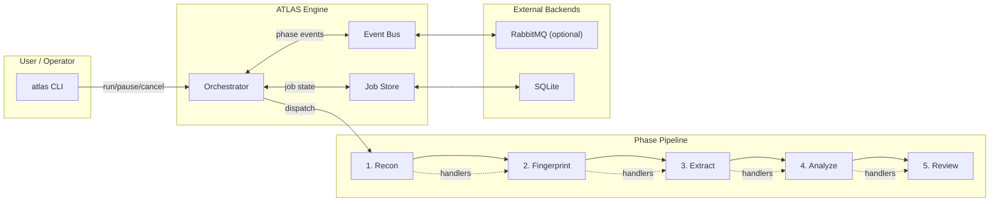
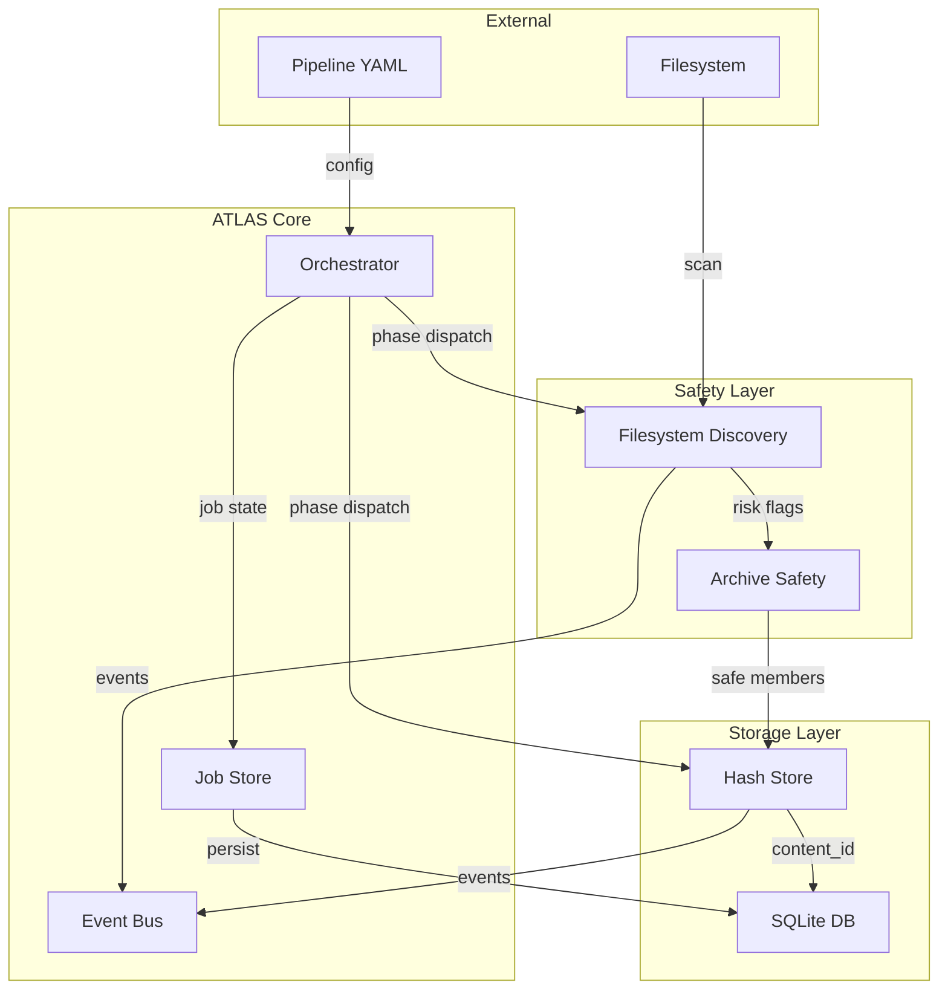
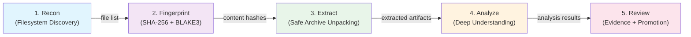

# ATLAS — Adaptive Task Lifecycle Engine

> In Greek mythology, Atlas held up the celestial spheres. In your pipelines, ATLAS holds up and orchestrates multi-phase workloads.

ATLAS is a standalone orchestration engine for multi-phase batch processing workflows. It sequences pipeline phases (discovery → fingerprinting → extraction → analysis → review), tracks async job state, emits events for observability, and enforces safety checks on filesystem artifacts.


## Installation

```bash
pip install atlas-pipeline
```

## Quick Start

```bash
# Run a pipeline
atlas run examples/ctfd_pipeline.yaml

# List jobs
atlas jobs list

# Control a running job
atlas job <job-id> pause
atlas job <job-id> resume
atlas job <job-id> cancel
```

## Architecture

### System Overview



### Data Flow



### Phase Pipeline Sequence



## License

MIT
