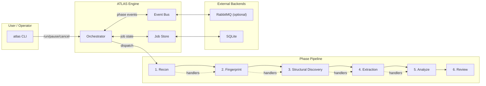
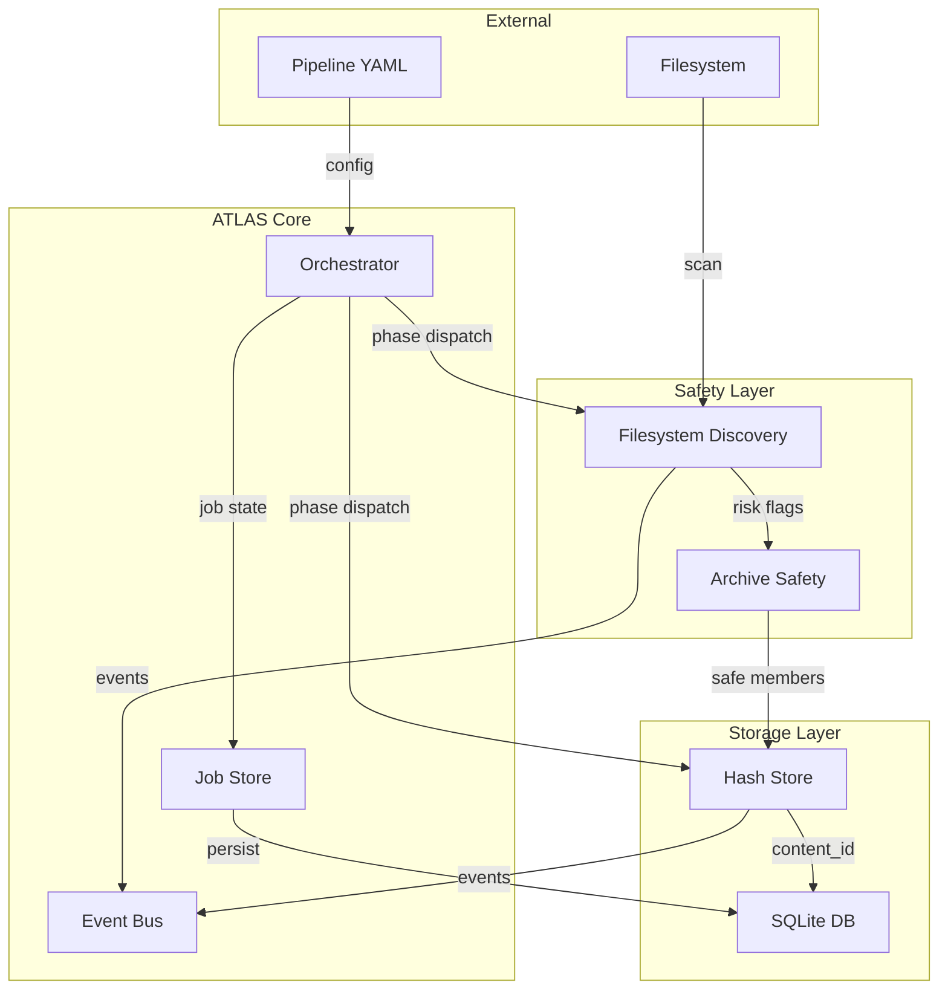
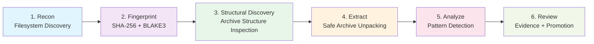
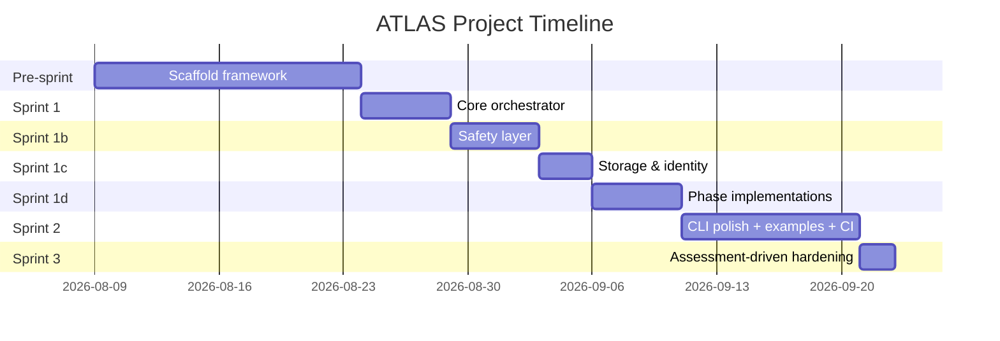

# ATLAS — Adaptive Task Lifecycle Engine

> In Greek mythology, Atlas held up the celestial spheres. In your pipelines, ATLAS holds up and orchestrates multi-phase batch processing workflows.

[](https://pypi.org/project/atlas-pipeline/)
[](https://github.com/Runndownn/ATLAS/actions/workflows/tests.yml)
[](LICENSE)


> **Project start date:** August 24, 2026
> **Maturity:** Pre-Alpha (v0.1.0) — framework skeleton with validated core lifecycle, safety, and storage layers

## Overview

ATLAS is a pre-alpha, single-process Python orchestration kernel for staged artifact-processing workflows. It sequences pipeline phases (reconnaissance → fingerprinting → structural discovery → extraction → analysis → review), tracks async job state in SQLite, emits lifecycle events to an event bus, and enforces safety checks on filesystem and archive artifacts.

Built for reliability, observability, and extensibility — whether you're processing CTF challenges, document archives, or code repositories. See [`docs/08-planning/Plans_/Plan_atlas-pipeline-engine/assessment.md`](docs/08-planning/Plans_/Plan_atlas-pipeline-engine/assessment.md) for a detailed architectural assessment.

## Key Features

- **Phase-based orchestration** — Sequential phase execution with pause/resume/cancel
- **Canonical runtime** — `AtlasRuntime` composition root wires all handlers automatically
- **Fail-closed safety** — Missing phase handlers raise errors instead of silently completing
- **Event-driven** — Dual backend: in-memory (default) or RabbitMQ, with SQLite event persistence
- **SQLite persistence** — Job state, phase records, and lifecycle events stored durably
- **Safety-first** — Archive bomb detection, symlink loop prevention, path traversal checks
- **Content-addressable** — SHA-256 + BLAKE3 hashing with automatic deduplication
- **Plugin phases** — Register custom phase handlers via Python Protocol
- **Observable** — Event bus emits structured events at every lifecycle point

## Installation

```bash
pip install atlas-pipeline
```

### With RabbitMQ support

```bash
pip install atlas-pipeline[rabbitmq]
```

### Development setup

```bash
pip install -e ".[dev]"
```

## Quick Start

```bash
# Run a pipeline
atlas run examples/ctfd_pipeline.yaml

# List all jobs
atlas jobs list

# Show job status
atlas job <job-id> status

# Control a running job
atlas job <job-id> pause
atlas job <job-id> resume
atlas job <job-id> cancel
```

## Architecture

### System Overview



### Data Flow



### Phase Pipeline Sequence



## Pipeline Phases

| Phase | Name | Description | Source |
|-------|------|-------------|--------|
| 1 | **Reconnaissance** | Filesystem discovery + risk flag computation | Yggdrasil Phase A |
| 2 | **Fingerprinting** | Content hashing (SHA-256 + BLAKE3) + dedup detection | Yggdrasil Phase B |
| 3 | **Structural Discovery** | Archive structure analysis + safe extraction | Yggdrasil Phase C |
| 4 | **Controlled Extraction** | Safe archive unpacking with bomb/path-traversal prevention | Yggdrasil Phase D |
| 5 | **Deep Understanding** | Analysis plugins + pattern detection | Yggdrasil Phase E |
| 6 | **Review/Promotion** | Evidence recording + artifact promotion | Yggdrasil Phase F |

## Process & Development

### Building Blocks

ATLAS is built with a clear separation of concerns:

```
atlas/
├── core/           # Orchestrator, Event Bus, Job Store, AtlasRuntime
├── phases/         # Pipeline phase implementations (7 phases)
├── safety/         # Archive safety + filesystem discovery + path safety
├── storage/        # Content hashing + dedup store
├── schema/         # SQLite schema exports
├── cli.py          # CLI entry point
└── __init__.py     # Package exports
```

### Development Process

This project follows the **BinReaper Mekanix** challenge-solving methodology, adapted for framework development:

1. **Evidence-based design** — Every phase is extracted from proven patterns in the geezer-mekanix workspace
2. **Phase isolation** — Each phase is independently testable
3. **Safety-first** — All filesystem operations go through the safety layer
4. **Observability** — Event bus emits structured events for every lifecycle action
5. **Reversible** — SQLite projections support atomic rollback

### Development Workflow

```bash
# Install in development mode
pip install -e ".[dev]"

# Run tests
python -m pytest tests/ -v

# Run a test pipeline
atlas run examples/ctfd_pipeline.yaml

# Check job status
atlas jobs list
atlas job <job-id> status
```

### Creating Custom Phases

```python
from atlas.core.runtime import AtlasRuntime
from atlas.core.orchestrator import PipelinePhase
from atlas.core.job_store import JobRecord, PhaseRecord
from atlas.phases.base import Phase

class MyCustomPhase(Phase):
    name = "my_custom_phase"
    
    async def execute(self, job, config, phase_record):
        await self.emit_event(job, "custom_started")
        # ... your logic here ...
        self.update_progress(percent=100.0, message="Done")

# Override a built-in phase
runtime = AtlasRuntime(db_path=":memory:")
await runtime.connect()
runtime.register_phase_handler(PipelinePhase.REVIEW_PROMOTION, MyCustomPhase())
```

## Testing

```bash
# Run full test suite
python -m pytest tests/ -v

# Run with coverage
python -m pytest tests/ --cov=atlas --cov-report=html

# Run specific test file
python -m pytest tests/test_orchestrator.py -v
```

### Test Structure

| File | Tests | Coverage |
|------|-------|----------|
| `test_orchestrator.py` | 12 | Orchestrator + JobRecord + PhaseRecord |
| `test_event_bus.py` | 5 | InMemoryEventBus (publish/consume/close) |
| `test_job_store.py` | 8 | SQLite persistence + metadata round-trip + event persistence |
| `test_filesystem_discovery.py` | 8 | Risk flags, symlink detection, depth limits |
| `test_archive_safety.py` | 8 | ZIP assessment, traversal detection, limits, manifest extraction |
| `test_hash_store.py` | 10 | SHA-256 + BLAKE3, dedup key matching, streaming |
| `test_path_safety.py` | 8 | Path traversal, null bytes, depth, symlink containment |
| `test_runtime.py` | 4 | AtlasRuntime handler wiring + fail-closed tests |
| `test_phases_integration.py` | 4 | Full pipeline end-to-end via AtlasRuntime |
| **Total** | **67** | |

## Project Origin & Philosophy

ATLAS was born from the **BinReaperMekanix** challenge-solving ecosystem. The orchestration patterns, phase sequencing, event bus, and safety checks were extracted from the [geezer-mekanix](https://github.com/Runndownn/geezer-mekanix) workspace's Yggdrasil knowledge-fabric domain and generalized into a standalone, open-source framework.

**What was removed (security/cognitive-ops):**
- RBAC / authentication / authorization
- Cognitive operations layer
- Production secrets management
- TLS / network security controls
- Audit logging to external SIEM
- Multi-tenant isolation

**What remains:** The pure orchestration, discovery, hashing, safety, and phase-engine logic — rebuilt as a clean, framework-agnostic package.

## BinReaper Production TODO Plan

This project is developed using the **BinReaper Production TODO** methodology. The living plan is in [`TODO_ATLAS-PART1.md`](TODO_ATLAS-PART1.md).

### Sprint Slices

| Slice | Status | Description |
|-------|--------|-------------|
| **Slice 1** | ✅ Complete | Core Orchestrator + Event Bus + Job Store + CLI + AtlasRuntime |
| **Slice 2** | ✅ Complete | Safety Layer (filesystem discovery + archive safety + path safety) |
| **Slice 3** | ✅ Complete | Storage & Identity (content hashing + dedup + event persistence) |
| **Slice 4** | ✅ Complete | Phase Implementations (recon → fingerprint → structural_discovery → extract → analyze → review) |
| **Slice 5** | ✅ Complete | CLI polish + example pipelines + CI + PyPI + docs |
| **Slice 6** | ✅ Complete | Assessment-driven hardening (fail-closed, TAR filter, progress wiring, config schema, StructuralDiscoveryPhase, event persistence, dedup keys, path safety) |

### Development Log

- **Aug 9–23, 2026** — Pre-sprint preparation: repo init, framework design, Slices 1-4 foundation
- **Aug 24, 2026** — Official project start date
- **Aug 24–28, 2026** — Sprint 1: Core orchestrator, event bus, job store, CLI (25 tests)
- **Aug 29–Sep 10, 2026** — Sprints 1b-1d: Safety layer, storage, phases (25+24+10+4=63 tests)
- **Sep 11–20, 2026** — Sprint 2: CLI polish, examples, CI, PyPI, docs (4 runtime tests)
- **Sep 21–22, 2026** — Sprint 3: Assessment-driven hardening (PathSafetyService, HashStore tests, event persistence, StructuralDiscoveryPhase, fail-closed, TAR filter, progress wiring, config schema) — 67 total tests

### Project Gantt Chart



### Sprint Dates

| Sprint | Dates | Scope | Owner |
|--------|-------|-------|-------|
| Pre-sprint Prep | Aug 9–23, 2026 | Repo init, framework design, foundation | Poolside |
| Sprint 1 | Aug 24–28, 2026 | Core orchestrator, event bus, job store, CLI | Poolside |
| Sprint 1b | Aug 29–Sep 2, 2026 | Filesystem discovery, archive safety | Poolside |
| Sprint 1c | Sep 3–5, 2026 | Hash store, schema | Poolside |
| Sprint 1d | Sep 6–10, 2026 | All 6 phases + integration tests | Poolside |
| Sprint 2 | Sep 11–20, 2026 | CLI polish, examples, CI, PyPI, docs | Poolside |
| Sprint 3 | Sep 21–22, 2026 | Assessment-driven hardening, 67 tests | Poolside |

## Hosting & Platform

ATLAS is hosted and sponsored by **REDC2 Portal**, providing the infrastructure backbone for pipeline orchestration workloads, built using the **Geezer Mekanix Agentic Engineering Platform**. The platform transforms human intent into **Bounded. Observable. Evidence-Aware. Governed.** execution.

The AI model powering framework development and planning decisions is the **Poolside Laguna S 2.1 (free)** — a 262,112-token model used through the Kilo Gateway for code generation, architectural reasoning, and sprint planning.

## Known Limitations

Following the [architectural assessment](docs/08-planning/Plans_/Plan_atlas-pipeline-engine/assessment.md), the following P0 and P1 items were resolved during Slice 6 hardening:

- ✅ **AtlasRuntime composition root** — `AtlasRuntime` wires all 6 phase handlers; CLI uses the same runtime as tests
- ✅ **Fail-closed orchestration** — Missing phase handlers raise RuntimeError instead of silently completing
- ✅ **Config schema validation** — `pipeline_id: "auto"` generates UUID; `phase_config`, `continue_on_phase_error`, and metadata are preserved
- ✅ **Review serialization fixed** — EvidenceRecord/PromotionRecord dataclasses serialize to JSON-safe dicts
- ✅ **TAR extraction hardened** — Explicit `filter="data"` on Python 3.13+
- ✅ **Suspicious archive paths fail safety** — Path traversal patterns now make `safe=False`
- ✅ **Event persistence** — Lifecycle events written to SQLite `atlas_events` table
- ✅ **HashStore dedup keys aligned** — `has_content()` works with both raw hex and `sha256:` prefix
- ✅ **StructuralDiscoveryPhase** — Phase C now has a dedicated implementation (not reusing ExtractionPhase)
- ✅ **Phase progress propagation** — `Phase.update_progress()` updates `PhaseRecord` and `JobRecord`
- ✅ **EventBus wiring** — All phases receive the shared event bus
- ✅ **Path safety hardened** — Null byte `ValueError` handling + precise pattern matching (no false positives)

### Remaining limitations (P2 items)

- **Pause/resume/cancel are process-local** — control commands from a separate CLI process cannot control a running pipeline in another process. A daemon/worker model is needed for cross-process control.
- **Content store is in-memory** — `HashStore` maintains an in-memory manifest; not persisted across restarts
- **No RabbitMQ consumer** — `RabbitMQEventBus` publishes but does not consume; event bus is primarily observability side-channel
- **Fingerprinting re-discovers files** — Phase B re-runs filesystem discovery instead of consuming Phase A's inventory (TOCTOU window)

MIT — See [LICENSE](LICENSE) for details.

## Contributing

Contributions welcome! Please follow the BinReaper methodology:
1. Review the TODO plan before implementing
2. Write tests for new features
3. Ensure all tests pass before merging
4. Document new phases/plugins in README
