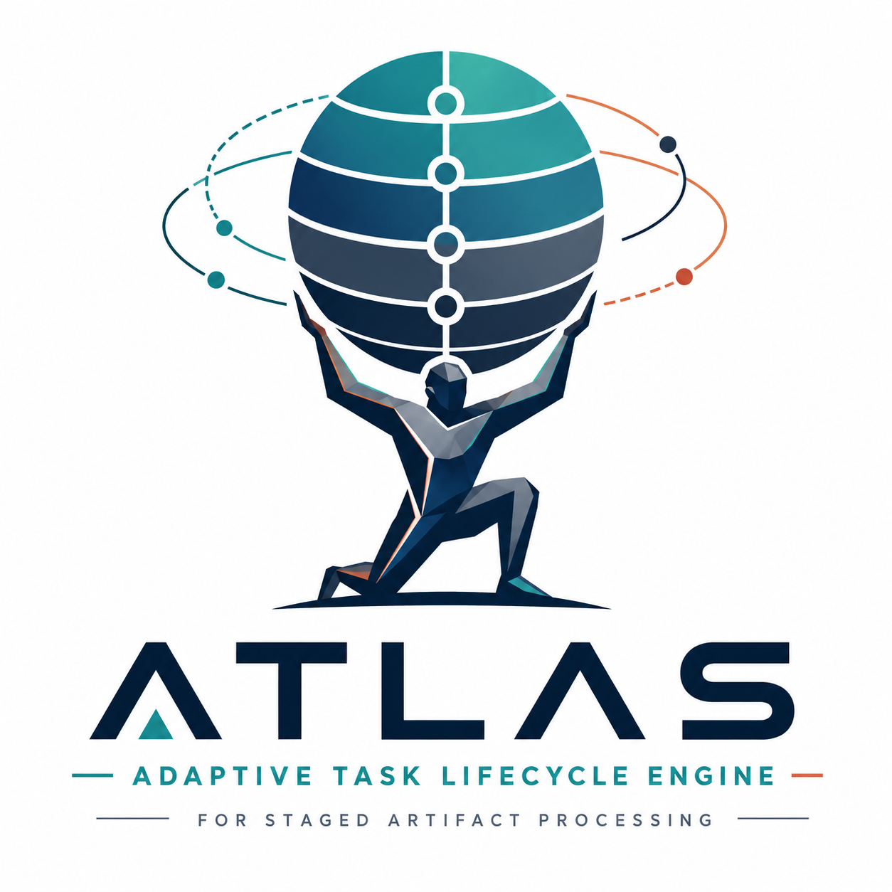
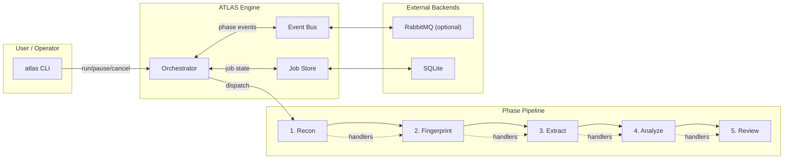
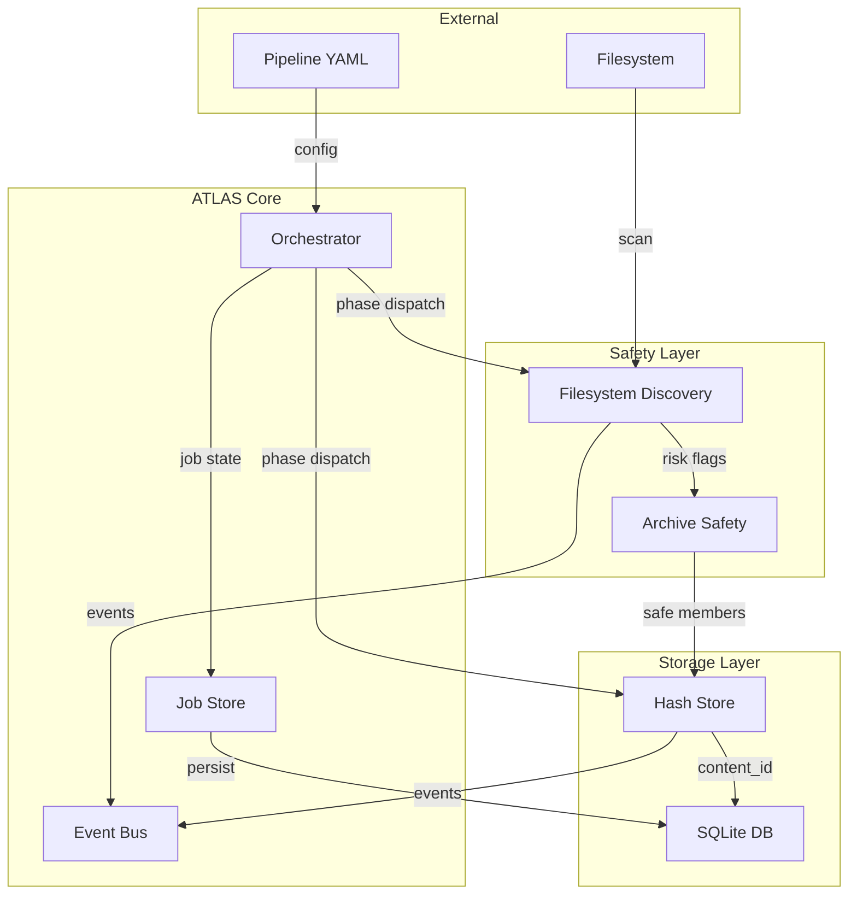
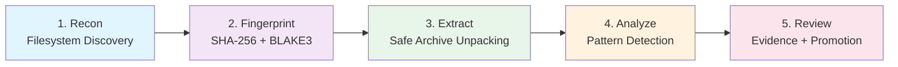

# ATLAS — Adaptive Task Lifecycle Engine

> In Greek mythology, Atlas held up the celestial spheres. In your pipelines, ATLAS holds up and orchestrates multi-phase batch processing workflows.

[](https://pypi.org/project/atlas-pipeline/)
[](https://github.com/Runndownn/ATLAS/actions/workflows/tests.yml)
[](LICENSE)



## Overview

ATLAS is a standalone orchestration engine for multi-phase batch processing workflows. It sequences pipeline phases (discovery → fingerprinting → extraction → analysis → review), tracks async job state, emits events for observability, and enforces safety checks on filesystem artifacts.

Built for reliability, observability, and extensibility — whether you're processing CTF challenges, document archives, or code repositories.

## Key Features

- **Phase-based orchestration** — Sequential phase execution with pause/resume/cancel
- **Event-driven** — Dual backend: in-memory (default) or RabbitMQ
- **SQLite persistence** — Job state, phase records, and events stored durably
- **Safety-first** — Archive bomb detection, symlink loop prevention, path traversal checks
- **Content-addressable** — SHA-256 + BLAKE3 hashing with automatic deduplication
- **Plugin phases** — Register custom phase handlers via Python Protocol
- **Observable** — Event bus emits structured events at every lifecycle point

## Installation

```bash
pip install atlas-pipeline
```

### With RabbitMQ support

```bash
pip install atlas-pipeline[rabbitmq]
```

### Development setup

```bash
pip install -e ".[dev]"
```

## Quick Start

```bash
# Run a pipeline
atlas run examples/ctfd_pipeline.yaml

# List all jobs
atlas jobs list

# Show job status
atlas job <job-id> status

# Control a running job
atlas job <job-id> pause
atlas job <job-id> resume
atlas job <job-id> cancel
```

## Architecture

### System Overview



### Data Flow



### Phase Pipeline Sequence



## Pipeline Phases

| Phase | Name | Description | Source |
|-------|------|-------------|--------|
| 1 | **Reconnaissance** | Filesystem discovery + risk flag computation | Yggdrasil Phase A |
| 2 | **Fingerprinting** | Content hashing (SHA-256 + BLAKE3) + dedup detection | Yggdrasil Phase B |
| 3 | **Structural Discovery** | Archive structure analysis + safe extraction | Yggdrasil Phase C |
| 4 | **Controlled Extraction** | Safe archive unpacking with bomb/path-traversal prevention | Yggdrasil Phase D |
| 5 | **Deep Understanding** | Analysis plugins + pattern detection | Yggdrasil Phase E |
| 6 | **Review/Promotion** | Evidence recording + artifact promotion | Yggdrasil Phase F |

## Process & Development

### Building Blocks

ATLAS is built with a clear separation of concerns:

```
atlas/
├── core/           # Orchestrator, Event Bus, Job Store
├── phases/         # Pipeline phase implementations
├── safety/         # Archive safety + filesystem discovery
├── storage/        # Content hashing + dedup store
├── schema/         # SQLite migrations
├── cli.py          # CLI entry point
└── __init__.py     # Package exports
```

### Development Process

This project follows the **BinReaper Mekanix** challenge-solving methodology, adapted for framework development:

1. **Evidence-based design** — Every phase is extracted from proven patterns in the geezer-mekanix workspace
2. **Phase isolation** — Each phase is independently testable
3. **Safety-first** — All filesystem operations go through the safety layer
4. **Observability** — Event bus emits structured events for every lifecycle action
5. **Reversible** — SQLite projections support atomic rollback

### Development Workflow

```bash
# Install in development mode
pip install -e ".[dev]"

# Run tests
python -m pytest tests/ -v

# Run a test pipeline
atlas run examples/ctfd_pipeline.yaml

# Check job status
atlas jobs list
atlas job <job-id> status
```

### Creating Custom Phases

```python
from atlas.core.orchestrator import PipelinePhase, PipelineOrchestrator
from atlas.core.job_store import JobRecord, PhaseRecord
from atlas.phases.base import Phase

class MyCustomPhase(Phase):
    name = "my_custom_phase"
    
    async def execute(self, job, config, phase_record):
        await self.emit_event(job, "custom_started")
        # ... your logic here ...
        self.update_progress(percent=100.0, message="Done")

# Register with orchestrator
orchestrator.register_phase_handler(
    PipelinePhase.REVIEW_PROMOTION,  # or a custom phase
    MyCustomPhase()
)
```

## Testing

```bash
# Run full test suite
python -m pytest tests/ -v

# Run with coverage
python -m pytest tests/ --cov=atlas --cov-report=html

# Run specific test file
python -m pytest tests/test_orchestrator.py -v
```

### Test Structure

| File | Tests | Coverage |
|------|-------|----------|
| `test_orchestrator.py` | 13 | Orchestrator + JobRecord + PhaseRecord |
| `test_event_bus.py` | 5 | InMemoryEventBus (publish/consume/close) |
| `test_job_store.py` | 8 | SQLite persistence + metadata round-trip |
| `test_filesystem_discovery.py` | 8 | Risk flags, symlink detection, depth limits |
| `test_archive_safety.py` | 6 | ZIP assessment, traversal detection, limits |
| `test_phases_integration.py` | 3 | Full pipeline end-to-end |

## Project Origin & Philosophy

ATLAS was born from the **BinReaperMekanix** challenge-solving ecosystem. The orchestration patterns, phase sequencing, event bus, and safety checks were extracted from the [geezer-mekanix](https://github.com/Runndownn/geezer-mekanix) workspace's Yggdrasil knowledge-fabric domain and generalized into a standalone, open-source framework.

**What was removed (security/cognitive-ops):**
- RBAC / authentication / authorization
- Cognitive operations layer
- Production secrets management
- TLS / network security controls
- Audit logging to external SIEM
- Multi-tenant isolation

**What remains:** The pure orchestration, discovery, hashing, safety, and phase-engine logic — rebuilt as a clean, framework-agnostic package.

## BinReaper Production TODO Plan

This project is developed using the **BinReaper Production TODO** methodology. The living plan is in [`TODO_ATLAS-PART1.md`](TODO_ATLAS-PART1.md).

### Sprint Slices

| Slice | Status | Description |
|-------|--------|-------------|
| **Slice 1** | ✅ Complete | Core Orchestrator + Event Bus + Job Store + CLI + Tests |
| **Slice 2** | ✅ Complete | Safety Layer (filesystem discovery + archive safety) |
| **Slice 3** | ✅ Complete | Storage & Identity (content hashing + dedup) |
| **Slice 4** | ✅ Complete | Phase Implementations (recon → fingerprint → extract → analyze → review) |
| **Slice 5** | 🔲 In Progress | CLI polish + example pipelines + PyPI publish |

### Development Log

- **2026-08-09** — Project initialized. Slice 1: Core orchestrator, event bus, job store, CLI. 25 tests passing.
- **2026-08-09** — Slices 2-4: Safety layer, storage layer, phase implementations. 44 tests passing, full integration test passing.
- **2026-08-09** — README updated with Mermaid architecture charts and process documentation.

## Hosting & Platform

ATLAS is hosted and sponsored by **REDC2 portals**, providing the infrastructure backbone for pipeline orchestration workloads.

The AI model powering framework development and planning decisions is the **Poolside Laguna S 2.1 (free)** — a 262,112-token model used through the Kilo Gateway for code generation, architectural reasoning, and sprint planning.

## License

MIT — See [LICENSE](LICENSE) for details.

## Contributing

Contributions welcome! Please follow the BinReaper methodology:
1. Review the TODO plan before implementing
2. Write tests for new features
3. Ensure all tests pass before merging
4. Document new phases/plugins in README
