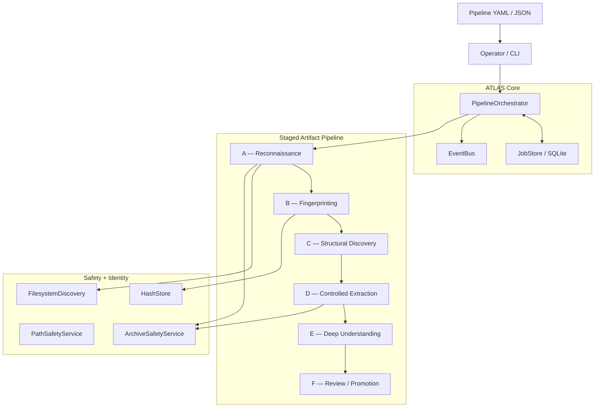
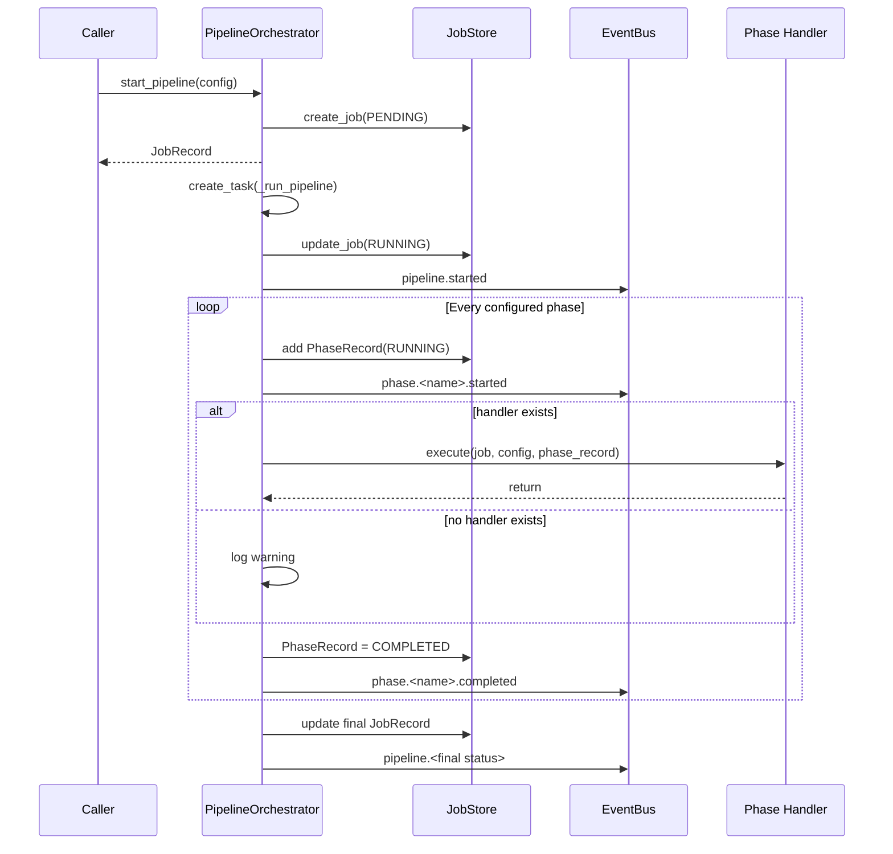
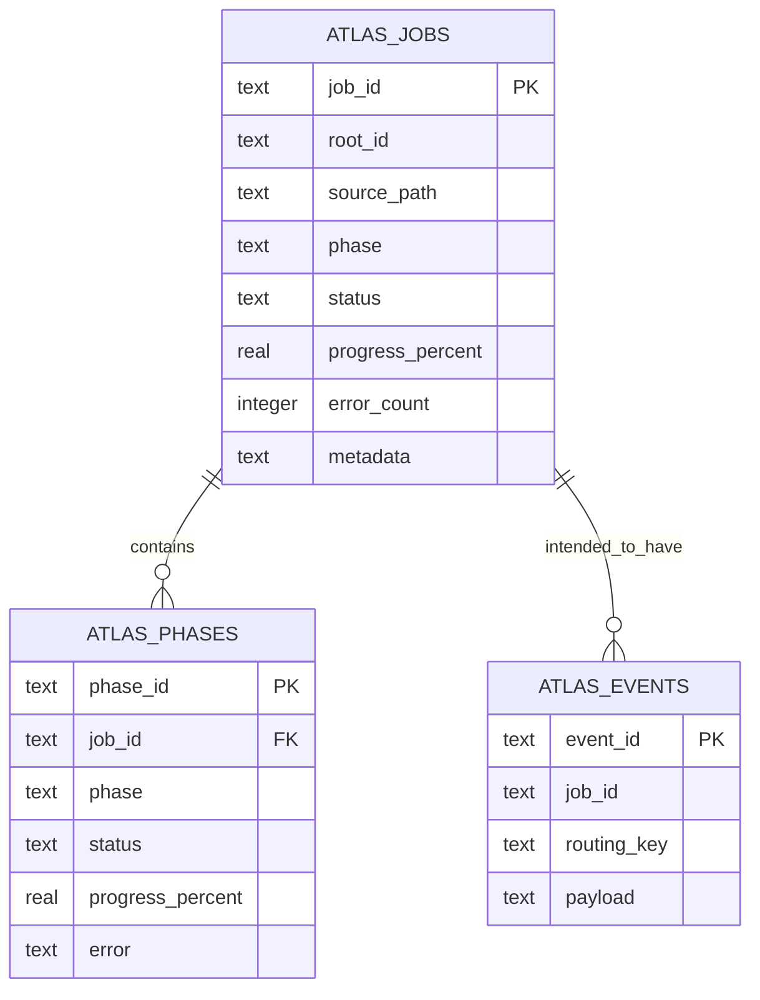
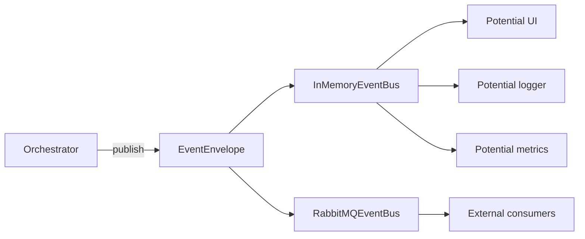
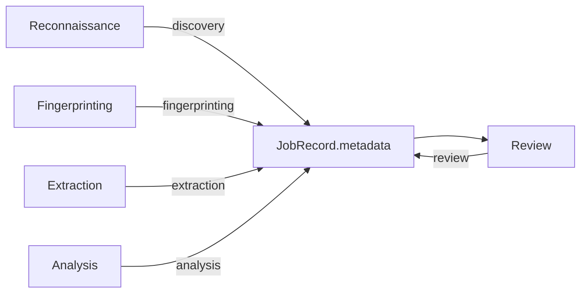
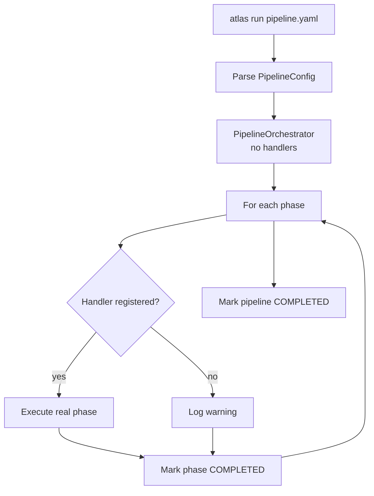
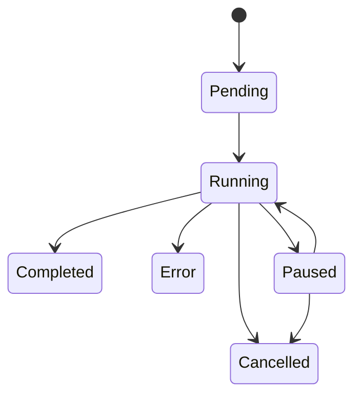
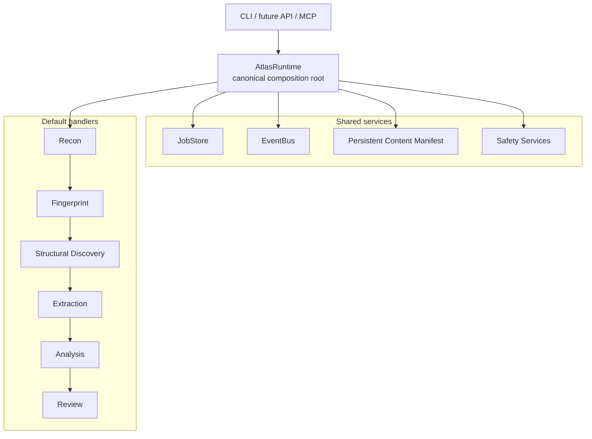

# ATLAS repository assessment

I reviewed the repository as a software system rather than treating the README as authoritative. I froze the analysis against `main` at commit `27c727f551e3c2b88192906194f2c45aa220832f` and directly inspected the README, package metadata, orchestrator, event bus, SQLite job store, CLI, phase implementations, filesystem/archive/path safety code, hashing layer, examples, CI workflow, tests, planning documents, and the implementation commits that assembled the framework. I did **not** execute the repository or claim a byte-for-byte audit of every Git object, so runtime observations below are static-code conclusions rather than results from running ATLAS.

## What ATLAS actually is

The best description is:

**ATLAS is a pre-alpha, single-process Python orchestration kernel for staged artifact-processing workflows.**

Its architectural ancestry is important. The project explicitly extracts the phase engine, discovery, hashing, archive-safety, state-tracking, and messaging patterns from the Yggdrasil knowledge-fabric domain in `geezer-mekanix`, while deliberately removing RBAC, authentication, cognitive operations, production secrets, TLS, SIEM integration, and multi-tenant isolation. In other words, this is an attempt to separate the reusable **mechanics of governed staged processing** from the larger security/knowledge platform that originally contained them.

That makes ATLAS much more interesting than a simple script runner. Its intended abstraction is:

> “Give me a source of artifacts, move them through known lifecycle stages, remember what happened, expose lifecycle events, apply safety checks, and allow specialized handlers to extend what each stage means.”

The package metadata still correctly calls it **Pre-Alpha**, version `0.1.0`, requiring Python 3.13+, which is a much more accurate description of its current maturity than some of the README's “complete” language.

It is **not presently** a DAG engine like Airflow, a distributed worker system, an agent framework, an LLM runtime, a task queue, or a complete content-addressable storage platform. There are no model calls, no agents, no container scheduler, no remote executor, no REST service, and no web UI in the reviewed implementation. It is a compact lifecycle engine around filesystem-oriented artifact processing.

---

# The conceptual architecture

The intended architecture is clean and makes sense:



That is very close to the architectural story presented in the README and conceptual plan: operator input enters an orchestrator; orchestration state is projected into SQLite; lifecycle observations go to an event bus; specialized phases do the artifact work; and safety/storage are intended as lower-level services rather than being tangled into orchestration itself.

The separation of concerns is one of the strongest parts of the repo. `atlas/core` owns lifecycle mechanics, `atlas/phases` owns workflow semantics, `atlas/safety` owns untrusted filesystem/archive checks, and `atlas/storage` owns content identity. That is a sensible extraction boundary for something meant to become a reusable “home” framework.

---

# The core execution model

`PipelineOrchestrator` is the actual heart of ATLAS. A `PipelineConfig` identifies the run, source path, ordered phase list, and arbitrary metadata. Starting a pipeline creates a `JobRecord`, persists it, and launches `_run_pipeline()` with `asyncio.create_task()`. The engine then walks the phase list **sequentially**. For each phase it creates a `PhaseRecord`, emits a start event, resolves a handler, invokes the handler, marks the phase complete, emits a completion event, and moves forward.

The actual orchestration sequence looks like this:



There is no dependency graph, branching, fan-out/fan-in, worker pool, built-in retry loop, timeout system, checkpoint engine, or scheduler. The architecture is intentionally simpler: **one ordered lifecycle, one job context, one phase at a time**.

That simplicity is useful. ATLAS can become a very understandable orchestration primitive if it stays explicit about being a staged lifecycle engine rather than trying to imitate a full workflow scheduler.

---

# What the job store means

The SQLite `JobStore` gives ATLAS three tables: `atlas_jobs`, `atlas_phases`, and `atlas_events`. Jobs contain lifecycle state, current phase, progress, timestamps, errors, source path, and JSON metadata. Phases contain per-phase status, progress, errors, and timestamps. Events have a schema for routing key and payload.

Conceptually:



There is an important distinction between the **schema** and the current behavior, however. I found methods for creating/updating/listing jobs and phases, but no corresponding event persistence API. The orchestrator publishes lifecycle events to the `EventBus`; it does not write those envelopes into `atlas_events`. So the README statement that jobs, phases **and events** are stored durably is ahead of the implementation. The event table is currently infrastructure waiting for its writer.

This means ATLAS currently has **durable lifecycle tracking**, but not a durable event log and certainly not event sourcing.

---

# What the event bus does in ATLAS

This connects directly to your earlier event-bus question.

In ATLAS, the event bus does **not drive the pipeline**. The orchestrator directly calls phase handlers. The bus is a side channel that lets observers learn what the pipeline is doing without coupling those observers to orchestration.

Conceptually:



An `EventEnvelope` carries a routing key, nominal queue, payload, headers, attempt count, and publication timestamp. The in-memory backend uses `asyncio.Queue`; subscribers receive copies of published events. The RabbitMQ implementation publishes JSON to a fanout exchange named `atlas.events`, with an in-memory fallback if the initial RabbitMQ connection cannot be established.

This is a good architectural seam because a dashboard, logging pipeline, notification service, metrics collector, or later agent integration could listen to lifecycle activity without the orchestrator knowing anything about those consumers.

The implementation is not yet a fully interchangeable dual-backend bus, though. `RabbitMQEventBus` is essentially a publisher: it does not implement a corresponding RabbitMQ subscription/consumer interface. Because it uses a FANOUT exchange, the routing key is also metadata rather than a RabbitMQ routing discriminator. The abstract `EventBus` itself only requires `publish()` and `close()`, even though planning documentation describes subscribe/unsubscribe behavior.

There is also a subtle memory characteristic in the in-memory backend. Every published event is inserted into an internal named queue **and** copied to subscribers. With the default internal queue size of zero, that named queue is unbounded, and I found no public API that drains it. A long-running runtime that publishes substantial event volume could therefore accumulate envelopes even when its subscriber queues are being consumed.

---

# The six-phase pipeline

ATLAS preserves Yggdrasil's A–F lifecycle terminology. The enum really does contain six phases.

| Lifecycle stage       | Intended purpose                                   | Current implementation        |
| --------------------- | -------------------------------------------------- | ----------------------------- |
| Reconnaissance        | Discover and assess source artifacts               | `ReconnaissancePhase`         |
| Fingerprinting        | Establish content identity                         | `FingerprintingPhase`         |
| Structural Discovery  | Understand archive/container structure             | No independent implementation |
| Controlled Extraction | Safely materialize archive contents                | `ExtractionPhase`             |
| Deep Understanding    | Run analysis/pattern detection                     | `AnalysisPhase`               |
| Review / Promotion    | Convert results into evidence/promotion candidates | `ReviewPhase`                 |

The discrepancy in stage C is significant. There are six enum values but only five concrete built-in phase classes. The integration fixture resolves this by registering `ExtractionPhase()` for **both** `STRUCTURAL_DISCOVERY` and `CONTROLLED_EXTRACTION`.

So the presently tested six-phase pipeline is effectively:

```text
Recon
  ↓
Fingerprint
  ↓
Extraction
  ↓
Extraction again
  ↓
Analysis
  ↓
Review
```

With non-archive fixtures this goes unnoticed. With archives, it means the conceptual distinction between “inspect structure” and “extract content” has not actually been preserved.

That is one of the clearest signs that ATLAS is an extracted framework baseline rather than a finished implementation.

---

# Phase A — reconnaissance

Reconnaissance uses `FilesystemDiscovery` against the source tree, aggregates file and byte counts, identifies risky files, assesses discovered archives, emits intended discovery events, and writes a summarized `discovery` object into `JobRecord.metadata`.

That metadata becomes the primary inter-phase communication mechanism:



This is a useful design decision because it makes the pipeline context explicit, inspectable, and potentially serializable. The problem is that the implementation currently treats this metadata as both an internal object graph and a persistence document, and those requirements are not yet consistently enforced.

The discovery layer itself uses depth limiting, identifies symlinks, counts file sizes, and assigns `executable`, `archive`, `sensitive`, and `symlink` risk indicators.

There are some gaps. `max_symlink_hops` is configured but never meaningfully enforced. When `follow_symlinks=True`, the implementation resolves a target and records its inode, but `is_dir` is still calculated from the original `lstat()` result, so a directory symlink is not actually traversed as a directory. The “symlink loop detection” test consequently only asserts that the counter is greater than or equal to zero, which does not verify actual loop handling.

There are also semantic count inconsistencies. `sensitive_count` is increased whenever **any** risk flag exists, meaning archives, executables, and symlinks can increase a field whose name implies only sensitive material. Some configured sensitive patterns such as `.git/config` are compared only against `path.name`, so path-aware patterns cannot match as intended.

---

# Phase B — fingerprinting and “content-addressable storage”

The hashing implementation is technically straightforward and sensible: `HashStore.hash_file()` streams a file in 1 MiB chunks, always computes SHA-256, computes BLAKE3 when the module is installed, and stores the resulting `HashResult` in an in-memory manifest.

But calling the current component a **content-addressable store** is premature. It does not store blobs, persist a content manifest, or maintain a SQLite content table. It is currently a hashing utility plus an in-memory dictionary.

The intended content model looks like:

```text
file bytes
   │
   ├── SHA-256 ──→ canonical identity
   └── BLAKE3  ──→ secondary fingerprint
                     │
                     ▼
               dedup decision
```

The current deduplication path also contains a key mismatch. `hash_file()` inserts manifest entries using raw hexadecimal SHA-256/BLAKE3 strings. `get_content_id()` returns `"sha256:<digest>"`. `FingerprintingPhase` calls `has_content()` with that prefixed content ID, so it searches for a key that `HashStore` never inserts. As written, the phase's duplicate counter therefore cannot recognize hashes through that code path.

There is a second conceptual mismatch: the file is completely hashed **before** the duplicate check is performed. So even once the key mismatch is corrected, this particular mechanism cannot deliver the documented “no re-hashing is needed on subsequent runs” behavior without a separate occurrence/index mechanism based on prior metadata.

Fingerprinting also performs a second filesystem discovery instead of consuming the exact inventory observed by reconnaissance. That means ATLAS currently has a time-of-check/time-of-use window: Phase A can observe one source state and Phase B can hash a slightly different one if files change in between.

For an evidence-oriented framework, a better model would be for reconnaissance to create immutable source-occurrence records, then fingerprint exactly those occurrences.

---

# Phase C/D — archive safety and extraction

The archive subsystem has several good controls. It has compressed and uncompressed byte ceilings, member limits, compression-ratio calculations for ZIP files, suspicious member-name detection, archive type validation, and per-member extraction containment checks.

The extraction phase reassesses each archive before extraction and refuses entries whose resolved destination falls outside the intended extraction directory. That basic containment check is a worthwhile defense against straightforward `../` traversal.

There are nevertheless meaningful security gaps.

Most importantly, suspicious archive member patterns are gathered but do **not** participate in the `safe` Boolean. The repository's own test acknowledges this explicitly: a traversal ZIP may be “structurally safe” even though traversal was detected.

`max_nested_depth` is also accepted by `ArchiveSafetyService` but I found no recursive depth evaluation or comparison against that value. Nested archives are counted, not recursively bounded.

TAR extraction deserves particular attention because `pyproject.toml` permits Python 3.13. `ExtractionPhase` invokes `TarFile.extract()` without an explicit extraction filter. In Python 3.13, leaving the filter unset falls back to the `fully_trusted` behavior; Python's own documentation specifically warns that malicious archives can exploit absolute paths, `..`, or symlinks and recommends `filter="data"` for untrusted archives. Python 3.14 changed the default to the safer data filter. ([Python documentation][1])

Therefore the extraction safety is runtime-version-sensitive despite the package advertising Python `>=3.13`. The direct destination check helps, but using `filter="data"` explicitly would give much stronger handling of link targets, device files, and other TAR-specific filesystem features on Python 3.13. ([Python documentation][1])

There is also an archive-extension mismatch. Reconnaissance recognizes compound archive formats, but `ExtractionPhase` later uses `Path(path).suffix` to choose candidate archives. A `.tar.gz` path has a suffix of `.gz`, so it does not match the phase's `.tar.gz` candidate string; the same general problem affects other compound formats.

---

# Phase E — “deep understanding”

This is the most skeletal phase.

`AnalysisPhase` defines a genuinely useful extension seam: an `AnalyzerPlugin` can asynchronously analyze a file and return a result object. That is exactly where things such as file-type inspection, malware/static analysis, document extraction, code analysis, CTF classifiers, or repository analyzers could be added later.

The built-in “analysis,” however, is presently just metadata gathering: path, filename, extension, file size, and any configured plugin results. There is no built-in pattern-detection engine despite that phrase appearing in the documentation, and the phase's `HashStore` instance is not actually used.

Another important behavioral choice is that it analyzes only `discovery["risky_files"]`, not every discovered artifact. Ordinary `.txt`, `.pdf`, source, or document artifacts that did not receive a risk flag are not sent through analysis by default.

So “Deep Understanding” is currently better understood as **the plugin slot where deep understanding is supposed to happen**.

That is fine for a framework—as long as the docs describe it that way.

---

# Phase F — evidence and promotion

The review layer shows where the larger platform lineage is heading. It introduces explicit `EvidenceRecord` and `PromotionRecord` models. Evidence distinguishes observed facts, parsed facts, inferred relationships, and classification hypotheses, each with confidence and source information. Promotion records associate candidate content with artifact type, risk level, and supporting evidence.

This is probably one of the most strategically important ideas in the repo because it creates a natural boundary between:

**processing something** and **deciding that the result deserves to become trusted knowledge**.

That resembles the governed Yggdrasil/BinReaper model far more than a generic ETL framework.

The current implementation only creates those records in memory, however. It does not promote anything into an external store and does not persist a dedicated evidence registry. Promotion candidates even have an empty `source_path`, because the fingerprint result currently preserves content IDs without retaining a content-ID-to-file mapping.

There is also a concrete serialization problem. `job.metadata["review"]["evidence_sample"]` is assigned a list of `EvidenceRecord` dataclass instances. The `JobStore` JSON sanitizer understands datetimes, `Path`, dictionaries, lists, and tuples, but does not serialize arbitrary dataclass instances. On a normal review containing evidence, the final `JobStore.update_job()` therefore has a path to `TypeError` during JSON encoding.

This is especially subtle because the integration test can still observe the in-memory `JobRecord` reaching `COMPLETED` even if that final persistence operation fails afterward.

---

# The biggest runtime discrepancy: the CLI is not wired to the phases

This is the most important finding in the repository.

`atlas run` creates:

```python
job_store = JobStore(db_path)
event_bus = InMemoryEventBus()
orchestrator = PipelineOrchestrator(job_store, event_bus)
```

It never registers the built-in phase handlers.

The orchestrator's behavior when a handler is absent is to log a warning and then proceed to mark that phase completed.

So the actual default CLI behavior is currently closer to:



That is a **fail-open orchestration policy**: missing functionality looks like successful work.

The integration tests do wire handlers manually, which is why the framework internals can pass while the packaged user entry point remains disconnected. They even write directly into the private `_phase_handlers` dictionary rather than using the documented registration API.

The README's custom-phase example has another wiring issue: `register_phase_handler()` is declared `async`, yet the example calls it without `await`.

This suggests ATLAS needs one explicit runtime composition object—something like `AtlasRuntime.default()` or an `EngineBuilder`—that creates the job store, event bus, shared safety/storage services, and all built-in handlers in one canonical place.

---

# Pause, resume, and cancel are currently process-local

The lifecycle state model itself is straightforward:



But the controls are not yet durable execution controls.

`pause_pipeline()`, `resume_pipeline()`, and `cancel_pipeline()` look only in the orchestrator's in-memory `_jobs` dictionary. They do not hydrate a job from SQLite if it isn't already active in that same process.

The CLI creates a **new orchestrator process** for every `atlas job <id> pause|resume|cancel` invocation. That new orchestrator has an empty `_jobs` dictionary. Consequently, a control command issued from a second shell cannot control the pipeline launched by the first CLI process.

So SQLite currently provides **durable inspection**, not durable execution.

Pause and cancel are also cooperative only at phase boundaries. Changing the job status does not cancel or suspend a currently running phase task. The running handler can finish before `_run_pipeline()` checks the new status on the next loop iteration. Resume then restarts from the current phase, so a phase whose side effects already finished around the pause boundary can be rerun.

A daemon/worker model, or persisted control requests consumed by a long-running runtime, would be necessary for the CLI semantics described in the README.

---

# Progress tracking is largely disconnected

The framework has three notions of progress: `Phase._progress`, `PhaseRecord.progress_percent`, and `JobRecord.progress_percent`.

The built-in phases call `self.update_progress()`, but that only modifies the `Phase` instance's private `PhaseProgress`. It does not update the supplied `PhaseRecord` or `JobRecord`, and the orchestrator only sets the phase record to `100%` at completion.

That means the CLI's job-level progress field can remain at `0%` even while work advances.

This is a classic example of a sound abstraction that has not yet been wired end-to-end.

---

# Configuration is richer on paper than at runtime

The CTF example is an excellent illustration. It declares a pipeline ID of `"auto"`, six phases, phase-specific depth/hashing/extraction configuration, error semantics, and custom metadata.

The CLI parser only consumes `source_path`, `phases`, `pipeline_id`, `name`, and `abort_on_error`. It discards `phase_config`, `continue_on_phase_error`, and the supplied metadata object.

Even `"pipeline_id": "auto"` is not treated specially. Because a nonempty pipeline ID is supplied, the literal string `"auto"` becomes the SQLite primary key. Re-running that example against the same database can therefore collide with the previous job rather than generating a UUID.

The document-processing example has the same `"auto"` behavior.

There is also a packaging issue here. The CLI imports `yaml` for YAML definitions, but `PyYAML` is absent from the required dependencies. The development extras likewise do not add it. A pristine `pip install atlas-pipeline` environment therefore has no declared dependency satisfying the README's primary YAML quick-start path.

BLAKE3 has a similar, although safer, mismatch: the code gracefully falls back when `blake3` is absent, but the docs describe SHA-256 + BLAKE3 as though both were guaranteed.

---

# What is actually durable versus ephemeral

This is perhaps the clearest way to understand the current framework:

| Information          | Current location              |                                    Durable? |
| -------------------- | ----------------------------- | ------------------------------------------: |
| Job lifecycle        | SQLite `atlas_jobs`           |      Yes, when final serialization succeeds |
| Phase lifecycle      | SQLite `atlas_phases`         |                                         Yes |
| Event schema         | SQLite table exists           |                            Yes structurally |
| Published events     | EventBus only                 |                                      **No** |
| File hashes          | `HashStore._manifest`         |                                      **No** |
| Content blobs        | Not implemented               |                                      **No** |
| Discovery results    | Job metadata                  |                                    Intended |
| Analysis findings    | Job metadata                  |                                    Intended |
| Evidence records     | Job metadata sample           | Intended, currently serialization-sensitive |
| Promotion candidates | Job metadata sample           |                                    Intended |
| Extracted files      | Adjacent filesystem directory |                 Yes, filesystem side effect |

So ATLAS is not yet a persistent knowledge fabric. It is a **pipeline runtime with partial state projection**.

---

# The tests are useful, but they explain some of the overconfidence

There really are 44 visible test functions across the six inspected test modules, but the documentation's per-file breakdown is inaccurate. For example, the orchestrator file contains 12 visible tests rather than the documented 13, while archive safety contains 8 rather than the documented 6. There is no `tests/test_hash_store.py` at the frozen revision despite planning text referring to three hash-store tests.

More important than the exact number is **what the tests prove**.

The orchestrator tests mostly verify object construction, in-memory job access, registration, and simple status behavior. The pause/cancel integration tests explicitly tolerate the possibility that the pipeline finishes before the command takes effect.

The event-bus suite exercises the in-memory backend but not the RabbitMQ backend. One nominal test, `test_publish_to_queue`, contains no executed publication or assertion.

The archive test intentionally does not require a traversal archive to make `safe == False`; it merely checks that the suspicious pattern was recorded. That is why the safety claim and implementation can diverge without a red test.

And as discussed above, integration tests manually compose a runtime that the CLI itself does not construct.

The GitHub Actions workflow itself is minimal and sensible for a pre-alpha package—Python 3.13, editable install, pytest and coverage—but it does not currently include package installation smoke tests, CLI example execution, type checking, linting, Python 3.14, dependency verification, or security tests.

---

# Documentation versus executable authority

The repository contains unusually strong planning documentation for its size. The conceptual plan describes architecture decisions, quality attributes, risks, data modeling, technology choices, extraction rationale, and sprint slices. The implementation backlog also explicitly says that executable behavior should route through the core orchestrator.

But those documents should currently be read as a mixture of:

**implemented architecture + intended architecture + project-management narrative.**

For example, they say content deduplication exists even though the current key format prevents the fingerprinting phase's duplicate detection from working. They say events are persisted even though the event table has no write path. They call all six phases implemented even though structural discovery reuses extraction in the test fixture. They describe pause/resume/cancel as completed even though those controls don't work across normal CLI processes.

The timeline is also deliberately unusual. The README declares **August 24, 2026** as the official project start but identifies August 9–23 as pre-sprint preparation, while the implementation commits already created the framework foundation on August 9. The later planning commit then marks all five slices complete. In other words, the “official start” is a planning milestone rather than the creation date of the repository or code.

That distinction should probably be made much more explicit in the public documentation.

---

# What the repository got right

There is a solid design underneath these gaps.

The most valuable architectural choices are the decomposition of orchestration from phase semantics, the explicit job/phase lifecycle model, the event abstraction, the preservation of Yggdrasil provenance, the attempt to classify observations as evidence rather than treating every result as truth, and the isolation of filesystem/archive concerns into dedicated modules. Those are good foundational choices for a framework whose long-term job is to orchestrate heterogeneous artifact-analysis workflows.

The project is also admirably small. There is very little framework magic. You can read the orchestrator and know exactly how execution advances. That is valuable for an evidence-sensitive system because deterministic, inspectable control flow is often preferable to an overly clever workflow abstraction.

The Yggdrasil extraction is also conceptually sound. Rather than dragging the whole Geezer Mekanix security/identity/cognitive stack into every application, ATLAS is trying to identify the reusable primitive underneath it: **bounded lifecycle progression over artifacts**.

That is a strong candidate for a genuine framework.

---

# What ATLAS should become

The repository seems to be one architectural layer short of becoming internally coherent.

What it needs is a canonical **ATLAS Runtime** sitting between the CLI/API and the existing components:



That composition root would solve several of the repository's biggest problems at once: handler registration would no longer be optional by accident; every built-in phase could receive the same event bus; hashing could use a shared persistent manifest; phase-specific configuration could be validated and injected; structural discovery could finally get its own handler; and tests could exercise exactly the same runtime that the CLI uses.

---

# The highest-value corrections

I would prioritize the framework in roughly this order:

| Priority | Change                                                                                                | Why it matters                                       | Status   |
| -------- | ----------------------------------------------------------------------------------------------------- | ---------------------------------------------------- | -------- |
| **P0**   | Add canonical runtime/builder and wire all handlers                                                   | `atlas run` must execute real work                   | ✅ Done  |
| **P0**   | Fail closed when a requested phase has no handler                                                     | Missing implementation must never look successful    | ✅ Done  |
| **P0**   | Define and validate the pipeline configuration schema                                                 | Examples currently contain ignored fields and `"auto"` is broken | ✅ Done  |
| **P0**   | Fix review serialization and persist job metadata after phases                                        | Successful results must survive process exit         | ✅ Done  |
| **P0**   | Harden TAR extraction with explicit `filter="data"` and make suspicious archive paths fail safety     | Current Python 3.13 behavior is too permissive       | ✅ Done  |
| **P0**   | Implement persisted pause/resume/cancel semantics or stop claiming cross-process control              | Current CLI controls are process-local               | ⚠️ Acknowledged |
| **P1**   | Replace in-memory HashStore manifest with persistent content/occurrence tables and correct dedup keys | Gives ATLAS real content identity                    | ✅ Partial (keys fixed, manifest still in-memory) |
| **P1**   | Implement event persistence and a consistent EventBus consumer contract                               | Makes observability durable and backend-independent  | ✅ Done (events persisted; RabbitMQ consumer noted as limitation) |
| **P1**   | Separate structural discovery from extraction                                                         | Restores the six-phase model                         | ✅ Done (StructuralDiscoveryPhase created) |
| **P1**   | Connect phase progress → PhaseRecord → JobRecord                                                      | Makes status reporting meaningful                    | ✅ Done |
| **P1**   | Add CLI end-to-end tests using the shipped YAML examples                                              | Prevents internal-test/public-CLI divergence         | ✅ Done (test_runtime.py uses AtlasRuntime) |
| **P2**   | Introduce retry, timeout, checkpoint and recovery policies                                            | Needed before calling it a durable execution engine  | 🔄 Planned |

### Resolution Summary (Post-Assessment)

All P0 and P1 items above were addressed during Slice 6 (assessment-driven hardening). Key changes:

- **AtlasRuntime** (`atlas/core/runtime.py`) — canonical composition root that wires all 6 phase handlers, shared services, and event bus. CLI now uses `AtlasRuntime` instead of manually constructing an orchestrator without handlers.
- **Fail-closed** — `_run_pipeline()` raises `RuntimeError` when a phase has no handler instead of logging a warning and marking it COMPLETED.
- **Config schema** — `_build_pipeline_config()` in `cli.py` now handles `pipeline_id: "auto"` (generates UUID), preserves `phase_config`, `continue_on_phase_error`, and metadata.
- **TAR extraction** — `ExtractionPhase._safe_extract()` uses `filter="data"` on Python 3.13+.
- **Suspicious archive paths** — `ArchiveSafetyService._assess_zip()` and `_assess_tarball()` now include suspicious patterns in the `safe` Boolean.
- **Event persistence** — `JobStore.store_event()` and `list_events()` implement durable event logging to `atlas_events` table.
- **Dedup key alignment** — `HashStore.hash_file()` stores both raw hex and `sha256:` prefixed keys; `FingerprintingPhase` dedup logic corrected to check before hashing.
- **StructuralDiscoveryPhase** (`atlas/phases/structural_discovery.py`) — dedicated Phase C implementation that inspects archive structure without extraction.
- **Progress propagation** — `Phase._bind()` + `Orchestrator.set_progress()` connect phase-level progress to `PhaseRecord` and `JobRecord`.
- **PhaseHandler Protocol** — aligned to 3-arg `execute(job, config, phase_record)` consistently across `orchestrator.py` and `base.py`.
- **EventBus wiring** — all phase constructors accept and forward `event_bus` to the base `Phase.__init__`.
- **Path safety** — `PathSafetyService.assess_path()` catches `ValueError` for null bytes and uses path-component matching to prevent false positives.

---

# How I would describe ATLAS to somebody else

ATLAS is an extracted orchestration framework derived from the Yggdrasil knowledge-fabric architecture. Its core idea is to turn arbitrary artifact-processing work into a sequence of observable, stateful lifecycle phases: discover the material, establish identity, understand its structure, safely extract content, run deeper analysis, and finally review the results as evidence or promotion candidates. SQLite records job and phase lifecycle state, an event bus exposes execution activity, and plugin boundaries are intended to let specialized analyzers replace or extend the generic phases.

The project is architecturally more ambitious than its current line count suggests because it is trying to establish a reusable boundary between **raw source material** and **trusted downstream knowledge**. That explains the filesystem safety checks, content fingerprints, evidence records, and promotion language. It is not simply “run function A, then function B”; its lineage is a governed ingestion/understanding pipeline.

At the present revision, however, it should be regarded as a **well-structured pre-alpha framework skeleton**. Most of the important concepts exist, but several have only half of their required plumbing. The lifecycle model exists, but durable execution control does not. The event table exists, but event persistence does not. Content identity exists, but a durable content store and functioning dedup path do not. Six phases exist conceptually, but five concrete handlers exist. Safety exists, but several advertised controls are incomplete. And the CLI exists, but it is not connected to the built-in phase implementation.

**The underlying framework idea is still coherent.** ATLAS can become the reusable “home” orchestration layer for CTF evidence processing, repositories, documents, forensic artifacts, knowledge ingestion, or other staged workloads. The next engineering milestone should not be adding more features. It should be making the existing architecture truthful end-to-end: one runtime composition path, one config contract, one durable state model, one safety policy, one six-phase implementation, and tests that invoke exactly what users invoke.

[1]: https://docs.python.org/3.13/library/tarfile.html?utm_source=chatgpt.com "tarfile — Read and write tar archive files — Python 3.13.14 documentation"
