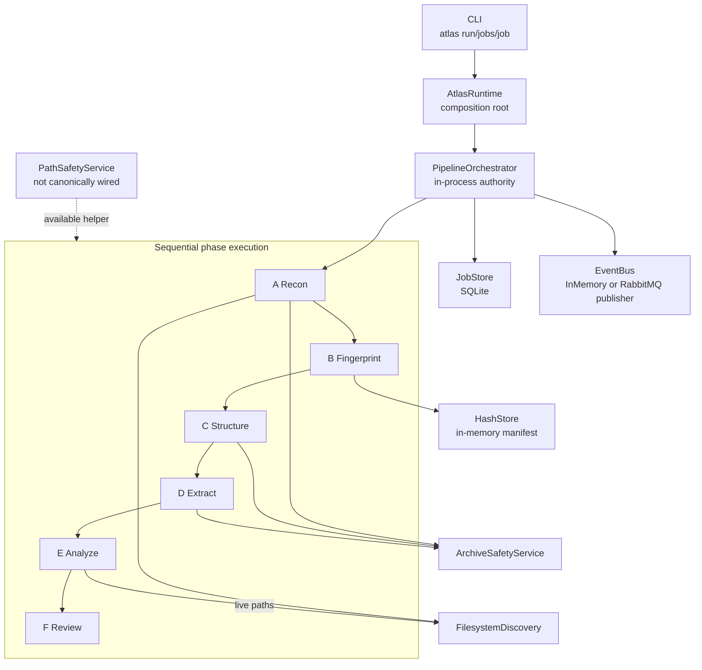
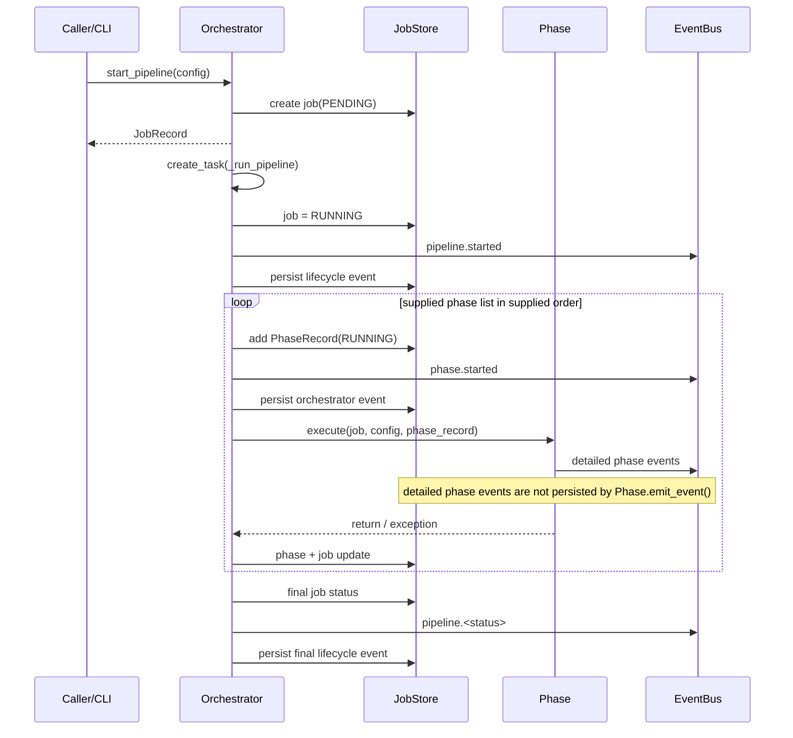
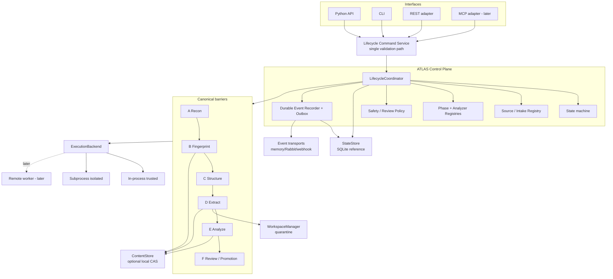
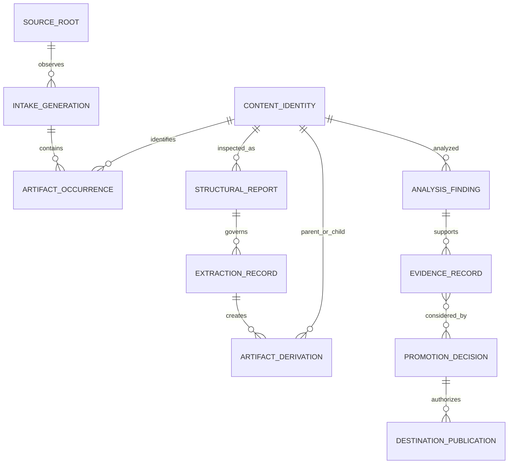
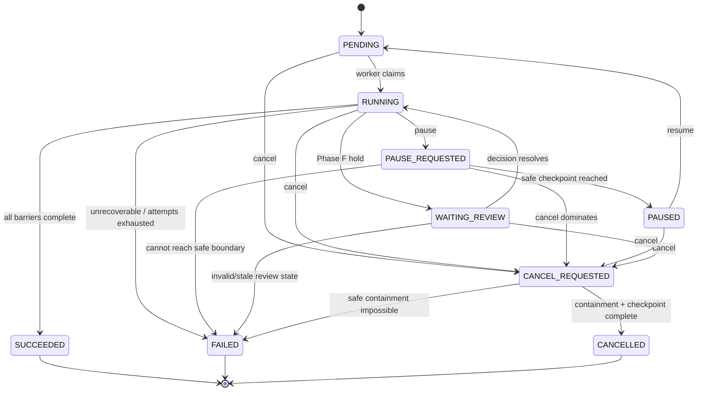
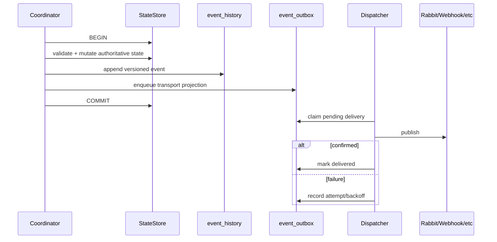
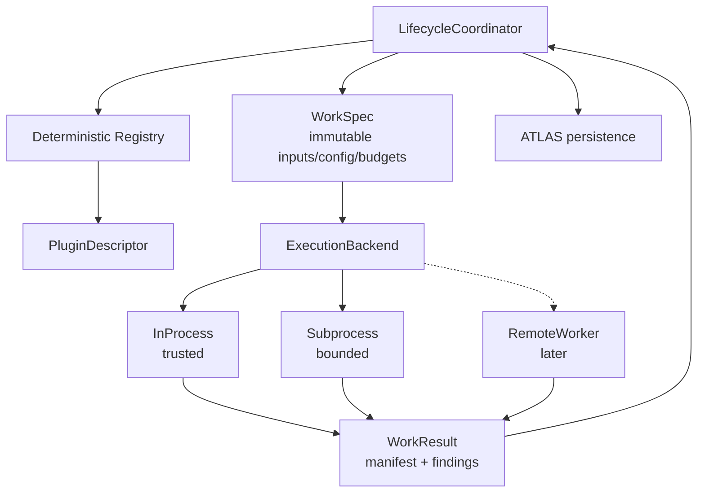
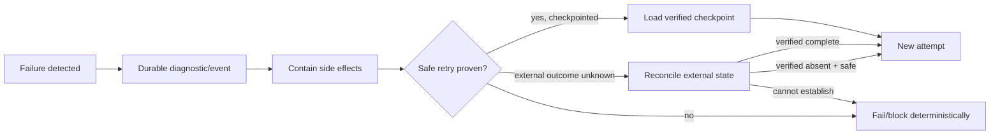

# ATLAS Evidence-Driven Architecture, Yggdrasil Integration, and Implementation Blueprint

- **Assessment date:** 2026-08-21
- **Assessment mode:** Read-only architecture and production-readiness review
- **Frozen ATLAS code baseline:** `efa547cafc64b58d60d19dcc1e5ba32c6b046bc5`
- **Frozen Yggdrasil donor baseline:** `2b0c51b6132c2a16e63fc2e2de2d2b4598b5fe40`
- **Recommended trajectory:** Hardened Sequential Lifecycle Engine → durable artifact lifecycle control plane
- **Implementation status:** Proposed only; no code or repository mutations performed
- **Evidence caveat:** See Section 2. Current ATLAS HEAD, live Yggdrasil source, and the original direction PDF require primary-source revalidation.

## Master Table of Contents

1. [Executive Summary](#1-executive-summary)
2. [Evidence and Baselines](#2-evidence-and-baselines)
3. [Current ATLAS Architecture](#3-current-atlas-architecture)
4. [PDF Requirements Extraction](#4-pdf-requirements-extraction)
5. [Current-State Gap Analysis](#5-current-state-gap-analysis)
6. [Yggdrasil Donor Assessment](#6-yggdrasil-donor-assessment)
7. [Architecture Options](#7-architecture-options)
8. [Recommended Target Architecture](#8-recommended-target-architecture)
9. [Target Data Model](#9-target-data-model)
10. [State Machine](#10-state-machine)
11. [Event Architecture](#11-event-architecture)
12. [Artifact and Provenance Architecture](#12-artifact-and-provenance-architecture)
13. [Plugin and Execution Architecture](#13-plugin-and-execution-architecture)
14. [Safety / Security / Governance Architecture](#14-safety-security-governance-architecture)
15. [Observability Architecture](#15-observability-architecture)
16. [Donor-Code Integration Map](#16-donor-code-integration-map)
17. [Repository Changeset Map](#17-repository-changeset-map)
18. [Architecture Decision Records](#18-architecture-decision-records)
19. [Implementation Roadmap](#19-implementation-roadmap)
20. [Detailed Task Specifications](#20-detailed-task-specifications)
21. [Test and Verification Strategy](#21-test-and-verification-strategy)
22. [Migration and Backwards Compatibility](#22-migration-and-backwards-compatibility)
23. [Failure / Recovery Matrix](#23-failure-recovery-matrix)
24. [Performance / Scale Plan](#24-performance-scale-plan)
25. [Security Threat Model](#25-security-threat-model)
26. [Release / Rollback Strategy](#26-release-rollback-strategy)
27. [Documentation Plan](#27-documentation-plan)
28. [Risk Register](#28-risk-register)
29. [Open Questions](#29-open-questions)
30. [Recommended Immediate Next Actions](#30-recommended-immediate-next-actions)

---
# 1. Executive Summary

**Assessment status.** The architectural conclusions below are frozen to the line-addressable ATLAS and Yggdrasil snapshots recorded in the attached assessment. Live verification on 2026-08-21 confirmed that ATLAS is publicly visible on `main`, but the available GitHub fetch path did not expose its exact current HEAD SHA; the referenced Yggdrasil URL returned 404; and the original 34-page direction document was not present as a separate attachment. Accordingly, ATLAS code/test claims retain their snapshot confidence, while donor and `[PDF:p.N]` claims require primary-source revalidation before implementation or code transplantation. See Section 2 and the evidence ledger.

ATLAS at the frozen baseline is **not** a workflow platform, task queue, durable workflow engine, content-addressable store, distributed worker system, or governance service. It is a **small, asynchronous, single-process, sequential artifact-processing kernel** with six named lifecycle phases, a canonical composition root, SQLite persistence for jobs/phases and selected lifecycle events, filesystem/archive safety helpers, streaming hashing, an in-process analyzer seam, and a conceptual review/promotion phase. **Confidence: High.** [ATLAS\:efa547cafc64b58d60d19dcc1e5ba32c6b046bc5\:atlas/core/runtime.py\:L35-L202] [ATLAS\:efa547cafc64b58d60d19dcc1e5ba32c6b046bc5\:atlas/core/orchestrator.py\:L25-L339]

The strongest existing architectural decision is the six-stage semantic spine:

`Reconnaissance → Fingerprinting → Structural Discovery → Controlled Extraction → Deep Understanding → Review / Promotion`

The weakest existing decision is that the code does **not actually enforce that semantic spine as an invariant**: `PipelineConfig.phases` accepts an arbitrary list/order, and the orchestrator executes exactly the supplied order. This permits configurations such as extraction-before-structure despite the architecture document explicitly defining Structural Discovery as the pre-materialization safety boundary. **Confidence: High.** [ATLAS\:efa547cafc64b58d60d19dcc1e5ba32c6b046bc5\:atlas/core/orchestrator.py\:L25-L68,L128-L220] [PDF\:p.29]

The product-direction document is internally coherent about ATLAS's intended destination: a **governed artifact lifecycle control plane**, not a generic scheduler or agent framework. Its invariant is not “task A happens before task B” in the abstract; it is that artifact knowledge and authority progress in ordered stages from occurrence, to byte identity, to structure, to controlled materialization, to findings/evidence, to an explicit trust decision. Pages 21 and 29 visually reinforce this by placing the control plane above bounded workers and preserving A–F inside every job. [PDF\:p.2] [PDF\:p.8] [PDF\:p.21] [PDF\:p.29] [PDF\:p.34]

The recommended trajectory is therefore **Option A — Hardened Sequential Lifecycle Engine**, extended into a durable local control plane while preserving bounded parallelism *inside* phase barriers. No generic DAG is justified. PostgreSQL, RabbitMQ worker dispatch, remote workers, object storage, MCP, multi-user IAM, and operator UI should remain later adapters until the local state machine, intake semantics, identity, recovery, and safety model are correct.

The P0 architecture should establish five invariants:

1. An accepted `IntakeGeneration` is an immutable **observation manifest**; downstream phases never rediscover the source independently.
2. `ArtifactOccurrence` identifies where bytes were observed; `ContentIdentity` identifies exact bytes. They are never interchangeable.
3. Every authoritative state transition is persisted atomically with its durable event; transports are downstream projections.
4. Any operation that can execute twice has an explicit idempotency/reconciliation contract.
5. A worker, plugin, AI model, CLI, API, or event transport can perform work but cannot independently mutate lifecycle authority.

The highest-consequence defects to correct first are:

| Finding | Classification | Consequence | Confidence |
| ------------------------------------------------------------------------------------------------------------------------------------- | ------------------------------------------ | ------------------------------------------------------------- | ---- |
| Missing/non-directory source can traverse all phases and finish `COMPLETED` because Recon records discovery errors without failing    | **IMPLEMENTED defect**                     | False-success pipeline                                        | High |
| Pipeline phase order is caller-controlled                                                                                             | **IMPLEMENTED defect**                     | Safety spine can be bypassed                                  | High |
| `continue_on_phase_error` is accepted by the CLI but ignored; `abort_on_error=False` can yield final `COMPLETED` after a failed phase | **IMPLEMENTED defect**                     | Ambiguous/incorrect final truth                               | High |
| Fingerprinting performs a new filesystem traversal instead of consuming Recon's exact occurrence set                                  | **IMPLEMENTED defect**                     | Source TOCTOU/provenance ambiguity                            | High |
| Hash identity is process-local; no persistent occurrence→content relationship exists                                                  | **PARTIALLY IMPLEMENTED**                  | No cross-run dedup or reproducible identity graph             | High |
| Pause/resume/cancel are in-memory execution controls; CLI explicitly hydrates stale state into a new process                          | **PARTIALLY IMPLEMENTED**                  | Cross-process control does not control the original execution | High |
| Detailed phase events are transport-only; only orchestrator lifecycle events go to SQLite                                             | **PARTIALLY IMPLEMENTED**                  | Incomplete durable reconstruction                             | High |
| Extraction writes adjacent to source archives, not into job quarantine                                                                | **IMPLEMENTED behavior / missing control** | Weak side-effect containment                                  | High |
| `ReviewPhase` builds transient promotion *candidates*, not durable approve/reject/hold decisions                                      | **PARTIALLY IMPLEMENTED**                  | No actual trust gate                                          | High |
| Archive nested depth is configured but not recursively enforced                                                                       | **PARTIALLY IMPLEMENTED**                  | Nested-container resource exhaustion                          | High |

Yggdrasil contains genuine donor value, but almost none of it should be copied wholesale. Its strongest reusable ideas are: deterministic capability registries, explicit source/occurrence/content separation, SQLite transaction ownership, checkpoints and idempotency keys, state-bound authorizations, immutable staging, no-replace commits, source-guard invalidation after mutation, replay reconciliation, generated-blob content addressing, and a strict distinction between repository capability and live deployment status. [YGGDRASIL:2b0c51b6132c2a16e63fc2e2de2d2b4598b5fe40\:app/domains/yggdrasil/runner/tool\_registry.py\:L1-L55] [YGGDRASIL:2b0c51b6132c2a16e63fc2e2de2d2b4598b5fe40\:app/domains/yggdrasil/release/filesystem.py\:L1-L240]

Its large governance plane, source-authority workflow, service identities, three-gate operator approval, AI work inbox, and release machinery should **not** become mandatory ATLAS core machinery. Those mechanisms solve deployment-governance problems beyond the compact lifecycle kernel and should be adapters or inspiration where consequential mutations justify them.

---

# 2. Evidence and Baselines

## Baseline freeze

This package distinguishes **live-access observations** from the **line-addressable frozen snapshot supplied in the attached assessment**. That distinction is necessary because the current public endpoints do not expose every primary source needed to independently re-run the entire review.

| Source | Live-access result on 2026-08-21 | Frozen line-level baseline used here | Authority and constraint |
|---|---|---|---|
| ATLAS | Public GitHub repository; default branch displayed as `main`; repository page displayed 35 commits and the expected `atlas/`, `tests/`, planning, examples, CI, README, TODO, and `pyproject.toml` surfaces | `efa547cafc64b58d60d19dcc1e5ba32c6b046bc5`, recorded by the attached assessment as 2026-08-10 16:49:33Z | **Primary implementation snapshot for this report.** The exact current live HEAD SHA was not recoverable through the available fetch path, so the report does not claim that the frozen SHA is today's HEAD. [EXT:GitHub ATLAS repository page:2026-08-21] |
| Yggdrasil | `https://github.com/Runndownn/Yggdrasil` returned HTTP 404; the owner's public repository page did not expose it | `2b0c51b6132c2a16e63fc2e2de2d2b4598b5fe40`, recorded by the attached assessment as a 2026-08-15 donor snapshot | **Secondary frozen donor evidence.** Path/symbol claims are retained for implementation planning but require revalidation against an archive or restored repository before code is copied or ported. [EXT:GitHub Yggdrasil URL:2026-08-21] |
| Product-direction document | No separate PDF/document was accessible among the current conversation attachments or matching File Library results | Attached assessment records a 34-page direction document and cites `[PDF:p.N]`; it states that the document references the ATLAS SHA above | **Secondary requirements extraction.** Page-level claims are preserved but are not represented as independently re-read in this run. The original document is required to close this evidence gap. |
| Attached assessment | Accessible as `Pasted markdown.md` | Uploaded 2026-08-21 | **Source assessment and evidence index.** It is not promoted above executable code; it supplies frozen paths, symbols, line ranges, document-page references, and prior reconstruction results. |

### Reproducibility declaration

- The analysis is frozen to the two recorded commit identifiers above for all line-addressable code claims.
- No repository file was modified, no branch/commit/pull request was created, and no implementation was performed.
- The frozen repositories were not executed in this environment. Runtime behavior is therefore a static control-flow reconstruction from code/tests represented in the attached evidence, not measured execution evidence.
- Current GitHub README content was used only as documentation evidence. It is not substituted for code or tests.
- Any future repository change must trigger a new baseline record; it must not be silently folded into this assessment.
- Before implementation, the engineering team should obtain immutable repository archives for both SHAs, record SHA-256 archive digests, and execute the characterization/test program in AT-001.

## Evidence status and confidence

| Evidence class | How it is used | Maximum confidence in this package |
|---|---|---|
| Frozen ATLAS code/test path + symbol + line citation | Current-state implementation and defect reconstruction | High when causality is direct; Medium where runtime/environment behavior remains unexecuted |
| Live ATLAS repository page | Default branch, public visibility, repository perimeter, documentation statements | High for the page observation; not proof of implementation |
| Frozen Yggdrasil path + symbol + line citation from attached assessment | Donor capability and integration planning | Medium until the donor snapshot is independently restored |
| `[PDF:p.N]` citation from attached assessment | Desired-direction requirement and principle | Medium for internally consistent requirements; Low where exact wording or diagram interpretation matters |
| README/TODO/diagram/comment | Documented or planned behavior only | Never implementation proof |
| Engineering inference | Target architecture, missing invariant, or recommended capability | Explicitly labeled; requires validation |
| Benchmark/SLO claim | Not accepted without retained raw measurements | Unresolved until AT-024 evidence exists |

## Evidence hierarchy

The assessment applies the requested hierarchy:

1. frozen executable ATLAS code and tests;
2. ATLAS schemas, configuration, packaging, CI, and behavior directly implied by code;
3. current ATLAS architecture documentation;
4. ATLAS planning/TODO material;
5. product-direction requirements as extracted from the attached assessment;
6. frozen Yggdrasil donor evidence;
7. current authoritative external technical documentation where needed;
8. engineering inference.

The following labels remain distinct:

- **IMPLEMENTED**
- **PARTIALLY IMPLEMENTED**
- **DOCUMENTED ONLY**
- **PLANNED**
- **DONOR CAPABILITY**
- **INFERRED REQUIREMENT**
- **RECOMMENDED NEW CAPABILITY**
- **REJECTED / NOT JUSTIFIED**

## Evidence ledger conventions

Important claims use forms equivalent to:

- `[ATLAS:<commit>:path:Lx-Ly]`
- `[ATLAS-TEST:<commit>:path:Lx-Ly]`
- `[YGGDRASIL:<commit>:path:Lx-Ly]`
- `[YGGDRASIL-TEST:<commit>:path:Lx-Ly]`
- `[PDF:p.N]`
- `[EXT:<source>:2026-08-21]`
- `[INFERENCE:<reason>]`

The companion `ATLAS_Evidence_Ledger.csv` records stable evidence IDs, status, source, observation, implication, confidence, and required follow-up.

## Unverified or inaccessible evidence

The following are explicitly unresolved:

1. ATLAS's exact current live HEAD SHA and whether it differs from the frozen assessment SHA.
2. The current/default branch and present state of the inaccessible Yggdrasil repository.
3. Independent verification of every Yggdrasil donor path and symbol.
4. The original product-direction PDF/document, its version/date, metadata, exact page text, and diagrams.
5. Runtime behavior under the stated Python, operating-system, filesystem, RabbitMQ, corruption, crash, and concurrency conditions.
6. CI status for the exact frozen SHAs.
7. Generated, binary, vendored, or external-service behavior not represented in the frozen evidence.

These limitations reduce confidence; they do not justify filling gaps with assumptions.

---

# 3. Current ATLAS Architecture

## Repository census

ATLAS is compact:

| Area | Current contents | Assessment |
| ------------------------------ | ------------------------------------------------------------------------------------------------- | ---------------------------------------------- |
| Composition/runtime            | `atlas/core/runtime.py`                                                                           | **IMPLEMENTED**                                |
| Orchestration                  | `atlas/core/orchestrator.py`                                                                      | **IMPLEMENTED**                                |
| Persistence                    | `atlas/core/job_store.py`                                                                         | **IMPLEMENTED**, narrow                        |
| Events                         | `atlas/core/event_bus.py`                                                                         | **PARTIALLY IMPLEMENTED**                      |
| Lifecycle phases               | `atlas/phases/{reconnaissance,fingerprinting,structural_discovery,extraction,analysis,review}.py` | **IMPLEMENTED**, semantics incomplete          |
| Safety                         | `atlas/safety/{filesystem_discovery,archive_safety,path_safety}.py`                               | **PARTIALLY IMPLEMENTED**                      |
| Identity/storage               | `atlas/storage/hash_store.py`                                                                     | **PARTIALLY IMPLEMENTED** hashing, **not CAS** |
| Schema                         | `atlas/schema/__init__.py`                                                                        | **DOCUMENTED ONLY** as migration package       |
| CLI                            | `atlas/cli.py`                                                                                    | **IMPLEMENTED**                                |
| API/daemon/workers             | absent                                                                                            | **PLANNED**                                    |
| Migrations                     | absent                                                                                            | **PLANNED**                                    |
| Tests                          | nine current test modules                                                                         | **IMPLEMENTED**, mostly happy-path/unit        |
| CI                             | `.github/workflows/tests.yml`                                                                     | **IMPLEMENTED**, test-only Linux/Python 3.13   |
| Planning                       | README, TODO, `docs/08-planning/...`                                                              | secondary evidence                             |

`atlas/schema/__init__.py` describes “SQLite migrations with rollback support” but merely re-exports `_DB_SCHEMA`; there is no migration mechanism. This is a direct documentation/code contradiction. [ATLAS\:efa547cafc64b58d60d19dcc1e5ba32c6b046bc5\:atlas/schema/**init**.py\:L1-L9]

## Current architecture diagram



### Runtime composition

`AtlasRuntime` constructs one `JobStore`, one event bus, shared discovery/archive/hash services, and all six handlers. It is correctly a composition root. However:

- `PathSafetyService` is declared as a lazy slot but not constructed or injected into the phases.
- `AnalysisPhase` does not receive the runtime's shared `HashStore`.
- `connect()` initializes the job store but does not invoke `RabbitMQEventBus.connect()`.
- late handler registration mutates the orchestrator asynchronously or reaches into its private handler map.

[ATLAS\:efa547cafc64b58d60d19dcc1e5ba32c6b046bc5\:atlas/core/runtime.py\:L35-L202]

### Execution model

ATLAS is asynchronous at the job/task level but **sequential inside a job**. `start_pipeline()` creates and persists a job, then starts `_run_pipeline()` with `asyncio.create_task()`. `_run_pipeline()` iterates the supplied phase list directly. There is no DAG, task dependency graph, fan-in/fan-out engine, scheduler, distributed queue, attempt model, or compensation engine. [ATLAS\:efa547cafc64b58d60d19dcc1e5ba32c6b046bc5\:atlas/core/orchestrator.py\:L101-L220]

### Current execution flow



### State model

Current job states:

`pending, running, paused, completed, error, cancelled`

The same enum values are reused as phase statuses even though phase and job semantics differ.

The transition graph is not encoded as a transition table. Mutating methods contain local checks. No attempt state exists. `retryable` exists on `Phase` but the orchestrator does not consume it. [ATLAS\:efa547cafc64b58d60d19dcc1e5ba32c6b046bc5\:atlas/phases/base.py\:L27-L72]

Pause/cancel are cooperative only at **phase boundaries** because `_run_pipeline()` tests `job.status` only before starting each phase. A long-running handler does not poll durable control state. Resume starts `_run_pipeline()` again from the current phase, which can repeat its side effects. [ATLAS\:efa547cafc64b58d60d19dcc1e5ba32c6b046bc5\:atlas/core/orchestrator.py\:L139-L146,L224-L283]

### Persistence

`JobStore` creates three inline tables:

- `atlas_jobs`
- `atlas_phases`
- `atlas_events`

Each create/update commits independently. There is no schema-version table, migration engine, attempt table, checkpoint table, control-request table, source registry, occurrence table, content-identity table, finding/evidence table, or publication table. State changes and event insertion do not share a transaction. [ATLAS\:efa547cafc64b58d60d19dcc1e5ba32c6b046bc5\:atlas/core/job\_store.py\:L19-L65,L172-L350]

The schema declares a foreign key from phases to jobs, but the connection code does not explicitly establish foreign-key enforcement. Therefore FK enforcement is **not demonstrated by ATLAS code**.

### Events

There are two different event classes in practice:

- orchestrator lifecycle events: published and then separately written to SQLite;
- phase detail events: published only.

Persistence failure is swallowed after the transport publish. A job can therefore transition successfully while its corresponding durable event fails. [ATLAS\:efa547cafc64b58d60d19dcc1e5ba32c6b046bc5\:atlas/core/orchestrator.py\:L298-L339]

The in-memory bus has named queues plus subscriber queues. Its default named queue has no bound; subscriber overflow drops the oldest event. RabbitMQ is a fan-out publisher with optional memory fallback; there is no RabbitMQ consumer, offset, delivery reconciliation, DLQ, or durable outbox. [ATLAS\:efa547cafc64b58d60d19dcc1e5ba32c6b046bc5\:atlas/core/event\_bus.py\:L24-L230]

### Phase reconstruction

| Phase | Actual behavior | Status |
| -------------------------- | ---------------------------------------------------------------------------------------------- | ------------------------- |
| A Recon                    | Live tree traversal, risk flags, archive assessments, summary metadata                         | **IMPLEMENTED**           |
| B Fingerprint              | Performs a second live traversal and streams hashes into an in-memory manifest                 | **PARTIALLY IMPLEMENTED** |
| C Structural               | Shallow ZIP/TAR structural assessment; nested archives counted, not recursively inspected      | **PARTIALLY IMPLEMENTED** |
| D Extraction               | Reassesses archive and writes next to source into `<stem>_extracted`                           | **PARTIALLY IMPLEMENTED** |
| E Analysis                 | Operates primarily on `risky_files`; arbitrary in-process plugins return dictionaries          | **PARTIALLY IMPLEMENTED** |
| F Review                   | Generates ephemeral evidence/promotion candidates and stores samples/summaries in job metadata | **PARTIALLY IMPLEMENTED** |

Evidence: [ATLAS\:efa547cafc64b58d60d19dcc1e5ba32c6b046bc5\:atlas/phases/reconnaissance.py\:L20-L111] [ATLAS\:efa547cafc64b58d60d19dcc1e5ba32c6b046bc5\:atlas/phases/fingerprinting.py\:L20-L136] [ATLAS\:efa547cafc64b58d60d19dcc1e5ba32c6b046bc5\:atlas/phases/structural\_discovery.py\:L21-L145] [ATLAS\:efa547cafc64b58d60d19dcc1e5ba32c6b046bc5\:atlas/phases/extraction.py\:L20-L181] [ATLAS\:efa547cafc64b58d60d19dcc1e5ba32c6b046bc5\:atlas/phases/analysis.py\:L18-L134] [ATLAS\:efa547cafc64b58d60d19dcc1e5ba32c6b046bc5\:atlas/phases/review\.py\:L19-L236]

### Data authority today

| Record | Persistence | Authority today |
| -------------------------------- | ---------------------------------------------- | ----------------------------------------------------------------- |
| `JobRecord`                      | SQLite + live object                           | Split: live orchestrator controls execution; DB records snapshots |
| `PhaseRecord`                    | SQLite                                         | Persisted phase snapshot                                          |
| orchestrator event               | SQLite + bus                                   | Durable history, but not transactional with state                 |
| phase event                      | bus only                                       | Ephemeral                                                         |
| `FileInfo`                       | memory                                         | Ephemeral                                                         |
| source occurrence                | absent                                         | —                                                                 |
| content hash                     | memory + flattened content IDs in job metadata | Derived, not durable identity model                               |
| extracted artifact               | filesystem                                     | External side effect; count only in metadata                      |
| analysis finding                 | first 50 embedded in job metadata              | Derived/truncated                                                 |
| `EvidenceRecord`                 | temporary dataclass/sample                     | Not first-class                                                   |
| `PromotionRecord`                | temporary dataclass/sample                     | Not a trust decision                                              |
| publication                      | absent                                         | —                                                                 |

### Trust boundaries

ATLAS crosses the following boundaries:

- untrusted pipeline YAML/JSON → `_load_pipeline()`; YAML uses `safe_load`;
- user-controlled `source_path` → filesystem traversal;
- symlink and mount topology → `FilesystemDiscovery`;
- untrusted ZIP/TAR metadata → `ArchiveSafetyService`;
- archive members → extraction filesystem;
- source path → hashing;
- live artifact path → analyzer plugin;
- analyzer plugin → same Python process and host authority;
- runtime → SQLite;
- runtime → optional RabbitMQ;
- extraction → source-adjacent directories.

The largest unclosed boundaries are source mutation between phases, source/path TOCTOU, plugin authority, archive recursion, temporary/workspace containment, and publication authority.

---

# 4. PDF Requirements Extraction

**Primary-source limitation.** This section preserves the requirements matrix and page references extracted in the attached assessment. The original direction PDF/document was not independently accessible in this run. Each `[PDF:p.N]` statement is therefore a **document-derived hypothesis from the frozen assessment**, not a newly verified quotation. Before implementation begins, re-run this matrix against the original document and record any wording, diagram, priority, or baseline differences as requirement changes rather than silently reconciling them.

The document's central requirement is not additional orchestration capability. It is **semantic durability**. [PDF\:p.2]

## Requirements matrix

| ID | Requirement / Idea | Source | Explicit / Inferred | Current ATLAS Support | Gap / Architectural Impact | Priority |
| ------------------------------------------------------------------------- | ------------------------------------------------------------------------------- | ------------- | -------- | ------------------------------- | ------------------------------------------------------------------------ | ----- |
| REQ-001                                                                   | ATLAS remains artifact-lifecycle-specific, not generic workflow/agent framework | p.2-3,34      | Explicit | Partial                         | Core naming still generic; phase list can act as arbitrary mini-workflow | P0    |
| REQ-002                                                                   | Six phases remain ordered semantic spine                                        | p.2,5,29,34   | Explicit | Partial                         | Ordering not enforced                                                    | P0    |
| REQ-003                                                                   | Recon emits immutable `IntakeGeneration`                                        | p.6,12        | Explicit | None                            | Downstream re-traverses mutable source                                   | P0    |
| REQ-004                                                                   | Occurrence/location distinct from byte identity                                 | p.6,8,16,31   | Explicit | None                            | Paths/hashes flattened into metadata                                     | P0    |
| REQ-005                                                                   | Persistent cross-run content identity/dedup                                     | p.6,12        | Explicit | Partial                         | HashStore process-local                                                  | P0    |
| REQ-006                                                                   | Typed/enforced phase configuration                                              | p.10,12       | Explicit | None                            | `phase_config` stored but ignored                                        | P0    |
| REQ-007                                                                   | One error-policy contract                                                       | p.10,12       | Explicit | None                            | continue/abort overlap                                                   | P0    |
| REQ-008                                                                   | Durable live progress                                                           | p.10,12       | Explicit | Partial                         | phase progress written only after handler return                         | P0    |
| REQ-009                                                                   | Structure inspection precedes materialization                                   | p.13,23,29    | Explicit | Partial                         | sequence configurable; D reassesses live source independently            | P0    |
| REQ-010                                                                   | Per-job quarantine workspace                                                    | p.7,13,23     | Explicit | None                            | source-adjacent extraction                                               | P0    |
| REQ-011                                                                   | One canonical path/archive policy                                               | p.13          | Explicit | Partial                         | PathSafety exists but is not canonical runtime service                   | P0    |
| REQ-012                                                                   | Recursive bounded nested-container inspection                                   | p.6,13        | Explicit | None                            | only nested count                                                        | P0    |
| REQ-013                                                                   | Durable detailed events                                                         | p.10,13,23    | Explicit | Partial                         | phase events transient                                                   | P0    |
| REQ-014                                                                   | Long-running owner for active jobs                                              | p.14          | Explicit | None                            | CLI process owns job                                                     | P0    |
| REQ-015                                                                   | Persisted control requests                                                      | p.14          | Explicit | None                            | process-local controls                                                   | P0    |
| REQ-016                                                                   | Cooperative control/checkpoints                                                 | p.14          | Explicit | None                            | boundary-only polling, no checkpoints                                    | P0    |
| REQ-017                                                                   | Retry/backoff/timeout/idempotency/crash recovery                                | p.15          | Explicit | None/partial declarations       | `retryable` not used                                                     | P1    |
| REQ-018                                                                   | Versioned migrations                                                            | p.15          | Explicit | None                            | inline schema only                                                       | P1    |
| REQ-019                                                                   | Persistent findings/evidence/reviews/promotions/publications                    | p.16          | Explicit | Conceptual only                 | no tables/contracts                                                      | P1    |
| REQ-020                                                                   | Evidence type remains explicit                                                  | p.7,16,23     | Explicit | Partial                         | four evidence labels exist, but transient                                | P1    |
| REQ-021                                                                   | Analyzer registry + normalized finding envelope                                 | p.17          | Explicit | Minimal protocol                | arbitrary dictionaries                                                   | P1    |
| REQ-022                                                                   | Analyzer capability/resource declarations and isolation                         | p.17          | Explicit | None                            | same-process unrestricted plugins                                        | P1    |
| REQ-023                                                                   | Versioned analyzer/tool/model attribution                                       | p.17          | Explicit | None                            | plugin name only                                                         | P1    |
| REQ-024                                                                   | Complete RabbitMQ semantics                                                     | p.18          | Explicit | Partial                         | publisher/fallback only                                                  | P1    |
| REQ-025                                                                   | REST/MCP/webhooks cannot bypass lifecycle                                       | p.18          | Explicit | Not present                     | requires shared command layer before interfaces                          | P1/P2 |
| REQ-026                                                                   | PostgreSQL/object storage/workers only after semantic stability                 | p.19-20,27    | Explicit | Not present                     | deliberately defer                                                       | P2    |
| REQ-027                                                                   | AI may analyze/propose but not own provenance/safety/promotion                  | p.22,34       | Explicit | No AI runtime                   | architectural constraint for future plugins                              | P1+   |
| REQ-028                                                                   | Publications trace bidirectionally to exact source bytes                        | p.16,28,31    | Explicit | None                            | lineage model absent                                                     | P1    |
| REQ-029                                                                   | Exact bytes/analyzer/config/events/checkpoints support reproducibility          | p.28          | Explicit | Partial                         | current source may disappear/change; config/results incomplete           | P1    |
| REQ-030                                                                   | Scale changes infrastructure, not meaning                                       | p.19-21,30,34 | Explicit | Architectural future constraint | must be preserved in APIs/workers/stores                                 | P2    |

### Document ambiguity

Page 16 presents the full lineage:

`SourceRoot → IntakeGeneration → ArtifactOccurrence → ContentIdentity → StructuralReport → ExtractionRecord → AnalysisFinding → EvidenceRecord → PromotionDecision → DestinationPublication`.

The page-31 visual omits `StructuralReport` and `ExtractionRecord`. [PDF\:p.16] [PDF\:p.31] I treat page 31 as a simplified illustration, because page 16 explicitly names those records and page 28 separately requires tracing container/extraction lineage. Confidence: Medium-High.

The term “immutable intake” should **not** be interpreted as an atomic filesystem snapshot unless the source backend actually provides snapshot semantics. The defensible interpretation is an immutable observation manifest plus later byte-verification/capture. [INFERENCE: arbitrary filesystems do not become immutable merely because ATLAS recorded paths.]

---

# 5. Current-State Gap Analysis

## Implementation defects

| Gap | Evidence → Observable Impact | Root Cause | Correction | Verification Method |
| --------------------------------------------------------------- | ------------------------------------------------------------------------------------------------------------------------- | ---------------------------------------------------- | ---------------------------------------------------------------------------- | ------------------------------------------------------- |
| GAP-001 False success on invalid source                         | Recon converts missing path into `errors` rather than raising → all later phases can no-op and job completes              | Discovery error and phase failure conflated          | Intake acceptance requires valid root and explicit completeness              | E2E missing/permission-denied root must `FAILED`        |
| GAP-002 Phase order bypass                                      | Orchestrator loops caller phases directly → extraction can precede structure                                              | Phase list treated as workflow definition            | Validate canonical A-F order; skipped phase is a recorded state, not reorder | Property test all invalid permutations                  |
| GAP-003 Failure policy ambiguity                                | CLI accepts `continue_on_phase_error`; orchestrator only checks `abort_on_error`; non-abort failures can finish completed | Two competing flags                                  | `FailurePolicy` enum/schema                                                  | Matrix tests all policies                               |
| GAP-004 Source re-discovery                                     | Fingerprint and some structural paths run new discovery → source occurrence set can drift                                 | Job metadata only stores summary                     | Persistent IntakeGeneration + occurrences                                    | Mutate source between A/B; job detects stale occurrence |
| GAP-005 No persistent dedup                                     | `HashStore._manifest` is in-process                                                                                       | Hash utility mislabeled store                        | `content_identities` table + optional blob store                             | Restart and reprocess duplicate bytes                   |
| GAP-006 Progress not live-durable                               | `update_progress()` mutates bound phase object but does not persist immediately                                           | Phase has no durable execution context               | `ExecutionContext.report_progress()` → state store                           | second process observes progress while phase still runs |
| GAP-007 Cross-process controls nonfunctional                    | CLI hydrates DB record into a new orchestrator                                                                            | Active runtime ownership absent                      | durable control table + daemon                                               | process B pauses job executing in process A             |
| GAP-008 Resume can repeat side effects                          | current phase is restarted                                                                                                | no attempts/checkpoints/idempotency                  | attempts + checkpoint/reconciliation                                         | crash at every side-effect boundary                     |
| GAP-009 Event/state non-atomic                                  | state commit and event commit separate; event failure swallowed                                                           | event bus and store composed after fact              | transactional state+history+outbox                                           | fault-inject after transition write                     |
| GAP-010 Rabbit runtime connection gap                           | `AtlasRuntime.connect()` does not connect Rabbit bus                                                                      | transport lifecycle not part of composition contract | transport start/stop lifecycle                                               | integration broker test                                 |
| GAP-011 Review is not governance                                | candidate objects created automatically; no durable approve/reject/hold                                                   | F implemented as summary generator                   | persistent `PromotionDecision`                                               | reject/hold/approve E2E                                 |
| GAP-012 Unsafe extraction containment                           | output beside source archive                                                                                              | no workspace manager                                 | per-job quarantine manager                                                   | assert no Phase-D write under source root               |
| GAP-013 Nested depth unenforced                                 | `max_nested_depth` stored but unused                                                                                      | shallow inspector                                    | recursive work queue + global budgets                                        | nested depth/bomb tests                                 |
| GAP-014 Plugin authority unrestricted                           | arbitrary Python plugin runs in runtime process against live path                                                         | plugin protocol contains no capability boundary      | descriptors + mediated context/backends                                      | hostile test plugin                                     |
| GAP-015 Analysis truncation                                     | only first 50 findings persisted in metadata                                                                              | metadata used as result store                        | findings table                                                               | >50 findings losslessness test                          |

Primary implementation evidence: [ATLAS:efa547cafc64b58d60d19dcc1e5ba32c6b046bc5:atlas/core/runtime.py:L35-L202] [ATLAS:efa547cafc64b58d60d19dcc1e5ba32c6b046bc5:atlas/core/orchestrator.py:L25-L339] [ATLAS:efa547cafc64b58d60d19dcc1e5ba32c6b046bc5:atlas/core/job_store.py:L19-L350] [ATLAS:efa547cafc64b58d60d19dcc1e5ba32c6b046bc5:atlas/core/event_bus.py:L24-L230] [ATLAS:efa547cafc64b58d60d19dcc1e5ba32c6b046bc5:atlas/storage/hash_store.py:L34-L63] [ATLAS:efa547cafc64b58d60d19dcc1e5ba32c6b046bc5:atlas/phases/reconnaissance.py:L20-L111] [ATLAS:efa547cafc64b58d60d19dcc1e5ba32c6b046bc5:atlas/phases/fingerprinting.py:L20-L136] [ATLAS:efa547cafc64b58d60d19dcc1e5ba32c6b046bc5:atlas/phases/extraction.py:L20-L181] [ATLAS:efa547cafc64b58d60d19dcc1e5ba32c6b046bc5:atlas/phases/review.py:L19-L236].

## Architecture debt

The largest architecture debt is `JobRecord.metadata`. It currently functions simultaneously as phase configuration, inter-phase data bus, result store, evidence summary, compatibility surface, and persistence document. This gives no owner to occurrence identity, structural reports, findings, or promotion decisions.

`PathSafetyService` is another example: its standalone design is reasonable, but it is not the authoritative route through which all filesystem operations pass. README language claiming that “all filesystem operations go through the safety layer” is therefore stronger than executable evidence. [ATLAS\:efa547cafc64b58d60d19dcc1e5ba32c6b046bc5\:atlas/safety/path\_safety.py\:L26-L146] [ATLAS\:efa547cafc64b58d60d19dcc1e5ba32c6b046bc5\:README.md]

## Documentation/planning drift

README currently calls the storage layer “content-addressable” and describes automatic deduplication, while `HashStore` explicitly says a full blob store is future work and keeps `_manifest` in memory. [ATLAS\:efa547cafc64b58d60d19dcc1e5ba32c6b046bc5\:atlas/storage/hash\_store.py\:L34-L63]

README says Slice 6 delivered “Config schema validation”; current `_build_pipeline_config()` performs extraction/coercion but there is no versioned schema or validation model, and phase-specific settings remain unconsumed. [ATLAS\:efa547cafc64b58d60d19dcc1e5ba32c6b046bc5\:atlas/cli.py\:L42-L91]

README says `Phase.update_progress()` updates PhaseRecord **and JobRecord**. The implementation updates `PhaseProgress` and `PhaseRecord`, not the job. [ATLAS\:efa547cafc64b58d60d19dcc1e5ba32c6b046bc5\:atlas/phases/base.py\:L76-L108]

README's project tree says “7 phases,” while the repository implements six.

README/TODO timelines include implementation dates extending beyond the frozen commit and beyond the current assessment date; those are planning claims, not evidence of implementation.

The older `docs/.../assessment.md` froze an earlier ATLAS commit and documents defects subsequently fixed at the current SHA—for example, the formerly missing independent Structural Discovery implementation. It is valuable history, not current truth.

## Test-quality gaps

Existing tests establish that the composition root wires six handlers and that a happy-path local fixture reaches completion. They do not prove recovery or semantic correctness under mutation. [ATLAS-TEST\:efa547cafc64b58d60d19dcc1e5ba32c6b046bc5\:tests/test\_runtime.py\:L18-L144]

One orchestrator test asserts `len(jobs) >= 0`, which can never fail for a list. [ATLAS-TEST\:efa547cafc64b58d60d19dcc1e5ba32c6b046bc5\:tests/test\_orchestrator.py\:L103-L111]

Missing high-value tests include:

- legal/illegal state transitions;
- invalid phase order;
- missing source;
- source mutation A→B;
- crash after each external write;
- replay/idempotency;
- stale worker/fencing;
- concurrent jobs against SQLite;
- actual archive write budgets;
- nested archive recursion;
- cross-mount traversal;
- malicious plugin;
- DB migration/rollback;
- RabbitMQ outage/recovery;
- publication partial failure.

---

# 6. Yggdrasil Donor Assessment

**Primary-source limitation.** The live Yggdrasil URL returned 404 on 2026-08-21. This donor analysis is frozen to commit `2b0c51b6132c2a16e63fc2e2de2d2b4598b5fe40` and the path/symbol evidence captured in the attached assessment. Treat every donor disposition as implementation-planning evidence that must be revalidated against an immutable donor archive before REUSE, ADAPT, or REIMPLEMENT work starts. No copy-and-paste transplantation is authorized by this report.

Yggdrasil's current tree contains both older service-oriented code and a newer governed-control-plane layer. The latter is the useful donor source; the former frequently duplicates or underperforms current ATLAS behavior.

| Donor mechanism | Evidence / capability | Disposition | Reason |
| ------------------------------------------------------------- | ----------------------------------------------- | --------------------------- | -------------------------------------------------------------- |
| `governance.registry.OperationDefinition` + capability status | deterministic IDs/status/capabilities           | **ADAPT**                   | Strong “implemented ≠ deployed” semantics                      |
| `governance.store.ControlPlaneStore` as a whole               | very broad SQLite governance store              | **REIMPLEMENT**             | Valuable invariants; too monolithic/domain-coupled             |
| SQLite `BEGIN IMMEDIATE`, WAL, transaction ownership          | explicit transaction helper                     | **ADAPT**                   | Directly valuable for ATLAS durability                         |
| State-bound review/decision/authorization                     | exact digests, one-use auth                     | **OPTIONAL EXTENSION**      | Useful for consequential publication; excessive for Recon/hash |
| Source guards                                                 | root locator/device/inode/policy binding        | **ADAPT**                   | Useful guard, but not content snapshot                         |
| `inventory.policy.InventoryPolicy`                            | strict typed policy                             | **ADAPT**                   | Pattern fits typed phase config                                |
| deterministic inventory generations/work/checkpoints          | durable generation + accepted HEAD              | **ADAPT**                   | Direct match to `IntakeGeneration`                             |
| `CanonicalContent` / `FileOccurrence` separation              | Pydantic + PostgreSQL models                    | **ADAPT**                   | Core semantic match                                            |
| generated evidence blob content addressing                    | SHA-256, staged write, immutable key            | **ADAPT**                   | Useful local CAS pattern                                       |
| `release.filesystem.resolve_beneath`                          | symlink/mount checks                            | **REIMPLEMENT**             | Check-then-open TOCTOU and Linux assumptions remain            |
| `copy_and_hash`                                               | exclusive destination, hash verification, fsync | **ADAPT**                   | Good destination/write invariant                               |
| `rename_noreplace`                                            | Linux `renameat2`                               | **REIMPLEMENT**             | Good semantic requirement; implementation not portable         |
| baseline snapshot manifest binding                            | exact content manifests                         | **ADAPT**                   | Useful; avoid two full source passes                           |
| candidate stage hidden staging + replay reconciliation        | verify then no-replace commit                   | **ADAPT**                   | Excellent model for extraction/publication side effects        |
| hash-chained event history                                    | previous/event digest                           | **OPTIONAL EXTENSION**      | Tamper evidence useful; not prerequisite to reliable events    |
| AI inbox with leases/schema validation                        | bounded AI work                                 | **OPTIONAL EXTENSION**      | Future analyzer backend, not core authority                    |
| governed FastAPI routes                                       | strict request models/gated operations          | **DEFER**                   | API follows durable semantics, not precedes them               |
| PostgreSQL knowledge projection                               | explicitly non-authoritative projection         | **DEFER**                   | Good separation, unnecessary locally                           |
| old `services/orchestrator_service.py`                        | process-local six-stage service                 | **REJECT**                  | No semantic advantage over ATLAS                               |
| old discovery/hash/archive services                           | older equivalents                               | **REJECT**                  | Current ATLAS already has equal/better local primitives        |
| knowledge-fabric documents/taxonomies/classification tables   | knowledge domain                                | **REJECT**                  | PDF explicitly assigns this downstream                         |
| authentication/RBAC/multi-tenancy core                        | deployment controls                             | **OPTIONAL EXTENSION**      | Document says stripped intentionally                           |
| three approval gates around metadata-only inventory           | operator governance                             | **REJECT** for default core | Harmless local inventory should not require ceremony           |

A particularly good donor principle appears in `tool_registry.py`: source definitions describe candidate capability but do not assert actual deployment state. [YGGDRASIL:2b0c51b6132c2a16e63fc2e2de2d2b4598b5fe40\:app/domains/yggdrasil/runner/tool\_registry.py\:L1-L55]

Yggdrasil's registered executor likewise separates operation ID, task type/version, handler, payload-read ability, source mutation, and processing lane. [YGGDRASIL:2b0c51b6132c2a16e63fc2e2de2d2b4598b5fe40\:app/domains/yggdrasil/runner/registered\_executor.py\:L1-L59]

Yggdrasil's optional PostgreSQL schema also demonstrates the right authority rule: its header explicitly says the SQLite governance/control plane remains authoritative and PostgreSQL is a projection. [YGGDRASIL:2b0c51b6132c2a16e63fc2e2de2d2b4598b5fe40\:app/domains/yggdrasil/schemas/yggdrasil\_schema.sql\:L1-L12]

---

# 7. Architecture Options

| Factor | A — Hardened Sequential Lifecycle | B — Generalized Artifact Workflow Runtime | C — Distributed Governed Platform |
| ----------------------------------------------------------------------------------------------------------------- | ------------------------- | ----------------------------- | ------------------------------------- |
| Product-document fit                                                                                              | **Very high**             | Medium                        | High end-state, low near-term         |
| Preserves A-F semantics                                                                                           | Native                    | Requires extra rules          | Requires central authority discipline |
| P0 implementation complexity                                                                                      | Lowest                    | Medium-high                   | Highest                               |
| Operational complexity                                                                                            | Low                       | Medium                        | High                                  |
| Recovery model                                                                                                    | Clear phase/attempt model | Harder with graph edges       | Hardest: graph + distributed failure  |
| Migration from current ATLAS                                                                                      | Incremental               | Significant semantic redesign | Major                                 |
| Backwards compatibility                                                                                           | Best                      | Moderate                      | Lowest                                |
| Local execution                                                                                                   | First-class               | First-class                   | Often secondary                       |
| Distributed future                                                                                                | Adapter-compatible        | Natural                       | Native                                |
| Failure surface                                                                                                   | Smallest                  | Larger                        | Largest                               |
| Generic DAG temptation                                                                                            | None                      | Significant                   | Significant                           |
| Security containment                                                                                              | Easier to prove           | More dynamic paths            | Requires worker/service auth          |
| Current evidence justifies it                                                                                     | **Yes**                   | No                            | Not yet                               |

## Selected trajectory: Option A

**Decision: Hardened Sequential Lifecycle Engine → durable artifact lifecycle control plane.**

“Sequential” applies to **semantic barriers**, not necessarily CPU scheduling. Within one phase ATLAS may process many occurrences/analyzers concurrently, but Phase N+1 cannot consume unaccepted Phase N+1 semantics before the prior barrier is satisfied.

This gives ATLAS most of the useful performance properties of a task system without turning artifact lifecycle truth into an arbitrary graph.

Option B is **REJECTED / NOT JUSTIFIED** now because no current/document requirement requires arbitrary cross-phase dependencies or user-defined topology.

Option C is **DEFERRED**, not rejected. Its worker and PostgreSQL adapters become reasonable only after the same state machine is proven locally. This directly follows the direction document's “scale only after integrity” rule. [PDF\:p.2] [PDF\:p.19] [PDF\:p.27] [PDF\:p.30]

---

# 8. Recommended Target Architecture

## Architectural invariant

**ATLAS owns semantic barriers; execution backends own where work occurs.**



## Composition root

`AtlasRuntime` remains the canonical construction path, but its target constructor owns:

- `StateStore`
- `LifecycleCoordinator`
- `DurableEventRecorder`
- transport dispatcher(s)
- `SourceRegistry`
- `ContentStore`
- `WorkspaceManager`
- `PhaseRegistry`
- `AnalyzerRegistry`
- `ExecutionBackendRegistry`
- `SafetyPolicy`
- `ReviewPolicy`
- telemetry sinks
- resource-budget resolver.

No component obtains hidden global authority.

## Workflow rule

All six canonical phase slots are represented in every job. A phase may be `SKIPPED` with a durable, validated reason; it cannot be reordered.

Examples:

- a directory with no containers: Structural Discovery succeeds with zero reports; Extraction is `SKIPPED(no_materialization_required)`;
- a no-analysis pipeline: Deep Understanding is `SKIPPED(policy_disabled)`;
- Review still records the terminal governance state when publication is relevant.

## Phase-internal worksets

A phase may create durable `WorkItem`s:

`phase_run → work_item[0..n] → outputs`

This permits hashing files concurrently or executing analyzers in parallel without exposing arbitrary DAG semantics.

A phase reaches its barrier only when every required work item is terminal under that phase's declared completion policy.

## Content-derived computation memoization

A useful machine-oriented optimization is deterministic reuse keyed by:

`operation_id + operation_version + config_digest + policy_digest + ordered input ContentIdentity IDs`

**Invariant improved:** identical bytes under identical deterministic operation semantics do not require repeat work.

**Conventional alternative:** rerun every analyzer/structure parser on every occurrence.

**Why alternative is insufficient:** high-duplicate corpora waste CPU while persistent identity already proves byte equality.

**Complexity cost:** one result-key index and explicit `cacheable/deterministic` plugin declaration.

**Resource effect:** additional metadata storage; potentially large CPU/I/O savings.

**Failure modes:** incorrectly declared nondeterministic analyzer; external data dependency drift.

**Observability:** `result_cache_hit/miss/invalidated` events with key components.

**Compatibility:** additive.

**Disproof benchmark:** repeated corpus with controlled duplicate ratio; compare CPU time, bytes read, and result equality. A plugin whose repeat results differ under identical key must automatically lose cache eligibility.

This is more useful than adding a generic DAG.

---

# 9. Target Data Model

## Core authority graph



## Records

| Entity | Identity / invariants | Authority |
| ------------------------------------ | --------------------------------------------------------- | ------------------------------------------------- |
| `SourceRoot`                         | stable ID + normalized locator + policy version           | Authoritative                                     |
| `IntakeGeneration`                   | immutable accepted manifest + digest                      | Authoritative                                     |
| `ArtifactOccurrence`                 | source generation + relative location + stat snapshot     | Authoritative observation                         |
| `ContentIdentity`                    | canonical SHA-256 + size; optional BLAKE3                 | Authoritative byte identity                       |
| `ContentBlob`                        | content ID → storage provider/key                         | Authoritative only for retained-byte availability |
| `StructuralReport`                   | content ID + handler/version + policy digest              | Authoritative derived record                      |
| `ExtractionRecord`                   | input structure + workspace + output manifest + policy    | Authoritative side-effect record                  |
| `ArtifactDerivation`                 | parent content → child content + operation                | Authoritative provenance edge                     |
| `AnalysisFinding`                    | analyzer/version/input identity/schema/payload digest     | Authoritative analyzer output                     |
| `EvidenceRecord`                     | typed interpretation + provenance                         | Authoritative evidence                            |
| `PromotionDecision`                  | approve/reject/hold + evidence-set digest + actor/policy  | Authoritative trust transition                    |
| `DestinationPublication`             | approved decision + adapter + verified destination result | Authoritative ATLAS record of external effect     |

## Execution records

- `Job`
- `PhaseRun`
- `Attempt`
- `WorkItem`
- `ControlRequest`
- `Checkpoint`
- `Workspace`
- `ResourceUsage`

## Identity rules

SHA-256 is the canonical interoperability identity.

BLAKE3 may be retained as a performance-oriented secondary digest but must not silently replace canonical identity. Current ATLAS only computes it when the optional module happens to be installed while `pyproject.toml` does not declare that dependency. [ATLAS\:efa547cafc64b58d60d19dcc1e5ba32c6b046bc5\:atlas/storage/hash\_store.py\:L20-L31] [ATLAS\:efa547cafc64b58d60d19dcc1e5ba32c6b046bc5\:pyproject.toml\:L20-L35]

A `ContentIdentity` does **not** imply ATLAS retained the bytes. `ContentBlob` is the explicit retained-byte fact. This prevents an identity index from masquerading as CAS.

---

# 10. State Machine

## Job state machine



Terminal jobs are immutable. Retrying after terminal `FAILED` creates a new job with `retry_of_job_id`, rather than rewriting history.

## Phase states

`PENDING → RUNNING → {SUCCEEDED, RETRY_WAIT, WAITING_REVIEW, FAILED, CANCELLED}`

`PENDING → SKIPPED` is legal only when a phase definition produces a deterministic skip reason.

`RETRY_WAIT → RUNNING` always creates a **new Attempt**.

## Attempt states

`READY → RUNNING → SUCCEEDED | FAILED | TIMED_OUT | CANCELLED | ABANDONED`

A process/worker disappearing while owning a running attempt results in `ABANDONED` only after its execution lease expires and the coordinator has fenced it.

## Control-request states

`PENDING → APPLIED | REJECTED | SUPERSEDED`

Control requests have idempotency keys.

## Fencing invariant

Every active attempt receives an execution epoch/fencing token. Checkpoint/result commits must match the current token. A worker returning after its lease is superseded cannot commit lifecycle state.

This is a **RECOMMENDED NEW CAPABILITY**. It is simpler than trying to infer stale worker authority from timestamps.

## Retry rule

Retry is phase-specific:

- pure read/derive operation: safe if its operation key is immutable;
- CAS write: safe if digest-keyed no-overwrite/reconciliation is implemented;
- extraction: safe only from verified workspace checkpoint;
- external publication: never blindly retry after an unknown outcome; adapter must reconcile using idempotency/destination evidence.

---

# 11. Event Architecture

ATLAS must keep three concepts separate:

1. **authoritative state** — jobs, phases, attempts, content, decisions;
2. **durable event history** — what transitions/observations occurred;
3. **transport** — how external consumers hear about them.

## Target transaction



## Event schema

Required fields:

- monotonic local `sequence`;
- immutable `event_id`;
- `event_type`;
- `schema_version`;
- `job_id`;
- optional `phase_run_id`, `attempt_id`;
- `correlation_id`;
- optional `causation_id`;
- `occurred_at`;
- payload;
- event class (`audit`, `operational`, `diagnostic`).

No consumer determines job state by replaying RabbitMQ messages.

## Transport policy

RabbitMQ becomes an **event transport**, not an alternate state authority.

The current “publish, then try SQLite, swallow failure” ordering is reversed. The DB event is committed first with the state transition. Transport follows via outbox.

High-volume progress is persisted primarily as current progress state; durable progress events are sampled/coalesced according to explicit policy so millions of files do not require millions of redundant percentage events.

Yggdrasil's hash-chain can later protect an audit-event subset, but a plain hash chain is not required for recovery and does not by itself establish external authenticity. **Disposition: OPTIONAL EXTENSION.**

---

# 12. Artifact and Provenance Architecture

## Target lineage

```mermaid
flowchart LR
    S["SourceRoot"]
    I["IntakeGeneration"]
    O["ArtifactOccurrence"]
    C["ContentIdentity"]
    SR["StructuralReport"]
    ER["ExtractionRecord"]
    D["Derived ContentIdentity"]
    AF["AnalysisFinding"]
    EV["EvidenceRecord"]
    PD["PromotionDecision"]
    DP["DestinationPublication"]

    S --> I --> O --> C
    C --> SR --> ER --> D
    C --> AF
    D --> AF
    AF --> EV --> PD --> DP
```



This is the page-16 lineage with derived-content relationships made explicit. [PDF\:p.16]

## Intake acceptance

Recon creates generation `G` in `BUILDING`.

Each observed filesystem entry becomes an immutable occurrence candidate with:

- relative path;
- entry type;
- device/inode where available;
- size;
- mode;
- timestamps;
- symlink status;
- exclusion/status reason.

Once traversal finishes and all budget/error policy requirements are satisfied, ATLAS computes a deterministic manifest digest and changes generation state to `ACCEPTED`.

Only `ACCEPTED` generations may feed Phase B.

A partial traversal remains `FAILED` or `BLOCKED`; it never looks like a valid empty intake.

## Source mutation

Fingerprint does not re-enumerate.

For each accepted regular-file occurrence, ATLAS performs a race-resistant open beneath its registered root, validates relevant stat identity, streams bytes, then rechecks the open handle/stat conditions.

If the source changed:

- mark the occurrence `STALE`;
- do not silently substitute new bytes;
- fail or supersede the generation according to intake policy;
- create a new generation if a new observation is desired.

Where byte retention is enabled, the same read can hash and copy into CAS in one pass.

## CAS policy

A local CAS is useful but not necessary to prove identity.

`retain_content = required | preferred | identity_only`

- `required`: job cannot claim replayability unless the blob is durably retained;
- `preferred`: identity persists even if capacity policy prevents retention;
- `identity_only`: exact identity exists but job status exposes `replayable_from_managed_bytes=false`.

This makes reproducibility claims explicit instead of implicit.

## Structural/extraction relationship

Phase C emits a `StructuralReport` tied to exact `ContentIdentity`.

Phase D receives report IDs; it does not independently select archives from live paths.

If the report's content identity does not match the material supplied to D, extraction fails closed.

---

# 13. Plugin and Execution Architecture

## Plugin architecture



## `PluginDescriptor`

Every plugin declares:

- `plugin_id`
- plugin version
- ATLAS plugin API version
- supported artifact/content types
- output schema versions
- deterministic/cacheable status
- filesystem read requirement
- filesystem write requirement
- network requirement
- subprocess/external tool requirements
- active-content execution risk
- CPU/memory hints
- expected timeout class
- compatible execution backends.

Duplicate IDs or incompatible API versions fail runtime construction.

## Analyzer authority

Analyzers receive a mediated `AnalysisContext`, not `JobRecord`, `StateStore`, or unrestricted lifecycle mutation methods.

An analyzer can:

- open approved input content;
- create bounded derived outputs through workspace/content APIs;
- emit normalized findings;
- emit diagnostics;
- report progress.

It cannot:

- change job/phase state;
- approve promotion;
- register source provenance;
- weaken a safety policy;
- publish to destination;
- write arbitrary database rows.

## Execution backends

Recommended sequence:

- **P1:** `InProcessBackend` for bundled/trusted deterministic handlers;
- **P1/P2:** `SubprocessBackend` for untrusted or external-tool analyzers;
- **P2:** local process pool if measurements justify it;
- **P3:** remote/queue backend.

The `WorkSpec` and `WorkResult` contracts remain the same.

---

# 14. Safety / Security / Governance Architecture

## Required core controls

These are framework invariants, not deployment policy:

- registered allowed roots;
- source-relative paths;
- no symlink following by default;
- mount crossing denied by default;
- race-resistant open/handle verification;
- source stat/digest drift detection;
- structural inspection before materialization;
- canonical archive-member normalization;
- absolute/drive/UNC/NUL/`..` rejection;
- archive symlink/hardlink/device/FIFO rejection by default;
- recursive nesting budget;
- member-count budget;
- per-member byte budget;
- total expanded-byte budget;
- actual-written-byte budget;
- temporary-workspace quota;
- job time/resource budget;
- unique per-attempt staging directories;
- restrictive file modes;
- no-overwrite finalization;
- hash verification of outputs;
- stale worker fencing.

Existing ATLAS limits—1 GiB total uncompressed, 128 MiB archive size, 50,000 members, depth 5, ratio 100—can serve as **migration defaults**, not claims that those values are universally optimal. [ATLAS\:efa547cafc64b58d60d19dcc1e5ba32c6b046bc5\:atlas/safety/archive\_safety.py\:L20-L83]

## Optional deployment controls

- user authentication;
- RBAC;
- service identities;
- tenant isolation;
- mTLS;
- secret manager;
- approval separation-of-duties;
- signed audit exports;
- network egress policy;
- container sandboxing;
- OS-level CPU/memory cgroups/job objects.

These should remain adapters until ATLAS is deployed in an environment requiring them.

## Governance flow

For a consequential publication:

`Request → Validate → Policy/Review → Authorize → Execute → Verify → Record`

For ordinary hashing:

`Validate → Execute → Verify → Record`

This avoids importing Yggdrasil's operator-gate machinery into harmless local work.

A Phase-F decision is always durable, but its authority may be:

- deterministic policy;
- human reviewer;
- external policy adapter.

Yggdrasil's exact-bound-state/one-use authorization is a good optional pattern for high-consequence destinations. [YGGDRASIL:2b0c51b6132c2a16e63fc2e2de2d2b4598b5fe40\:app/domains/yggdrasil/governance/source\_authority.py]

---

# 15. Observability Architecture

## Logs

Structured fields:

`timestamp, level, job_id, intake_id, phase_run_id, attempt_id, work_item_id, content_id, plugin_id, event_type, error_code`

Never log artifact bytes, secrets, full untrusted document text, or credential-bearing configuration by default.

## Metrics

Core metrics should cover:

- jobs by state;
- phase/attempt duration;
- retries/timeouts;
- checkpoint age;
- pending controls;
- discovered entries/bytes;
- bytes hashed;
- content reuse ratio;
- CAS bytes stored/deduplicated;
- archive members/expanded bytes/rejections;
- analyzer duration/failures/cache hits;
- SQLite transaction latency/contention;
- event outbox backlog;
- worker lease expiry/stale result count;
- workspace/CAS disk usage;
- publication attempts/failures.

## Traces

Optional OpenTelemetry spans should use the same correlation IDs as durable events.

Trace export failure can never block lifecycle authority.

## Job Status Surface

One status projection should answer:

- canonical job state;
- current phase;
- current attempt;
- durable progress;
- latest checkpoint;
- pending control;
- blockers;
- resource use;
- last deterministic error;
- replayability;
- evidence/review status.

This directly adapts Yggdrasil's useful “status surface” pattern without importing its entire governance store.

## Diagnostics

`atlas diagnostics job <id>` should eventually produce a redacted bundle containing:

- job/pipeline definition digest;
- state transition history;
- checkpoints;
- relevant event subset;
- plugin versions;
- safety-policy digest;
- schema version;
- storage health;
- outbox backlog.

---

# 16. Donor-Code Integration Map

| Donor Path / Symbol | Capability | Dependencies / Hidden Assumptions | ATLAS Destination | Disposition | Required Refactor / Data Impact | Tests to Port | License / Provenance Risk |
| -------------------------------------------------------------------------------------------------------------------------------------------------- | --------------------------------- | ------------------------------------------- | ------------------------------------- | --------------- | ------------------------------------------------------ | --------------------------------- | -------------------------------- |
| `governance/registry.py::OperationDefinition`                                                                                                      | deterministic capability registry | source status ≠ live deployment             | `atlas/plugins/registry.py`           | **ADAPT**       | rename operations to phase/analyzer/backend capability | duplicate IDs, unsupported status | Low; record donor provenance     |
| `governance/store.py::transaction`                                                                                                                 | SQLite transaction owner          | SQLite/local control directory              | `atlas/persistence/sqlite.py`         | **ADAPT**       | much smaller schema                                    | rollback, contention              | Low                              |
| `governance/store.py::{jobs,checkpoints,runner_tasks}`                                                                                             | durable execution state           | governance entities intertwined             | `atlas/persistence/*`                 | **REIMPLEMENT** | ATLAS Job/Phase/Attempt/Checkpoint                     | restart/idempotency               | Medium if copying large portions |
| `inventory/policy.py::InventoryPolicy`                                                                                                             | strict versioned config           | metadata-only assumptions                   | `atlas/config/models.py::ReconConfig` | **ADAPT**       | ATLAS-specific fields                                  | unknown keys/budget validation    | Low                              |
| `inventory/runner.py` generation/HEAD logic                                                                                                        | accepted immutable inventory      | source guard only protects root metadata    | `atlas/intake/service.py`             | **ADAPT**       | full occurrence model                                  | partial scan never accepted       | Medium                           |
| `models/yggdrasil_models.py::CanonicalContent/FileOccurrence`                                                                                      | occurrence/content split          | Pydantic knowledge domain                   | `atlas/models/artifacts.py`           | **ADAPT**       | lean lifecycle records                                 | many-occurrences-one-content      | Low                              |
| `schemas/yggdrasil_schema.sql` content/occurrence relations                                                                                        | relational shape                  | PostgreSQL projection                       | SQLite migrations                     | **ADAPT**       | use semantics, not DDL                                 | FK/uniqueness                     | Low                              |
| `governance/store.py::put_generated_blob`                                                                                                          | content-addressed generated blob  | local filesystem/hard-link behavior         | `atlas/artifacts/store.py`            | **ADAPT**       | generalized provider                                   | collision/replay/orphans          | Medium                           |
| `release/filesystem.py::resolve_beneath`                                                                                                           | symlink/mount containment         | path checks can race; POSIX model           | `atlas/safety/source_access.py`       | **REIMPLEMENT** | handle-relative access                                 | symlink swap/mount tests          | Medium                           |
| `release/filesystem.py::copy_and_hash`                                                                                                             | exclusive verified write          | local files                                 | content/workspace writer              | **ADAPT**       | source-handle verification                             | size/hash drift                   | Low                              |
| `release/filesystem.py::rename_noreplace`                                                                                                          | atomic no-overwrite               | Linux `renameat2` only                      | platform commit adapter               | **REIMPLEMENT** | capability-driven implementation                       | collision/platform                | Low                              |
| `release/baseline_snapshot.py`                                                                                                                     | exact manifest binding            | expensive two-pass enumeration/read pattern | Intake/Content capture                | **ADAPT**       | one-pass capture where possible                        | source drift                      | Medium                           |
| `release/candidate_stage.py`                                                                                                                       | staging + verify + reconcile      | governed release semantics                  | Extraction/Publications               | **ADAPT**       | generic `StagedMaterialization`                        | crash/replay/no mutation repeat   | Medium                           |
| `runner/tool_registry.py`                                                                                                                          | typed exposed tools               | governance operation IDs                    | plugin registry                       | **REIMPLEMENT** | plugin schema/capabilities                             | deterministic registry            | Low                              |
| `runner/registered_executor.py`                                                                                                                    | versioned handler mapping         | import-string handlers                      | execution registry                    | **ADAPT**       | factory-based registration                             | version mismatch                  | Low                              |

Yggdrasil's release test is particularly valuable conceptually: it verifies that repeated execution is reconciliation-only and does not repeat the mutation, that destination authority is invalidated after mutation, and that source byte drift invalidates the approved operation. Those tests should be ported in ATLAS form. [YGGDRASIL-TEST:2b0c51b6132c2a16e63fc2e2de2d2b4598b5fe40\:tests/test\_release\_pipeline.py]

---

# 17. Repository Changeset Map

| Path | Symbol | Action | Exact target responsibility |
| ------------------------------------------- | ----------------------------------- | --------------------- | ------------------------------------------------------------------------ |
| `atlas/core/runtime.py`                     | `AtlasRuntime`                      | **extend/refactor**   | authoritative composition; construct stores/registries/backends/policies |
| `atlas/core/orchestrator.py`                | `PipelineOrchestrator`              | **refactor**          | compatibility facade over `LifecycleCoordinator`                         |
| `atlas/core/orchestrator.py`                | `PipelineConfig`                    | **deprecate**         | replaced internally by typed `PipelineDefinition`; keep import shim      |
| `atlas/core/job_store.py`                   | `JobStore`                          | **refactor**          | compatibility facade; canonical implementation moves to persistence      |
| `atlas/core/event_bus.py`                   | `EventBus`                          | **split**             | transport only; no durable authority                                     |
| `atlas/phases/base.py`                      | `Phase`                             | **refactor**          | typed `PhaseContext`, checkpoints/control, declared contract             |
| `atlas/phases/reconnaissance.py`            | `ReconnaissancePhase`               | **replace internals** | build durable IntakeGeneration                                           |
| `atlas/phases/fingerprinting.py`            | `FingerprintingPhase`               | **replace internals** | consume occurrences, establish ContentIdentity                           |
| `atlas/phases/structural_discovery.py`      | `StructuralDiscoveryPhase`          | **extend**            | recursive StructuralReports keyed to ContentIdentity                     |
| `atlas/phases/extraction.py`                | `ExtractionPhase`                   | **replace internals** | consume approved reports into quarantine workspace                       |
| `atlas/phases/analysis.py`                  | `AnalyzerPlugin`                    | **deprecate**         | compatibility adapter to versioned Analyzer contract                     |
| `atlas/phases/review.py`                    | `EvidenceRecord`, `PromotionRecord` | **replace**           | durable evidence/decision/publication services                           |
| `atlas/storage/hash_store.py`               | `HashStore`                         | **split**             | `Hasher` + optional `ContentStore`; preserve facade                      |
| `atlas/safety/filesystem_discovery.py`      | `FilesystemDiscovery`               | **refactor**          | bounded deterministic occurrence traversal                               |
| `atlas/safety/path_safety.py`               | `PathSafetyService`                 | **extend**            | canonical path policy + handle-safe access helpers                       |
| `atlas/safety/archive_safety.py`            | `ArchiveSafetyService`              | **extend**            | recursive structural budgets + canonical member paths                    |
| `atlas/cli.py`                              | CLI handlers                        | **refactor**          | invoke shared command service; no private `_jobs` mutation               |
| `atlas/schema/__init__.py`                  | schema export                       | **replace**           | schema-version/migration exports                                         |
| `pyproject.toml`                            | dependencies/dev tooling            | **extend**            | typed validation, quality gates, optional transports                     |
| `.github/workflows/tests.yml`               | CI                                  | **replace/extend**    | build/type/static/migration/security/OS test matrices                    |
| `examples/*.yaml`                           | pipeline definitions                | **migrate**           | explicit schema version + typed per-phase config                         |

### Proposed paths

```text
atlas/
  artifacts/
    models.py
    store.py
    workspace.py
  config/
    loader.py
    models.py
  events/
    models.py
    recorder.py
    dispatcher.py
  execution/
    base.py
    inprocess.py
    subprocess.py
  intake/
    service.py
  persistence/
    base.py
    sqlite.py
    migrations/
  plugins/
    contracts.py
    registry.py
  review/
    service.py
    publication.py
  service/
    daemon.py
  safety/
    source_access.py
```

Later, not P0:

```text
atlas/api/
atlas/persistence/postgres.py
atlas/execution/remote.py
atlas/artifacts/object_store.py
atlas/integrations/mcp.py
```

---

# 18. Architecture Decision Records

## ADR-001 — Sequential lifecycle versus DAG

**Problem:** user-supplied phase lists can violate artifact semantics.
**Current Behavior:** arbitrary ordered list is executed.
**Evidence:** orchestrator loops supplied phases; PDF requires stable A-F.
**Alternatives:** arbitrary DAG; fixed A-F; fixed A-F with internal worksets.
**Decision:** fixed A-F barriers with bounded phase-internal worksets.
**Rationale:** satisfies all demonstrated requirements with fewer states.
**Consequences:** no arbitrary cross-phase dependencies.
**Compatibility:** legacy phase names retained; invalid reorderings become validation errors.
**Migration:** normalize old YAML to canonical slots.
**Failure implication:** no execution can bypass Structure before Extraction.
**Validation:** permutation/property tests.

## ADR-002 — Persistence abstraction

**Problem:** `JobStore` mixes schema, serialization, connection and lifecycle persistence.
**Decision:** introduce narrow `StateStore` protocol with SQLite implementation.
**Alternative:** keep concrete JobStore; ORM.
**Rationale:** supports tests/future PostgreSQL without ORM complexity.
**Compatibility:** `JobStore` remains facade.
**Migration:** canonical tables added through numbered migrations.
**Failure:** backend errors fail transitions closed.
**Validation:** conformance suite shared by future backends.

## ADR-003 — SQLite versus PostgreSQL

**Current Behavior:** SQLite only.
**Decision:** SQLite remains reference/required backend. PostgreSQL deferred.
**Rationale:** current workload evidence does not demonstrate SQLite as bottleneck.
**Consequence:** distributed scale waits.
**Compatibility:** no new service requirement.
**Migration:** backend-neutral IDs/contracts now.
**Failure:** SQLite contention surfaces as metric/error rather than hidden queueing.
**Validation:** concurrent-job benchmark determines need for PostgreSQL.

## ADR-004 — Authoritative state versus event history

**Decision:** state tables are authority; event history is immutable historical evidence; transport is projection.
**Alternative:** event sourcing.
**Why not event sourcing:** no requirement justifies rebuilding all state from event replay.
**Migration:** add versioned event history and transactional outbox.
**Failure:** transport outage cannot alter job truth.
**Validation:** kill process between state/event/outbox fault points.

## ADR-005 — Hash identity versus true CAS

**Decision:** SHA-256 `ContentIdentity` exists independently of retained blob.
**Alternative:** equate every identity with stored content.
**Rationale:** identity can be useful without copying every input.
**Compatibility:** existing `sha256:<hex>` IDs remain valid.
**Migration:** `ContentBlob` makes byte retention explicit.
**Failure:** unavailable retained bytes set replayability false, not false success.
**Validation:** identity-only/CAS modes.

## ADR-006 — Occurrence versus content

**Decision:** many occurrences may reference one immutable content identity.
**Alternative:** path-hash record.
**Rationale:** required directly by document.
**Migration:** legacy content ID lists backfill no occurrence provenance and must be marked incomplete.
**Validation:** same bytes at multiple paths/sources.

## ADR-007 — Metadata dictionary versus typed phase contexts

**Decision:** metadata becomes compatibility summary, not internal contract.
**Alternative:** continue arbitrary dict mutation.
**Rationale:** ownership/versioning currently ambiguous.
**Migration:** dual-populate legacy summary during compatibility period.
**Failure:** schema mismatch fails before phase starts.
**Validation:** strict unknown-key/config tests.

## ADR-008 — In-process versus pluggable execution

**Decision:** lifecycle semantics use `ExecutionBackend`; in-process is first backend.
**Alternative:** immediate remote workers.
**Rationale:** decouples execution location without distributed dependency.
**Migration:** bundled phases adapted first.
**Failure:** backend disappearance produces attempt state, not alternate lifecycle.
**Validation:** same WorkSpec through in-process/subprocess.

## ADR-009 — Governance core versus optional governance

**Decision:** durable `PromotionDecision` is core; interactive approvals/service IAM are adapters.
**Alternative:** require Yggdrasil-style approval for all work.
**Rationale:** harmless local processing does not warrant human ceremony.
**Failure:** consequential publication still cannot bypass decision.
**Validation:** policy-auto and human-review paths produce same decision schema.

## ADR-010 — Plugin isolation

**Decision:** trusted built-ins may run in process; untrusted/external-tool plugins require isolated backend according capability policy.
**Alternative:** all in-process or all containers.
**Rationale:** least complexity while acknowledging isolation need.
**Failure:** unsupported requested capability fails dispatch.
**Validation:** hostile plugin fixture.

## ADR-011 — Checkpoint semantics

**Decision:** checkpoints represent verified durable progress, not arbitrary serialization of Python objects.
**Alternative:** pickle runtime state.
**Rationale:** safer/versionable/replayable.
**Compatibility:** no existing checkpoint format.
**Failure:** incompatible checkpoint falls back only where full phase replay is declared safe.
**Validation:** crash/restart at every checkpoint boundary.

## ADR-012 — Event transport

**Decision:** RabbitMQ/webhooks are outbox-driven transport adapters; not required for core execution.
**Alternative:** broker-required core.
**Rationale:** document says local integrity first.
**Failure:** backlog accumulates durably under transport outage.
**Validation:** broker outage/reconnect/re-delivery.

## ADR-013 — Source snapshot semantics

**Decision:** `IntakeGeneration` means immutable observation manifest; exact byte replay requires validated source or retained CAS.
**Alternative:** call directory listing a snapshot.
**Rationale:** avoids unsupported atomic-snapshot claims.
**Failure:** source drift invalidates occurrence instead of substituting bytes.
**Validation:** mutation/rename/delete/inode replacement tests.

---

# 19. Implementation Roadmap

| Task | Epic | Priority | Depends on |
| -------------------------- | ------------------------------------ | -- | ----------------------------------- |
| AT-001                     | Characterization/invariants          | P0 | —                                   |
| AT-002                     | Typed pipeline semantics             | P0 | AT-001                              |
| AT-003                     | Persistence/migrations               | P0 | AT-001                              |
| AT-004                     | Durable state machine/attempts       | P0 | AT-002,003                          |
| AT-005                     | SourceRoot/IntakeGeneration          | P0 | AT-003,004                          |
| AT-006                     | Occurrence/ContentIdentity           | P0 | AT-005                              |
| AT-007                     | Durable events/outbox                | P0 | AT-003,004                          |
| AT-008                     | Progress/control/checkpoints         | P0 | AT-004,007                          |
| AT-009                     | Canonical source/path access         | P0 | AT-005                              |
| AT-010                     | Quarantine/archive safety            | P0 | AT-006,009                          |
| AT-011                     | Local content store/CAS              | P1 | AT-006,009                          |
| AT-012                     | Structural/extraction lineage        | P1 | AT-010,011                          |
| AT-013                     | Analyzer contracts/registry          | P1 | AT-002,006                          |
| AT-014                     | ExecutionBackend                     | P1 | AT-004,013                          |
| AT-015                     | Findings/evidence/review/publication | P1 | AT-012,013                          |
| AT-016                     | Retry/timeout/recovery               | P1 | AT-004,008,012,014                  |
| AT-017                     | Long-running daemon + CLI controls   | P1 | AT-008,016                          |
| AT-018                     | Observability/status/diagnostics     | P1 | AT-007,008                          |
| AT-019                     | RabbitMQ + REST adapters             | P2 | AT-017,018                          |
| AT-020                     | Subprocess/resource isolation        | P2 | AT-014                              |
| AT-021                     | PostgreSQL/object adapters           | P3 | benchmark evidence                  |
| AT-022                     | Remote workers                       | P3 | AT-016,019,021                      |
| AT-023                     | MCP/operator UI                      | P3 | AT-015,017,018                      |
| AT-024                     | Release-quality gates                | P1 | starts AT-001; expands continuously |

Foundations precede scale exactly as the direction document requires. [PDF\:p.27]

---

# 20. Detailed Task Specifications

The specifications below are proposals, not implementation claims. Each task is independently reviewable and has an explicit rollback boundary. Ownership is `@unassigned` until the repository assigns it. Stable task IDs are used throughout the roadmap, risks, migration plan, and immediate-action sequence.

## AT-001 — Establish deterministic current-behavior characterization

- **ID:** AT-001
- **Epic:** Truth reconciliation and correctness
- **Title:** Establish deterministic current-behavior characterization
- **Priority:** **P0**
- **Owner:** `@unassigned`
- **Status:** Not started
- **Dependencies:** None
- **Rationale:** Pin the observable defects and compatibility surfaces before refactoring so corrections do not erase evidence or silently change unrelated behavior.
- **Evidence:** GAP-001, GAP-002, GAP-003, GAP-004, GAP-006, GAP-007, GAP-009; [ATLAS-TEST:efa547cafc64b58d60d19dcc1e5ba32c6b046bc5:tests/test_runtime.py:L18-L144]; [ATLAS-TEST:efa547cafc64b58d60d19dcc1e5ba32c6b046bc5:tests/test_orchestrator.py:L103-L111]
- **Files / Symbols:** Existing `tests/`; create `tests/characterization/`, versioned fixtures under `tests/fixtures/v0_1/`; no production-file behavior changes in this task.

### Detailed Requirements

1. Create executable fixtures for missing/non-directory/unreadable sources, invalid phase permutations, contradictory error-policy inputs, a failed phase under non-abort policy, source mutation between A and B, progress visibility, process-local pause/resume/cancel, event-persistence failure, and >50 analyzer findings.
2. Record current results as characterization expectations and tag each known-defect expectation with its GAP ID; do not label known-bad behavior as desired behavior.
3. Capture CLI exit status, persisted rows, job/phase terminal states, emitted events, filesystem side effects, and exceptions as machine-readable evidence.
4. Preserve existing public imports, sample YAML, CLI invocations, and database fixtures for later compatibility testing.

### Interfaces / Data Structures

Versioned fixture manifest: `{fixture_id, requirement_ids, gap_ids, setup, command_or_api, expected_current, expected_target, cleanup}`. No public runtime API change.

### Invariants

- Every P0 correction is preceded by a reproducible failing or characterization test.
- Fixtures are deterministic, sanitized, self-contained, and do not require network access.

### Edge Cases

- Empty tree; unreadable child; dangling symlink; duplicate phase; missing handler; event-store full/fault; analyzer emits 0, 1, 50, and 51 findings.

### Failure Behavior

A test-harness setup failure is distinct from a product failure and must fail the test run with retained diagnostics. Known-defect expectations remain explicitly marked until corrected by a later task.

### Security Considerations

Use temporary directories, no privileged mounts by default, sanitized fixtures, and explicit cleanup. Platform-specific race tests must skip only with a documented capability reason.

### Observability

Archive JUnit/JSON reports, persisted database copies for failing cases, captured event sequences, and filesystem manifests.

### Tests

Pytest characterization suite; three clean deterministic runs; negative tests for traversal/symlink/archive mutation; subprocess-based CLI checks.

### Acceptance Criteria

- [ ] Each GAP-001 through GAP-015 has at least one executable reproducer or an explicit `INSUFFICIENT EVIDENCE` investigation record.
- [ ] Three clean runs produce byte-identical machine-readable expectation files except normalized timestamps/temporary paths.
- [ ] No production behavior changes are included.
- [ ] CI retains the characterization artifacts on failure.

### Migration

None.

### Rollback

Delete only the new test/fixture files; production data is untouched.

### Completion Evidence

Committed fixture manifest, test report, current-versus-target expectation matrix, and clean-run determinism evidence.


## AT-002 — Introduce a versioned PipelineDefinition and enforce canonical A–F semantics

- **ID:** AT-002
- **Epic:** Lifecycle and configuration semantics
- **Title:** Introduce a versioned PipelineDefinition and enforce canonical A–F semantics
- **Priority:** **P0**
- **Owner:** `@unassigned`
- **Status:** Not started
- **Dependencies:** AT-001
- **Rationale:** The current caller-controlled phase list and overlapping failure flags permit extraction-before-structure and ambiguous terminal truth.
- **Evidence:** GAP-002, GAP-003, REQ-001, REQ-002, REQ-006, REQ-007; [ATLAS:efa547cafc64b58d60d19dcc1e5ba32c6b046bc5:atlas/core/orchestrator.py:L25-L68,L128-L220]; [ATLAS:efa547cafc64b58d60d19dcc1e5ba32c6b046bc5:atlas/cli.py:L42-L91]
- **Files / Symbols:** Create `atlas/config/models.py`, `atlas/config/loader.py`; refactor `atlas/cli.py`, `atlas/core/orchestrator.py`; update `examples/*.yaml`; compatibility shim for `PipelineConfig`.

### Detailed Requirements

1. Define `PipelineDefinition(schema_version, name, source, failure_policy, phases, metadata)` with six named phase slots in canonical order.
2. Represent disabled work as a validated phase policy that becomes a durable `SKIPPED` state; never by deleting or reordering semantic slots.
3. Replace `continue_on_phase_error` and `abort_on_error` with one `FailurePolicy`; reject contradictory legacy values rather than guessing.
4. Define typed phase-specific configuration and reject unknown required keys, invalid types, unsupported capabilities, and phase settings that have no consumer.
5. Compute and persist a canonical configuration digest after normalization.

### Interfaces / Data Structures

`PipelineDefinitionV1`; `FailurePolicy={FAIL_REQUIRED_PHASE, CONTINUE_OPTIONAL_PHASE, COLLECT_FAILURES}` or an equivalent minimal enum; `LegacyPipelineLoader` normalizes unversioned YAML without changing public CLI syntax.

### Invariants

- A–F order is immutable for every job.
- Every accepted configuration is versioned, validated, canonicalized, and digestible.
- No public configuration key is accepted and then ignored.

### Edge Cases

- Duplicate phase keys; omitted optional phase; unknown schema version; conflicting legacy flags; environment override with wrong type; YAML duplicate keys.

### Failure Behavior

Invalid configuration fails before job creation with stable error codes and source locations; no partial job row or workspace is created.

### Security Considerations

Configuration cannot grant undeclared filesystem/network/process capabilities. YAML parsing uses safe loaders and duplicate-key rejection.

### Observability

Emit/configure `pipeline.validated` diagnostics containing schema version, digest, legacy-normalization warnings, and deprecated keys without secrets.

### Tests

Parser unit/property tests, invalid-permutation tests, duplicate-key tests, all existing example YAML as compatibility fixtures, CLI preflight integration.

### Acceptance Criteria

- [ ] All six phase slots appear in every normalized pipeline in canonical order.
- [ ] Every current example either normalizes successfully with an expected digest or fails with an approved migration message.
- [ ] Contradictory legacy error flags are rejected before job creation.
- [ ] No `phase_config` field remains unconsumed.

### Migration

Support unversioned YAML through a documented compatibility window; provide `atlas pipeline migrate` or equivalent dry-run converter before deprecation.

### Rollback

Keep the legacy loader and `PipelineConfig` facade behind a feature flag for one compatibility window; new stored definitions remain readable.

### Completion Evidence

Versioned JSON/YAML schema, migration examples, compatibility matrix, parser tests, and configuration-digest evidence.


## AT-003 — Create the StateStore abstraction and versioned SQLite migration system

- **ID:** AT-003
- **Epic:** Persistence and migrations
- **Title:** Create the StateStore abstraction and versioned SQLite migration system
- **Priority:** **P0**
- **Owner:** `@unassigned`
- **Status:** Not started
- **Dependencies:** AT-001
- **Rationale:** Inline schema creation, independent commits, and absent schema versioning prevent safe evolution of authoritative records.
- **Evidence:** GAP-009, REQ-018; [ATLAS:efa547cafc64b58d60d19dcc1e5ba32c6b046bc5:atlas/core/job_store.py:L19-L65,L172-L350]; [ATLAS:efa547cafc64b58d60d19dcc1e5ba32c6b046bc5:atlas/schema/__init__.py:L1-L9]
- **Files / Symbols:** Create `atlas/persistence/base.py`, `atlas/persistence/sqlite.py`, `atlas/persistence/migrations/`; refactor `atlas/core/job_store.py`; replace `atlas/schema/__init__.py` exports.

### Detailed Requirements

1. Define explicit transaction ownership, read/write repository interfaces, connection lifecycle, foreign-key enforcement, busy timeout, WAL policy, and error taxonomy.
2. Add a schema metadata table and immutable numbered migrations with checksums and forward-only application.
3. Before migrating an existing database: integrity check, verified backup, schema fingerprint, migration transaction, row/invariant verification, migration event, retained backup.
4. Provide backup, restore-verification, and orphan/partial-migration diagnostics.
5. Keep SQLite as authoritative local/reference backend; do not introduce PostgreSQL in this task.

### Interfaces / Data Structures

`StateStore`, `Transaction`, repository interfaces for jobs/phases/events initially; `schema_migrations(version, checksum, applied_at, tool_version)`.

### Invariants

- No authoritative state is changed outside a StateStore transaction.
- Fresh and upgraded databases converge to the same schema and invariants.
- Foreign keys and required uniqueness constraints are actually enabled and tested.

### Edge Cases

- Legacy v0.1 DB; empty DB; corrupt DB; full disk; lock contention; process kill during migration; checksum mismatch; newer unsupported schema.

### Failure Behavior

Migration failure leaves the original database and verified backup intact; startup fails closed on corruption, unknown newer schema, or checksum drift.

### Security Considerations

Database/workspace path must be outside untrusted source roots; restrictive file permissions; SQL parameters only; backup path canonicalization.

### Observability

Migration start/end/failure events, lock-wait metrics, integrity-check result, schema version, backup hash and location.

### Tests

Fresh install, every-version upgrade, interrupted migration fault injection, lock contention, FK enforcement, backup/restore, corruption and newer-schema negative tests.

### Acceptance Criteria

- [ ] Fresh and v0.1-upgraded databases have identical schema fingerprints and pass integrity/FK checks.
- [ ] Killing migration at each defined fault point never destroys the pre-migration database.
- [ ] No direct `aiosqlite` write remains outside the persistence package except approved migration bootstrap.
- [ ] Backup and restore verification are documented and automated.

### Migration

This task is the migration foundation; ship v0.1-to-v1 migration and retain legacy readers until AT-004+ data is available.

### Rollback

Restore the verified pre-migration backup; application refuses to run a binary incompatible with the restored schema.

### Completion Evidence

Migration manifest/checksums, fresh/upgrade test artifacts, backup hashes, schema diagram, and operator recovery procedure.


## AT-004 — Implement explicit Job, Phase, Attempt, and control transition guards

- **ID:** AT-004
- **Epic:** Lifecycle/state-machine normalization
- **Title:** Implement explicit Job, Phase, Attempt, and control transition guards
- **Priority:** **P0**
- **Owner:** `@unassigned`
- **Status:** Not started
- **Dependencies:** AT-002, AT-003
- **Rationale:** Current mutable status fields do not define legal transitions, attempts, fencing, immutable terminal truth, or stale-result behavior.
- **Evidence:** REQ-014–REQ-017; GAP-007, GAP-008; state reconstruction in Sections 3 and 10.
- **Files / Symbols:** Create `atlas/models/states.py`, `atlas/core/lifecycle.py`; refactor `atlas/core/orchestrator.py`; add migrations/tables for phase runs and attempts.

### Detailed Requirements

1. Define exhaustive legal transition tables and guards for jobs, phase runs, attempts, and control requests.
2. Represent each execution as a new immutable attempt with attempt number, backend identity, lease/fencing token, start/end, outcome, error class, checkpoint reference, and result digest.
3. Make terminal job/phase/attempt states immutable except through explicit reconciliation records.
4. Define failure propagation, skip reasons, suspension, cancellation, retry scheduling, restart, and replay semantics.
5. Reject late results whose fencing token or expected state no longer matches.

### Interfaces / Data Structures

`JobState`, `PhaseState`, `AttemptState`, `ControlRequestState`, `TransitionCommand`, `TransitionResult`, `TransitionError(code, current, requested)`.

### Invariants

- Illegal transitions cannot be persisted.
- A terminal record cannot silently become non-terminal.
- Only the coordinator transaction can advance lifecycle authority.
- A stale attempt can never overwrite a newer attempt.

### Edge Cases

- Duplicate completion; cancel during retry delay; pause at terminal phase; resume non-suspended job; late worker result; crash after external effect but before result commit.

### Failure Behavior

Guard rejection is deterministic and leaves state unchanged; unknown side-effect outcome enters `RECONCILIATION_REQUIRED`, not automatic retry.

### Security Considerations

Fencing tokens are unguessable or monotonic within authoritative state; control actor/adapter identity is recorded; no API/CLI bypass.

### Observability

Transition counters by from/to/result, rejection reason, attempt age, stale-result count, terminal-state audit record.

### Tests

Exhaustive table/property tests, concurrent transition races, stale fencing, duplicate command idempotency, crash-point integration.

### Acceptance Criteria

- [ ] Every transition documented in Section 10 has a direct positive and negative test.
- [ ] Concurrent incompatible transitions yield one committed winner and deterministic loser errors.
- [ ] Terminal-state immutability and stale-result rejection are proven under concurrency.
- [ ] Legacy status strings project consistently for compatibility readers.

### Migration

Map legacy `completed→SUCCEEDED`, `error→FAILED`; create attempt 1 for active/historical phase rows where provenance is sufficient, otherwise mark `legacy_unattributed`.

### Rollback

Compatibility projection permits old readers; rollback restores pre-migration DB, not ad-hoc state rewrites.

### Completion Evidence

Machine-readable transition table, exhaustive test report, migration mapping, and concurrency/fencing evidence.


## AT-005 — Introduce SourceRoot and accepted IntakeGeneration records

- **ID:** AT-005
- **Epic:** Immutable intake
- **Title:** Introduce SourceRoot and accepted IntakeGeneration records
- **Priority:** **P0**
- **Owner:** `@unassigned`
- **Status:** Not started
- **Dependencies:** AT-003, AT-004
- **Rationale:** Downstream phases currently rediscover mutable sources, so a job has no immutable occurrence set or completeness decision.
- **Evidence:** GAP-001, GAP-004, REQ-003, REQ-014; [ATLAS:efa547cafc64b58d60d19dcc1e5ba32c6b046bc5:atlas/phases/reconnaissance.py:L20-L111]
- **Files / Symbols:** Create `atlas/intake/service.py`, `atlas/artifacts/models.py`; refactor `atlas/phases/reconnaissance.py`, `atlas/safety/filesystem_discovery.py`; add persistence migrations.

### Detailed Requirements

1. Register `SourceRoot` with normalized locator, provider type, allowed-root policy, and stable source ID.
2. Build an `IntakeGeneration` in `BUILDING`; persist every observed occurrence candidate and exclusion/error reason.
3. Accept only after traversal completes and completeness/budget/error policy passes; compute deterministic manifest digest; partial traversal is `FAILED` or `BLOCKED`, never valid empty intake.
4. Use deterministic relative-path ordering and bounded traversal; record mount/symlink/special-file policy decisions.
5. Downstream phases receive only `intake_generation_id` and occurrence IDs.

### Interfaces / Data Structures

`SourceRoot`, `IntakeGeneration`, `ArtifactOccurrenceCandidate`, `IntakePolicy`, `IntakeAcceptanceResult`.

### Invariants

- Only `ACCEPTED` generations may feed Fingerprinting.
- Accepted manifests are immutable observation records.
- A path is an occurrence locator, not content identity.
- Every omission has an explicit policy or error reason.

### Edge Cases

- Missing root; permission error mid-tree; disappearing entry; symlink loop; mount boundary; special file; maximum entries/bytes/depth reached; case/Unicode collision.

### Failure Behavior

Incomplete generations remain non-accepted with retained diagnostics; no later phase interprets them as success.

### Security Considerations

Allowed roots, canonical relative paths, no symlink following by default, mount policy, resource budgets, no source writes.

### Observability

Entries/bytes/errors/exclusions by reason, traversal duration, manifest digest, budget utilization, source mutation indicators.

### Tests

Deterministic traversal, missing/unreadable source, symlink/mount/collision fixtures, million-entry synthetic benchmark procedure, crash before/after acceptance.

### Acceptance Criteria

- [ ] Missing or incomplete source cannot produce a completed job.
- [ ] Two unchanged traversals produce the same manifest digest and ordered occurrence set.
- [ ] Fingerprinting no longer invokes filesystem discovery.
- [ ] All accepted-generation rows are immutable through public APIs.

### Migration

Legacy jobs receive `intake_generation_id=NULL` and `provenance_complete=false`; no fabricated occurrences.

### Rollback

New intake tables are additive; legacy Recon path remains read-only behind a compatibility feature flag during one window.

### Completion Evidence

Schema, intake service, deterministic manifest fixtures, mutation tests, and provenance-completeness status surface.


## AT-006 — Persist occurrence-to-content identity using canonical SHA-256

- **ID:** AT-006
- **Epic:** Artifact identity and provenance
- **Title:** Persist occurrence-to-content identity using canonical SHA-256
- **Priority:** **P0**
- **Owner:** `@unassigned`
- **Status:** Not started
- **Dependencies:** AT-005
- **Rationale:** Current hashes are process-local and disconnected from accepted occurrences, preventing cross-run deduplication and exact-byte lineage.
- **Evidence:** GAP-004, GAP-005, REQ-004, REQ-005; [ATLAS:efa547cafc64b58d60d19dcc1e5ba32c6b046bc5:atlas/storage/hash_store.py:L34-L63]; [ATLAS:efa547cafc64b58d60d19dcc1e5ba32c6b046bc5:atlas/phases/fingerprinting.py:L20-L136]
- **Files / Symbols:** Create/extend `atlas/artifacts/models.py`, `atlas/artifacts/hasher.py`; refactor `atlas/storage/hash_store.py`, `atlas/phases/fingerprinting.py`; migrations.

### Detailed Requirements

1. Canonical identity is `sha256:<hex>`; optional BLAKE3 is acceleration/integrity metadata, never the sole canonical identity.
2. Fingerprint only accepted regular-file occurrences; open through canonical source access (AT-009 integration point), stream bytes, validate pre/post handle metadata, and persist occurrence↔content relation atomically.
3. Recognize one content identity across many occurrences and runs.
4. Record hash algorithm/version, byte count, read start/end, mutation result, and capture/storage status.
5. Keep hashing separate from blob retention; CAS arrives in AT-011.

### Interfaces / Data Structures

`ContentIdentity`, `OccurrenceContentBinding`, `HashObservation`, `Hasher` protocol; compatibility `HashStore` facade.

### Invariants

- Path, size, name, and timestamp never equal byte identity.
- One SHA-256 identity may bind many occurrences; an occurrence generation binds at most one verified content identity.
- Mutated/stale reads never receive a false binding.

### Edge Cases

- File truncates/appends/replaces during read; sparse/large file; duplicate bytes; interrupted hash; unsupported special file; BLAKE3 unavailable.

### Failure Behavior

Mutation yields a typed stale-source result and blocks dependent work according policy; interrupted hashes create no content binding.

### Security Considerations

Race-resistant source opening, bounded read buffers, no active-content execution, digest comparison in constant behavior where applicable.

### Observability

Bytes hashed, throughput, duplicate hit/miss, mutation failures, algorithm/version, restart dedup result.

### Tests

Source swap/truncate/append, duplicate bytes in multiple paths/runs, multi-gigabyte streaming fixture/procedure, restart dedup, algorithm compatibility.

### Acceptance Criteria

- [ ] Cross-process/restart reprocessing recognizes existing SHA-256 identities.
- [ ] Source mutation cannot attach the wrong identity to an occurrence.
- [ ] No phase independently invents content IDs.
- [ ] Legacy `HashStore.has_content()` compatibility behavior is covered.

### Migration

Import verified legacy SHA-256 values as orphan `ContentIdentity` rows only; do not fabricate occurrence bindings.

### Rollback

Compatibility facade can read new identities; additive tables permit reverting code after DB backup.

### Completion Evidence

Identity schema, hash service, restart/mutation test artifacts, duplicate metrics, and migration report.


## AT-007 — Make state transition, event history, and outbox atomic

- **ID:** AT-007
- **Epic:** Durable events
- **Title:** Make state transition, event history, and outbox atomic
- **Priority:** **P0**
- **Owner:** `@unassigned`
- **Status:** Not started
- **Dependencies:** AT-003, AT-004
- **Rationale:** Current publish-then-persist behavior can commit authoritative state without durable evidence and treats RabbitMQ as an ambiguous side channel.
- **Evidence:** GAP-009, GAP-010, REQ-013, REQ-024; [ATLAS:efa547cafc64b58d60d19dcc1e5ba32c6b046bc5:atlas/core/orchestrator.py:L298-L339]; [ATLAS:efa547cafc64b58d60d19dcc1e5ba32c6b046bc5:atlas/core/event_bus.py:L24-L230]
- **Files / Symbols:** Create `atlas/events/models.py`, `atlas/events/recorder.py`, `atlas/events/dispatcher.py`; split/refactor `atlas/core/event_bus.py`; migrations.

### Detailed Requirements

1. Persist authoritative state mutation, required durable event, and transport outbox row in one StateStore transaction.
2. Define immutable event IDs, local sequence, schema version, correlation/causation IDs, entity IDs, class, occurred time, and typed payload.
3. Make transports projections only; implement at-least-once outbox dispatch with idempotent delivery keys, backoff, retention, backlog limits, and reconciliation.
4. Coalesce/sample high-volume progress events while keeping current progress authoritative.
5. Preserve legacy routing keys through a versioned adapter.

### Interfaces / Data Structures

`DurableEvent`, `EventRecorder`, `OutboxMessage`, `EventDispatcher`, `EventTransport`.

### Invariants

- A successful required transition always has its durable event.
- Transport success/failure never defines lifecycle state.
- Event ordering is deterministic per authoritative store.
- Redelivery cannot duplicate an authoritative effect.

### Edge Cases

- DB full; transport down; duplicate dispatcher; crash after publish before ack; poison event; consumer failure; backlog overflow.

### Failure Behavior

If event/outbox cannot commit, state transition does not commit. Delivery failure remains pending/dead-lettered with evidence; no swallowed persistence exceptions.

### Security Considerations

Validate event type/schema, prevent payload secrets/path leakage, authenticate deployment transports optionally, reject event injection into authoritative command paths.

### Observability

Outbox depth/age, delivery attempts, dead letters, sequence gaps, coalescing counts, transport health.

### Tests

Transaction fault injection at each write, ordering/replay, duplicate dispatch, broker outage/recovery, backpressure, schema-version compatibility.

### Acceptance Criteria

- [ ] Every required state transition query returns its durable event in the same committed transaction.
- [ ] RabbitMQ can be disabled or unavailable without corrupting state.
- [ ] Crash/redelivery tests produce no duplicate lifecycle effects.
- [ ] Outbox backlog has explicit bounded/degraded behavior.

### Migration

Import legacy `atlas_events` as schema v0/legacy class; start new sequence after verified maximum; keep routing adapter.

### Rollback

Disable external dispatchers while retaining history/outbox; restore pre-migration DB for schema rollback.

### Completion Evidence

Event schema, transaction tests, broker fault report, outbox diagnostics, and transport authority documentation.


## AT-008 — Persist progress, control requests, safe points, and versioned checkpoints

- **ID:** AT-008
- **Epic:** Checkpoints, controls, and recovery
- **Title:** Persist progress, control requests, safe points, and versioned checkpoints
- **Priority:** **P0**
- **Owner:** `@unassigned`
- **Status:** Not started
- **Dependencies:** AT-004, AT-007
- **Rationale:** Current progress and pause/resume/cancel are process-local; restart repeats phases without verified recovery state.
- **Evidence:** GAP-006, GAP-007, GAP-008, REQ-008, REQ-015, REQ-016, REQ-017.
- **Files / Symbols:** Refactor `atlas/phases/base.py`, coordinator and CLI; create checkpoint/control models and persistence tables; add `atlas/core/context.py` if useful.

### Detailed Requirements

1. Expose a typed `PhaseContext` for durable progress, control polling, checkpoint creation, artifact/result writes, and telemetry.
2. Persist idempotent `ControlRequest` records with requested/applied/rejected state and actor/correlation identity.
3. Define safe control points per built-in phase; `PAUSED` means the attempt durably acknowledged a safe checkpoint.
4. Version checkpoints by phase/operation/config/input digests and validate before resume.
5. Separate current progress state from sampled progress history.

### Interfaces / Data Structures

`PhaseContext.report_progress`, `.poll_control`, `.checkpoint`, `ControlRequest`, `Checkpoint`, `ResumeDecision`.

### Invariants

- Pause is an acknowledged durable execution state, not a string edit.
- A checkpoint is accepted only for exact phase/operation/config/input identity.
- Cancellation cannot report success while side effects remain unknown.

### Edge Cases

- Cancel during hashing/extraction/publication; duplicate control; stale checkpoint; resume after plugin upgrade; crash after checkpoint write; long uninterruptible call.

### Failure Behavior

Unsafe control remains pending until safe point or timeout; invalid checkpoint is rejected and restart/reconciliation policy is explicit.

### Security Considerations

Authorize control adapters at deployment boundary; record actor; avoid checkpointing secrets; protect checkpoint integrity with digests.

### Observability

Live progress, last checkpoint, pending control age, safe-point latency, resume reason, rejected stale checkpoint count.

### Tests

Two-process logical integration, crash/restart for each built-in phase, duplicate/stale control, checkpoint mismatch, cancellation cleanup.

### Acceptance Criteria

- [ ] A second process can observe live progress from persistent state.
- [ ] Pause/resume/cancel requests are durably acknowledged or rejected with reasons.
- [ ] Stale or incompatible checkpoints never resume work.
- [ ] Built-in phases document maximum control latency and checkpoint granularity.

### Migration

Legacy active jobs cannot be safely resumed unless compatibility evidence exists; mark them `RECOVERY_REQUIRED` or `legacy_nonresumable`.

### Rollback

Disable resume use of new checkpoints while retaining them as diagnostics; controls fall back only for new jobs under explicit compatibility mode.

### Completion Evidence

Control/checkpoint schemas, phase safe-point contracts, two-process tests, crash/restart report, and status output.


## AT-009 — Create one canonical race-resistant SourceAccess service

- **ID:** AT-009
- **Epic:** Filesystem safety
- **Title:** Create one canonical race-resistant SourceAccess service
- **Priority:** **P0**
- **Owner:** `@unassigned`
- **Status:** Not started
- **Dependencies:** AT-005
- **Rationale:** PathSafetyService is not the authoritative route for all opens, leaving bypasses and source TOCTOU exposure.
- **Evidence:** GAP-004, GAP-012, REQ-011; [ATLAS:efa547cafc64b58d60d19dcc1e5ba32c6b046bc5:atlas/safety/path_safety.py:L26-L146].
- **Files / Symbols:** Create `atlas/safety/source_access.py`; extend `atlas/safety/path_safety.py`; integrate all phases and intake/artifact services.

### Detailed Requirements

1. Resolve all source access from registered root + canonical relative path; prohibit arbitrary post-intake absolute paths.
2. Define symlink policy, mount-boundary policy, special-file policy, case/Unicode normalization policy, and platform capability fallback.
3. Use handle-relative/no-follow operations where supported; validate opened handle metadata against occurrence record.
4. Centralize temporary-file creation and destination path construction separately from source access.
5. Add static/runtime guards against direct phase `open()` bypass.

### Interfaces / Data Structures

`SourceAccess.open_occurrence`, `stat_occurrence`, `read_stream`; `PathPolicy`; platform capability report.

### Invariants

- No built-in phase opens a user-supplied absolute source path after intake.
- The accessed object must match the accepted occurrence identity constraints.
- Unsupported safe semantics fail closed or require explicit reduced-assurance mode.

### Edge Cases

- Symlink swap; parent rename; mount insertion; hard link; Windows reparse point; case-fold collision; Unicode normalization; device/FIFO/socket.

### Failure Behavior

Unsafe/stale access returns typed error without following or materializing the target; job/phase policy determines block/fail, never silent skip.

### Security Considerations

Required core control; allowed roots, no-follow, handle validation, secure temp files, source read-only guarantee.

### Observability

Safety decision/reason, platform capability, denied path count, mutation/race detection, reduced-assurance mode.

### Tests

Adversarial filesystem race fixtures, symlink/mount/reparse tests by OS, static bypass scan, property tests for canonical paths.

### Acceptance Criteria

- [ ] Static analysis finds no unapproved built-in direct source opens.
- [ ] Symlink/mount/case/Unicode fixtures produce documented deterministic outcomes.
- [ ] All phase source reads are attributable to an occurrence ID.
- [ ] Reduced-assurance mode is never the silent default.

### Migration

Existing absolute paths are normalized to SourceRoot + relative path only when safely provable; otherwise provenance incomplete.

### Rollback

Compatibility path adapter remains read-only and loudly warns; no weakening of canonical policy for new jobs.

### Completion Evidence

SourceAccess API, OS capability matrix, adversarial test corpus/results, and bypass inventory at zero or approved exceptions.


## AT-010 — Introduce quarantine workspaces and recursive cumulative archive budgets

- **ID:** AT-010
- **Epic:** Archive safety and containment
- **Title:** Introduce quarantine workspaces and recursive cumulative archive budgets
- **Priority:** **P0**
- **Owner:** `@unassigned`
- **Status:** Not started
- **Dependencies:** AT-006, AT-009
- **Rationale:** Current extraction writes beside the source and nested-depth configuration is not recursively enforced.
- **Evidence:** GAP-012, GAP-013, REQ-009, REQ-010, REQ-012; [ATLAS:efa547cafc64b58d60d19dcc1e5ba32c6b046bc5:atlas/phases/extraction.py:L20-L181]; [ATLAS:efa547cafc64b58d60d19dcc1e5ba32c6b046bc5:atlas/safety/archive_safety.py].
- **Files / Symbols:** Create `atlas/artifacts/workspace.py`; extend `atlas/safety/archive_safety.py`, `atlas/phases/structural_discovery.py`, `atlas/phases/extraction.py`.

### Detailed Requirements

1. Create unique per-job/phase/attempt quarantine workspaces outside source roots with quotas and restrictive permissions.
2. Inspect nested containers recursively through a bounded work queue before materialization where feasible; enforce cumulative depth, member count, declared/actual expanded bytes, per-file bytes, compression ratio, temp bytes, and wall time.
3. Canonicalize member names and reject absolute, parent traversal, NUL, reserved/device, symlink/hardlink/device entries unless an explicit safe policy exists.
4. Require an accepted StructuralReport for the exact parent ContentIdentity before extraction.
5. Account actual bytes written, hash every materialized output, and persist derivation records; partial extraction remains contained.

### Interfaces / Data Structures

`WorkspaceManager`, `ArchiveBudget`, `StructuralReport`, `MaterializationPlan`, `ExtractionRecord`.

### Invariants

- No extraction writes beneath a source root.
- No materialization precedes an accepted report for exact bytes.
- Budgets are cumulative across nested containers and actual writes.
- Every materialized regular file receives content identity and lineage.

### Edge Cases

- Malformed archive; overlapping paths; duplicate/case-colliding members; nested bomb; symlink/hardlink/device; disk exhaustion; encrypted member; partial write; recursive cycle by repeated content.

### Failure Behavior

Stop at first required safety/budget violation; mark ExtractionRecord failed/blocked; retain or purge quarantine according policy with evidence; no partial publication.

### Security Considerations

Required core control; active content is never executed; secure temp/open flags; no source-adjacent writes; total-job budgets.

### Observability

Nested depth, member/byte budgets, actual versus declared bytes, quarantine usage, rejection reasons, cleanup status.

### Tests

Adversarial archive corpus, generated path/member properties, nested bombs, disk-full fault injection, partial extraction cleanup, no-write-under-source assertion.

### Acceptance Criteria

- [ ] All adversarial archives terminate within configured resource bounds.
- [ ] No Phase-D write occurs under source root.
- [ ] Every extracted file has a derivation edge and hash before downstream use.
- [ ] Nested-depth and cumulative-byte limits are enforced recursively, not only counted.

### Migration

Legacy extracted directories are external/unmanaged artifacts and are never retroactively trusted; optional import requires re-intake.

### Rollback

Disable new extraction only by blocking jobs; never fall back to source-adjacent legacy extraction for new jobs.

### Completion Evidence

Workspace/recursive-budget implementation plan, corpus manifest, fault results, cleanup evidence, and lineage samples.


## AT-011 — Add an optional local immutable content-addressable store

- **ID:** AT-011
- **Epic:** Artifact storage
- **Title:** Add an optional local immutable content-addressable store
- **Priority:** **P1**
- **Owner:** `@unassigned`
- **Status:** Not started
- **Dependencies:** AT-006, AT-009
- **Rationale:** Persistent identities enable safe deduplication, reproducibility, and stable inputs, but a true CAS must not be confused with hashing.
- **Evidence:** REQ-005, REQ-029; GAP-005; ADR-005.
- **Files / Symbols:** Create `atlas/artifacts/store.py`; extend runtime/config/persistence; preserve `HashStore` facade.

### Detailed Requirements

1. Store blobs at digest-derived immutable locations using staged exclusive write, streamed hash verification, fsync of file and directory where supported, and no-replace commit.
2. Verify an existing digest path before reuse; treat mismatch as integrity incident.
3. Record blob status, size, provider, retention class, verification time, and occurrence/capture provenance.
4. Reconcile harmless orphan blobs when filesystem commit succeeds but DB commit fails.
5. Make CAS optional; identity-only operation remains explicit with reduced reproducibility status.

### Interfaces / Data Structures

`ContentStore.put/open/verify/has/reconcile`, `BlobRecord`, provider capability descriptor.

### Invariants

- A committed digest path is immutable and never overwritten.
- Blob bytes must match canonical content identity.
- CAS authority is content bytes; DB records link lifecycle/provenance.

### Edge Cases

- Concurrent identical writers; partial blob; DB failure after finalize; disk quota; bit rot; cross-device rename; unsupported fsync/no-replace.

### Failure Behavior

Unknown/mismatched existing blob fails closed; orphan is quarantined/reconciled; quota failure does not corrupt existing blobs.

### Security Considerations

Store outside source/workspaces, restrictive permissions, no execution, safe filename derivation, integrity verification on configurable schedule.

### Observability

Bytes stored/deduplicated, put latency, orphan count, verify failures, quota/retention usage, cache hit/miss.

### Tests

Concurrent writers, every crash point, duplicate corpus, bit-flip verification, quota full, provider conformance.

### Acceptance Criteria

- [ ] Repeated identical content consumes one blob payload.
- [ ] No concurrent writer overwrites existing content.
- [ ] Crash-point tests leave either a valid committed blob, a detectable orphan, or no blob—never a false identity.
- [ ] Identity-only and captured-byte status is visible in provenance.

### Migration

Legacy identities can gain blobs only by re-reading verified occurrences or explicit import; never assume bytes exist.

### Rollback

Disable new puts and keep read/verify access; immutable blobs can be retained or removed only through audited retention tooling.

### Completion Evidence

Provider contract, local implementation, crash/concurrency report, retention/quota documentation, and dedup benchmark.


## AT-012 — Persist StructuralReport and ExtractionRecord as exact-byte contracts

- **ID:** AT-012
- **Epic:** Structural and extraction lineage
- **Title:** Persist StructuralReport and ExtractionRecord as exact-byte contracts
- **Priority:** **P1**
- **Owner:** `@unassigned`
- **Status:** Not started
- **Dependencies:** AT-010, AT-011
- **Rationale:** Current structural and extraction phases exchange summaries/live paths rather than durable records bound to exact content.
- **Evidence:** REQ-009, REQ-019, REQ-028; GAP-004, GAP-012, GAP-013.
- **Files / Symbols:** Extend `atlas/artifacts/models.py`; refactor `atlas/phases/structural_discovery.py`, `atlas/phases/extraction.py`; migrations.

### Detailed Requirements

1. Persist reports keyed to parent ContentIdentity, inspector/version, policy/config digest, manifest, risk/budget assessment, and acceptance state.
2. Extraction consumes a report ID and verifies exact content/config/policy binding before materialization.
3. Persist one ExtractionRecord per attempt with workspace, plan, actual outputs, derivation edges, budgets, failure/cleanup status.
4. Support deterministic reuse only for declared deterministic inspectors and exact key matches.

### Interfaces / Data Structures

`StructuralReport`, `ArchiveMember`, `ExtractionRecord`, `ArtifactDerivation`, `MaterializationOutcome`.

### Invariants

- A report for content X can never authorize content Y.
- Derived artifacts retain parent container/member/attempt lineage.
- Partial extraction is never promoted as complete.

### Edge Cases

- Archive changes after report; inspector upgrade; policy change; same content at new path; duplicate members; failed cleanup.

### Failure Behavior

Binding mismatch blocks extraction and emits stale-report evidence; partial/unknown extraction requires reconciliation or cleanup.

### Security Considerations

Report data remains inert; no member materialization during structural inspection; policy digests prevent stale unsafe reuse.

### Observability

Report cache hit/miss, stale binding, member/risk counts, extraction output/cleanup status, lineage query latency.

### Tests

Swap archive after C, policy/config change, repeated identical content, partial write/crash, bidirectional lineage queries.

### Acceptance Criteria

- [ ] Phase D rejects any report/content/config/policy mismatch.
- [ ] Every extracted content identity traces to exact parent/member/report/attempt.
- [ ] Repeated deterministic structure analysis can be reused only under exact key equality.
- [ ] Unknown/partial outcomes are visibly non-success.

### Migration

Legacy structural/extraction metadata remains a non-authoritative summary with `lineage_complete=false`.

### Rollback

New records are additive; disable reuse and extraction while retaining reports for diagnostics.

### Completion Evidence

Schemas, phase contract changes, swap/reuse/crash tests, and sample lineage export.


## AT-013 — Define versioned typed plugin descriptors and a deterministic registry

- **ID:** AT-013
- **Epic:** Plugin and analyzer contracts
- **Title:** Define versioned typed plugin descriptors and a deterministic registry
- **Priority:** **P1**
- **Owner:** `@unassigned`
- **Status:** Not started
- **Dependencies:** AT-002, AT-006
- **Rationale:** Arbitrary in-process plugin dictionaries lack schema, version, capability, resource, determinism, and authority boundaries.
- **Evidence:** GAP-014, GAP-015, REQ-021, REQ-022, REQ-023; [ATLAS:efa547cafc64b58d60d19dcc1e5ba32c6b046bc5:atlas/phases/analysis.py:L18-L134].
- **Files / Symbols:** Create `atlas/plugins/contracts.py`, `atlas/plugins/registry.py`; refactor `atlas/phases/analysis.py`; compatibility adapter for `AnalyzerPlugin`.

### Detailed Requirements

1. Define stable plugin ID/version/API range, supported inputs, output schema, capabilities, filesystem/network/process needs, tools, CPU/memory/temp/time expectations, active-content risk, deterministic/cacheable flags, and provenance.
2. Build deterministic registry discovery with duplicate/conflict rejection and explicit enabled/deployed status.
3. Normalize output into typed AnalysisFinding records; reject arbitrary dictionaries and preserve complete result sets.
4. AI plugins may produce findings/recommendations but cannot mutate lifecycle, provenance, safety, evidence acceptance, or promotion decisions.
5. Version operation/config/policy/input digests for reproducibility and optional memoization.

### Interfaces / Data Structures

`PluginDescriptor`, `Analyzer`, `AnalyzerInput`, `AnalyzerResult`, `AnalysisFinding`, `RegistrySnapshot`.

### Invariants

- Plugin output is data, never lifecycle authority.
- Duplicate plugin IDs/versions cannot resolve nondeterministically.
- Every finding attributes plugin/tool/model/version/config/input identities.
- No findings are silently truncated.

### Edge Cases

- Duplicate ID; incompatible API version; malformed result; unavailable external tool; nondeterministic plugin marked cacheable; 0/50/51/large findings; plugin crash.

### Failure Behavior

Invalid plugin is disabled/rejected before work; optional plugin failure is isolated and recorded; required plugin failure follows pipeline policy.

### Security Considerations

Capability least privilege; no direct StateStore; no implicit source/network; secret references mediated; output schema and size limits.

### Observability

Registry snapshot/digest, plugin load/disable reason, execution/resource metrics, finding counts, cache eligibility/hit/miss.

### Tests

Registry determinism, version compatibility, duplicate conflict, malformed/oversized results, attribution, losslessness, AI authority negative tests.

### Acceptance Criteria

- [ ] No arbitrary dictionary reaches durable findings.
- [ ] Two clean registry builds produce the same ordered snapshot/digest.
- [ ] More than 50 findings persist losslessly within declared limits.
- [ ] A plugin cannot invoke lifecycle transitions through its context.

### Migration

Wrap legacy `AnalyzerPlugin` behind an adapter with generated descriptor and deprecation warning; mark provenance as legacy where fields are unknown.

### Rollback

Disable new plugin discovery and retain adapter for legacy trusted plugins; findings remain readable.

### Completion Evidence

Plugin API/schema, registry snapshot artifact, compatibility tests, normalized finding fixtures, and security contract.


## AT-014 — Separate lifecycle semantics from execution location with ExecutionBackend

- **ID:** AT-014
- **Epic:** Execution abstraction
- **Title:** Separate lifecycle semantics from execution location with ExecutionBackend
- **Priority:** **P1**
- **Owner:** `@unassigned`
- **Status:** Not started
- **Dependencies:** AT-004, AT-013
- **Rationale:** A stable work/result contract is required before isolation or remote execution; the backend must never own lifecycle state.
- **Evidence:** REQ-022, REQ-025, REQ-030; ADR-008.
- **Files / Symbols:** Create `atlas/execution/base.py`, `atlas/execution/inprocess.py`; integrate coordinator/plugins; later `subprocess.py` in AT-020.

### Detailed Requirements

1. Define `WorkSpec` containing immutable operation, plugin/version, input identity references, config/policy digests, resource limits, deadline, idempotency key, and fencing token.
2. Define `WorkResult` with status, output references/digest, diagnostics, resource usage, and echoed authority fields.
3. Implement trusted in-process backend first and backend conformance suite.
4. Coordinator alone validates result and transitions attempts/phases; backend cannot access StateStore authority.
5. Support cancellation/deadline protocol and stale-result rejection.

### Interfaces / Data Structures

`ExecutionBackend.submit/cancel/health`, `WorkSpec`, `WorkResult`, `BackendCapabilities`.

### Invariants

- Execution location does not change lifecycle semantics.
- Backend result cannot advance state without coordinator validation.
- Exact work key defines duplicate/replay behavior.
- All backends pass the same conformance contract.

### Edge Cases

- Timeout; backend loss; duplicate result; stale fencing; malformed/oversized output; cancellation race; backend shutdown.

### Failure Behavior

Unknown result or lost backend leaves attempt timed out/lost/reconciliation-required according operation contract; no blind success.

### Security Considerations

Minimize backend credentials/context; mediated artifact access; signed/authenticated protocol deferred to remote adapter but fields reserved.

### Observability

Queue/run latency, backend health, resource usage, cancellations, stale/malformed results, conformance version.

### Tests

In-process conformance, identical analyzer through direct/contract path, cancellation/timeout/stale results, serialization compatibility.

### Acceptance Criteria

- [ ] A bundled analyzer produces identical normalized findings through the backend contract.
- [ ] Backend code has no direct lifecycle write capability.
- [ ] Stale/malformed/duplicate results are rejected deterministically.
- [ ] Conformance suite is reusable for AT-020/022.

### Migration

Route trusted built-ins through in-process backend behind existing APIs; preserve direct plugin adapter during transition.

### Rollback

Switch coordinator to compatibility direct executor while retaining WorkSpec/Result records for new jobs only.

### Completion Evidence

Contracts, in-process backend, conformance suite, equivalence evidence, and authority-boundary documentation.


## AT-015 — Implement first-class findings, evidence, decisions, and publication attempts

- **ID:** AT-015
- **Epic:** Evidence, review, and publication
- **Title:** Implement first-class findings, evidence, decisions, and publication attempts
- **Priority:** **P1**
- **Owner:** `@unassigned`
- **Status:** Not started
- **Dependencies:** AT-012, AT-013
- **Rationale:** Review currently produces transient candidates rather than durable approve/reject/hold decisions and verifiable publications.
- **Evidence:** GAP-011, GAP-015, REQ-019, REQ-020, REQ-027, REQ-028; [ATLAS:efa547cafc64b58d60d19dcc1e5ba32c6b046bc5:atlas/phases/review.py:L19-L236].
- **Files / Symbols:** Create `atlas/review/service.py`, `atlas/review/publication.py`; refactor `atlas/phases/review.py`; extend artifact/finding models and migrations.

### Detailed Requirements

1. Persist normalized findings separately from evidence records, promotion decisions, publication requests/attempts, and destination verification.
2. Define decision states `APPROVE/REJECT/HOLD` with actor/policy identity, exact evidence-set digest, reason, time, and supersession rules.
3. Require an authorized current decision before publication; harmless local jobs may use explicit policy decisions without interactive approval.
4. Use staged destination writes, idempotency keys, verification, no-replace/expected-replace semantics, and unknown-outcome reconciliation.
5. Provide bidirectional lineage from publication to exact source bytes and from source occurrence to all derived publications.

### Interfaces / Data Structures

`AnalysisFinding`, `EvidenceRecord`, `PromotionDecision`, `PublicationRequest`, `PublicationAttempt`, `DestinationPublication`, `PublicationAdapter`.

### Invariants

- Finding ≠ evidence ≠ decision ≠ publication.
- AI/plugin assertions cannot self-promote to trusted evidence/decision.
- A decision is bound to an exact evidence set and policy version.
- Unknown external outcome is never blindly retried.

### Edge Cases

- Hold/reject; evidence superseded; destination already exists; partial external write; timeout after destination commit; duplicate request; destination outage.

### Failure Behavior

Publication failure/unknown remains a non-success attempt with reconciliation instructions; no promotion record implies destination success.

### Security Considerations

Destination policy/capability restrictions, optional deployment authorization, secret references, path/command injection prevention, immutable attribution.

### Observability

Decision latency/outcomes, stale evidence, publication attempts/reconciliation, destination verification, lineage query diagnostics.

### Tests

Approve/reject/hold E2E, stale evidence negative, duplicate/partial/unknown publication, unauthorized adapter, bidirectional lineage.

### Acceptance Criteria

- [ ] Every publication traces to exact source and derived content identities, findings, evidence, decision, policy, actor, and attempt.
- [ ] Reject/hold cannot publish.
- [ ] Unknown destination outcome enters reconciliation and does not auto-repeat mutation.
- [ ] AI/plugin-only output cannot create an approved decision.

### Migration

Legacy promotion candidates remain historical summaries with `decision_authority=none`; they are never treated as approved publications.

### Rollback

Disable publication adapters; retain decisions/evidence as read-only records; restore DB for schema rollback.

### Completion Evidence

Review/publication schemas, adapter contract, E2E/fault evidence, lineage export, and operator status.


## AT-016 — Define retries, timeouts, idempotency, reconciliation, and crash recovery per phase

- **ID:** AT-016
- **Epic:** Reliability and recovery
- **Title:** Define retries, timeouts, idempotency, reconciliation, and crash recovery per phase
- **Priority:** **P1**
- **Owner:** `@unassigned`
- **Status:** Not started
- **Dependencies:** AT-004, AT-008, AT-012, AT-014
- **Rationale:** Replay is unsafe unless each operation declares duplicate effects, checkpoints, and unknown-outcome handling.
- **Evidence:** GAP-008, REQ-017; Sections 23 and ADR-011.
- **Files / Symbols:** Coordinator/lifecycle, phase contracts, execution backends, review/publication; create error/recovery policy module if needed.

### Detailed Requirements

1. Define typed error taxonomy and per-operation retryability, maximum attempts, backoff/jitter, deadline, idempotency key, checkpoint/restart mode, and reconciliation hook.
2. Classify built-in operations as pure/restartable, checkpoint-resumable, idempotent side effect, or externally reconcilable side effect.
3. On startup, scan nonterminal attempts and deterministically resume, retry, reconcile, block, or fail based on verified state.
4. Never automatically retry an operation with unknown duplicate effects.
5. Retain failed attempt evidence and link successor attempts.

### Interfaces / Data Structures

`RetryPolicy`, `OperationSemantics`, `RecoveryDecision`, `Reconciler`, typed `AtlasError` hierarchy.

### Invariants

- Anything that may run twice has declared duplicate-effect behavior.
- Recovery resumes from verified durable state, not memory.
- Unknown outcome cannot become success or blind retry.
- Retries create new attempts and retain predecessors.

### Edge Cases

- Crash before/after every transaction and external write; timeout while child still runs; stale checkpoint; repeated host restarts; dependency outage; retry storm.

### Failure Behavior

Unreconcilable/unsafe state becomes `BLOCKED/RECONCILIATION_REQUIRED` with operator evidence; retry budget exhaustion is terminal under policy.

### Security Considerations

Bound retries/resources, no secret leakage in errors, external reconciliation uses least privilege and exact idempotency identity.

### Observability

Attempt/retry/recovery counters, reason codes, backoff, checkpoint age, unresolved outcomes, restart recovery summary.

### Tests

Subprocess kill/fault injection at durable points for every built-in phase, repeated restart, retry exhaustion, external unknown outcome, stale checkpoint.

### Acceptance Criteria

- [ ] Every built-in phase has a documented/tested operation-semantics classification.
- [ ] Crash matrix yields one deterministic recovery decision per fault point.
- [ ] No side-effecting unknown outcome is automatically repeated.
- [ ] Recovery diagnostics identify exact attempt/checkpoint/effect boundary.

### Migration

Legacy active jobs are classified conservatively as nonresumable unless exact durable evidence proves safe continuation.

### Rollback

Disable automatic recovery and require manual block/restart for new jobs; never weaken unknown-outcome safeguards.

### Completion Evidence

Recovery matrix implementation, phase semantics registry, crash-test artifacts, and startup recovery report.


## AT-017 — Add a long-running local daemon as the authoritative active-job owner

- **ID:** AT-017
- **Epic:** Runtime ownership
- **Title:** Add a long-running local daemon as the authoritative active-job owner
- **Priority:** **P1**
- **Owner:** `@unassigned`
- **Status:** Not started
- **Dependencies:** AT-008, AT-016
- **Rationale:** A CLI process cannot durably own jobs or honor controls from another process; hydrating private `_jobs` is not control.
- **Evidence:** GAP-007, REQ-014, REQ-015; README remaining limitation on process-local controls.
- **Files / Symbols:** Create `atlas/service/daemon.py`; refactor `atlas/cli.py`, runtime/coordinator; add claim/lease tables as needed.

### Detailed Requirements

1. Run a single local owner/claim loop that discovers runnable jobs, claims with lease/fencing token, executes/recoveries, and renews authority.
2. CLI submits commands and reads status through shared command/state service; it never edits private runtime maps.
3. Support graceful shutdown, abandoned-claim recovery, single-instance lock or multi-owner-safe claims, and health/readiness.
4. Keep same-process library mode for tests/embedded use under explicit ownership contract.
5. Do not add remote/distributed workers.

### Interfaces / Data Structures

`AtlasDaemon`, `JobClaim`, `CommandService`, local IPC choice or database-mediated commands; unchanged public CLI verbs.

### Invariants

- Exactly one valid fenced owner advances an attempt.
- CLI never manufactures active runtime state.
- Daemon restart preserves durable lifecycle semantics.
- Embedded and daemon modes use the same coordinator rules.

### Edge Cases

- Two daemons; stale lease; host sleep; daemon kill; CLI during shutdown; database lock; orphan subprocess.

### Failure Behavior

Lost lease stops authority; stale owner result rejected; readiness false on unusable store; claims recover after expiry/reconciliation.

### Security Considerations

Local IPC/database permissions, actor attribution, no unauthenticated network listener by default, least-privileged daemon account.

### Observability

Daemon identity/uptime, claim/lease age, runnable queue, recovery actions, health/readiness, shutdown status.

### Tests

Launch daemon and second CLI process pause/resume/cancel; competing-daemon claim test; kill/restart; stale fencing; embedded equivalence.

### Acceptance Criteria

- [ ] Separate CLI process controls a job executing under daemon ownership.
- [ ] Private `_jobs` hydration/mutation is removed from CLI.
- [ ] Competing daemon cannot double-execute a fenced attempt.
- [ ] Graceful and forced restart produce deterministic recovery.

### Migration

CLI defaults may remain foreground for one window; add explicit `atlas daemon`/connection detection and deprecation path.

### Rollback

Return to foreground mode for new jobs only; existing daemon-owned nonterminal jobs are blocked/recovered safely, not stolen.

### Completion Evidence

Daemon/service code plan, ownership tests, health/status output, operator runbook, and compatibility behavior.


## AT-018 — Provide canonical status, telemetry, health, and diagnostic bundles

- **ID:** AT-018
- **Epic:** Observability and diagnostics
- **Title:** Provide canonical status, telemetry, health, and diagnostic bundles
- **Priority:** **P1**
- **Owner:** `@unassigned`
- **Status:** Not started
- **Dependencies:** AT-007, AT-008
- **Rationale:** Operators need authoritative progress, blockers, provenance, and recovery evidence without reading raw SQLite or logs.
- **Evidence:** REQ-008, REQ-013, REQ-029; Sections 15 and 23.
- **Files / Symbols:** Create status/telemetry modules; extend CLI, runtime, persistence queries; documentation.

### Detailed Requirements

1. Define structured JSON logs with stable error taxonomy and correlation/job/phase/attempt/work IDs.
2. Expose canonical job status projection: current phase/attempt, progress, pending control, checkpoint, blocker, retry, resource budget, outbox backlog, provenance completeness.
3. Define metrics and optional traces without making them authoritative.
4. Implement liveness/readiness/dependency health semantics and a sanitized diagnostic bundle with schema/config/runtime versions and relevant evidence.
5. Redact secrets and bound payload-derived text/path samples.

### Interfaces / Data Structures

`StatusService`, `JobStatus`, telemetry adapter, `DiagnosticBundle`, health/readiness result.

### Invariants

- Status is derived from authoritative state, not transport.
- Logs/metrics/traces never replace durable evidence.
- Diagnostics are safe to share under documented redaction.

### Edge Cases

- Huge job; high-cardinality paths; clock skew; telemetry sink outage; corrupted row; partial diagnostic bundle; secret-like metadata.

### Failure Behavior

Telemetry sink failure degrades observability but not lifecycle state; diagnostics report missing components explicitly.

### Security Considerations

Redaction before logging/export, path minimization, no raw file content by default, access controls optional deployment layer.

### Observability

This task defines it: stable logs, metrics, traces, health/readiness, progress, errors, diagnostic bundle integrity.

### Tests

Golden structured logs/status, redaction, telemetry outage, high-volume cardinality limits, health dependency semantics, diagnostic reproducibility.

### Acceptance Criteria

- [ ] A user can identify exact phase/attempt/checkpoint/blocker/recovery action without raw DB inspection.
- [ ] Telemetry outage cannot change job outcome.
- [ ] Diagnostic bundle contains no fixture secrets/raw payloads and has a manifest hash.
- [ ] Health/readiness semantics are deterministic and tested.

### Migration

Legacy jobs show reduced fields with `provenance_complete=false`; CLI output remains backward-readable with additive fields/JSON version.

### Rollback

Disable optional sinks; keep status service and durable state queries.

### Completion Evidence

Status schema, metric catalog, log/error taxonomy, diagnostic example, redaction and outage test evidence.


## AT-019 — Implement REST, RabbitMQ, and webhook adapters over the shared command/event contracts

- **ID:** AT-019
- **Epic:** External interfaces
- **Title:** Implement REST, RabbitMQ, and webhook adapters over the shared command/event contracts
- **Priority:** **P2**
- **Owner:** `@unassigned`
- **Status:** Not started
- **Dependencies:** AT-017, AT-018
- **Rationale:** External interfaces are useful only after durable semantics exist and must not create alternate lifecycle authority.
- **Evidence:** REQ-024, REQ-025, REQ-030; current RabbitMQ publisher-only behavior.
- **Files / Symbols:** Create `atlas/api/`; complete event transport/dispatcher; optional webhook adapter; CLI/Python remain canonical clients.

### Detailed Requirements

1. Expose versioned request/response schemas that invoke the same CommandService and StatusService as CLI/Python.
2. Complete RabbitMQ as outbox-backed event transport with publisher confirms, bounded retry/DLQ, schema/version headers, and no consumer-driven state mutation.
3. Webhooks are signed optional notifications with idempotent delivery.
4. Define authentication/authorization as deployment adapters; local single-operator mode need not require network IAM.
5. Generate and verify OpenAPI/contract artifacts.

### Interfaces / Data Structures

REST v1, event envelope v1, webhook delivery record; no alternate phase/workflow semantics.

### Invariants

- No external interface bypasses canonical phase order, state guards, review, or source policy.
- Events are notifications, not commands, unless a separately authenticated command endpoint validates through CommandService.

### Edge Cases

- Duplicate request; stale ETag/version; broker/webhook outage; malformed schema; replayed command; slow consumer; API process restart.

### Failure Behavior

Return stable errors without partial state; outbox retains delivery; replayed idempotent command returns prior result.

### Security Considerations

Optional authn/authz/TLS/rate limits, request size/schema, replay protection, secret handling, event injection separation.

### Observability

Request IDs/latency/errors, outbox/delivery metrics, contract version, auth decisions, replay detections.

### Tests

Contract/OpenAPI validation, lifecycle-bypass negative tests, duplicate/replay, broker outage/redelivery, webhook signature, auth adapter.

### Acceptance Criteria

- [ ] REST and CLI produce identical authoritative state for equivalent commands.
- [ ] RabbitMQ outage does not block committed lifecycle transitions beyond explicit outbox capacity policy.
- [ ] No event payload can mutate state by being replayed as a command.
- [ ] OpenAPI/event schemas are versioned and CI-checked.

### Migration

Preserve legacy routing keys through v1 adapter; introduce REST additively.

### Rollback

Remove/disable adapters without changing core state or job executability.

### Completion Evidence

Versioned contracts, integration/fault reports, OpenAPI artifact, and adapter runbooks.


## AT-020 — Add subprocess execution with mediated artifacts and enforceable limits

- **ID:** AT-020
- **Epic:** Plugin isolation and resource governance
- **Title:** Add subprocess execution with mediated artifacts and enforceable limits
- **Priority:** **P2**
- **Owner:** `@unassigned`
- **Status:** Not started
- **Dependencies:** AT-014
- **Rationale:** Third-party analyzers should not share process authority, unrestricted filesystem, or StateStore credentials.
- **Evidence:** GAP-014, REQ-022; ADR-010.
- **Files / Symbols:** Create `atlas/execution/subprocess.py`; extend plugin descriptors/policy and workspace/artifact access.

### Detailed Requirements

1. Launch plugins in a separate process with a minimal JSON/binary contract, dedicated workspace, mediated content handles/copies, and no StateStore credentials.
2. Enforce timeout/termination, output size, temp storage, process count, and platform-available CPU/memory constraints; report unsupported controls.
3. Network and external tool access are denied by default and explicitly declared/policy-granted.
4. Sanitize environment, working directory, inherited descriptors, PATH/tool resolution, and secrets.
5. Treat containers/sandboxes as later backend adapters, not mandatory core.

### Interfaces / Data Structures

Subprocess backend implementing ExecutionBackend; `CapabilityGrant`; mediated artifact token/locator.

### Invariants

- Plugin process cannot mutate lifecycle authority.
- Plugin receives only declared inputs/capabilities.
- Timeout/kill leaves contained workspace and deterministic attempt outcome.

### Edge Cases

- Fork bomb; stdout flood; child tree; ignored termination; output protocol corruption; temp exhaustion; network attempt; Windows job object/POSIX limits.

### Failure Behavior

Kill process tree, mark attempt failed/timed out, retain bounded diagnostics, clean/quarantine workspace; no host-wide retry storm.

### Security Considerations

Core control for untrusted plugins where technically enforceable; document platform gaps; no secrets unless explicitly referenced.

### Observability

CPU/memory/temp/time, denied capability attempts where observable, exit/signal, output truncation, cleanup.

### Tests

Hostile plugin corpus: file escape, network, process spawn, output flood, timeout, memory/temp exhaustion; backend conformance by OS.

### Acceptance Criteria

- [ ] Test plugin cannot access StateStore credentials or source paths outside mediated input under supported controls.
- [ ] Timeout kills the entire child tree and preserves deterministic evidence.
- [ ] Unsupported resource controls are visible and cannot be claimed as enforced.
- [ ] In-process backend remains limited to explicitly trusted plugins.

### Migration

Legacy plugins default to trusted in-process compatibility; require descriptor/trust classification before subprocess eligibility.

### Rollback

Disable subprocess backend; untrusted plugins become unavailable rather than silently in-process.

### Completion Evidence

Backend, capability policy, hostile-plugin test report, platform enforcement matrix, and cleanup diagnostics.


## AT-021 — Add PostgreSQL and object-storage adapters only after measured trigger conditions

- **ID:** AT-021
- **Epic:** Optional scale adapters
- **Title:** Add PostgreSQL and object-storage adapters only after measured trigger conditions
- **Priority:** **P3**
- **Owner:** `@unassigned`
- **Status:** Not started
- **Dependencies:** AT-003, AT-011, AT-016, benchmark evidence from AT-024
- **Rationale:** Additional stores are justified only when SQLite/local CAS fail defined workloads while semantics are already stable.
- **Evidence:** REQ-026, REQ-030; ADR-003; OQ-007.
- **Files / Symbols:** Later `atlas/persistence/postgres.py`, `atlas/artifacts/object_store.py`; migration/conformance tooling.

### Detailed Requirements

1. Define quantitative trigger report from local benchmarks: contention, dataset size, recovery objective, multi-host need, or storage durability gap.
2. Implement adapters behind existing StateStore/ContentStore contracts; do not change lifecycle/data semantics.
3. Provide migration/copy verification, dual-read or maintenance-window strategy, consistency model, backup/restore, and rollback.
4. Keep one authoritative store per deployment; no split-brain dual writers.

### Interfaces / Data Structures

Existing persistence/content conformance suites; provider configuration/version.

### Invariants

- Scale adapters preserve identical state transitions, identities, events, and lineage.
- Only one authoritative backend is writable at a time.
- Migration is verified before cutover.

### Edge Cases

- Partial copy; network partition; object eventual consistency; credential outage; schema mismatch; rollback after writes.

### Failure Behavior

Abort cutover on verification mismatch; retain old authority; reconcile unknown copied objects without promoting them.

### Security Considerations

TLS/IAM/secrets are deployment controls; least privilege, bucket/database isolation, encryption options, audit.

### Observability

Migration progress/checksums, backend latency/contention, object verify failures, cutover authority status.

### Tests

Backend conformance, migration fault/rollback, partition/outage, large-data benchmarks, restore drill.

### Acceptance Criteria

- [ ] A written benchmark proves the selected adapter solves a measured limitation.
- [ ] All core conformance/recovery tests pass unchanged.
- [ ] Cutover/rollback drill preserves row/blob counts and hashes.
- [ ] No dual-writer authority exists.

### Migration

Introduce → shadow copy/verify → cut over authority → observe → deprecate old backend; exact approach based on workload.

### Rollback

Stop new writes, restore old authority from verified point, reconcile post-cutover records via manifest.

### Completion Evidence

Trigger analysis, adapter conformance report, migration/rollback drill, cost/resource model, and operator guide.


## AT-022 — Add remote workers with leases, fencing, and the existing WorkSpec contract

- **ID:** AT-022
- **Epic:** Optional distributed execution
- **Title:** Add remote workers with leases, fencing, and the existing WorkSpec contract
- **Priority:** **P3**
- **Owner:** `@unassigned`
- **Status:** Not started
- **Dependencies:** AT-014, AT-016, AT-019, AT-021 if multi-node store required
- **Rationale:** Remote execution is an infrastructure adapter, not a reason to redefine lifecycle semantics.
- **Evidence:** REQ-026, REQ-030; Option C deferred; R-11.
- **Files / Symbols:** Later `atlas/execution/remote.py`, worker service/protocol, deployment docs.

### Detailed Requirements

1. Dispatch immutable WorkSpec to authenticated workers; lease/heartbeat/fencing tokens and idempotency keys are authoritative in StateStore.
2. Workers receive scoped artifact access and cannot write lifecycle state.
3. Define result authentication/integrity, stale worker rejection, cancellation, worker drain, retry/reconciliation, and compatibility negotiation.
4. Preserve phase barriers and coordinator ownership.
5. Adopt only after workload/operational need is demonstrated.

### Interfaces / Data Structures

Remote ExecutionBackend, worker protocol v1, lease/heartbeat, scoped artifact tokens.

### Invariants

- Worker loss or duplication cannot create duplicate authoritative effects.
- Stale worker result is fenced.
- Remote versus local execution yields equivalent persisted semantics.

### Edge Cases

- Partition; duplicate delivery; stale worker; clock skew; worker upgrade mismatch; lost cancel; artifact transfer interruption; malicious worker.

### Failure Behavior

Lease expires; attempt becomes lost/recoverable under operation semantics; stale results rejected; unknown side effect reconciled.

### Security Considerations

Mutual service identity, scoped single-use access, transport security, no StateStore credentials, tenant isolation only if deployment requires.

### Observability

Worker/lease health, queue/run/transfer latency, stale results, retries, capability/version distribution.

### Tests

Network partition, worker kill, duplicate work, stale result, protocol mismatch, local/remote conformance, load/soak.

### Acceptance Criteria

- [ ] Remote backend passes the same conformance/recovery suite as local backends.
- [ ] Killing/partitioning a worker cannot double-commit a side effect.
- [ ] Stale result fencing is demonstrated.
- [ ] Documented workload evidence justifies deployment complexity.

### Migration

Enable per operation/phase with local fallback only where idempotency contract permits; no flag-day move.

### Rollback

Drain remote dispatch, run new work locally, reconcile in-flight leases/results.

### Completion Evidence

Need justification, protocol spec, security model, fault/soak results, and rollback drill.


## AT-023 — Expose MCP and operator UI only as bounded clients of canonical services

- **ID:** AT-023
- **Epic:** Optional agent/operator interfaces
- **Title:** Expose MCP and operator UI only as bounded clients of canonical services
- **Priority:** **P3**
- **Owner:** `@unassigned`
- **Status:** Not started
- **Dependencies:** AT-015, AT-017, AT-018, AT-019
- **Rationale:** Agent/UI convenience must not become an alternate provenance, policy, or promotion authority.
- **Evidence:** REQ-025, REQ-027, REQ-030; R-18.
- **Files / Symbols:** Later `atlas/integrations/mcp.py`, optional UI project/adapter.

### Detailed Requirements

1. Expose read/status/analysis proposal tools first; any consequential command uses CommandService, policy, idempotency, and decision attribution.
2. Treat all model/tool text as untrusted data; prevent prompt/content instructions from becoming lifecycle commands.
3. Require explicit capability declarations and optional deployment authorization for controls/publication.
4. UI renders authoritative status and evidence, clearly distinguishing observed, inferred, proposed, approved, and published.
5. Do not embed model authority in core.

### Interfaces / Data Structures

Versioned MCP tools/resources/prompts; UI API over REST/Status; bounded proposal records.

### Invariants

- AI may analyze/classify/correlate/recommend but cannot establish provenance, filesystem safety, lifecycle truth, or final promotion.
- All consequential actions have deterministic backend validation and attribution.

### Edge Cases

- Prompt injection in artifact; tool enumeration; replayed control; stale UI state; XSS in findings; model timeout/hallucination; confused deputy.

### Failure Behavior

Unsafe/invalid request rejected; AI failure produces no lifecycle mutation; stale UI command requires version check/idempotency.

### Security Considerations

Untrusted-content separation, output encoding, CSRF/auth optional deployment, least privilege, no raw secrets/content by default.

### Observability

Tool calls, denied actions, proposal/decision separation, model/plugin versions, stale/replay events.

### Tests

Prompt-injection fixtures, lifecycle-bypass negative tests, XSS/output encoding, stale/replay controls, AI authority assertions.

### Acceptance Criteria

- [ ] No MCP/UI path can bypass CommandService/state guards/review.
- [ ] Artifact text cannot cause an unrequested tool action.
- [ ] UI labels authority categories accurately.
- [ ] Removing the adapters leaves core semantics unchanged.

### Migration

Additive optional packages; no existing interface replacement.

### Rollback

Disable/uninstall adapters; all authoritative records remain accessible through Python/CLI.

### Completion Evidence

Threat model, bounded contract, negative tests, operator UX evidence, and adapter removal test.


## AT-024 — Establish continuous release-quality gates and benchmark evidence

- **ID:** AT-024
- **Epic:** Testing, packaging, and release engineering
- **Title:** Establish continuous release-quality gates and benchmark evidence
- **Priority:** **P1**
- **Owner:** `@unassigned`
- **Status:** Not started
- **Dependencies:** Begins with AT-001 and expands as each task lands
- **Rationale:** Current CI is test-only on Ubuntu/Python 3.13 and does not prove migration, packaging, security, compatibility, recovery, or performance.
- **Evidence:** R-16; [ATLAS:efa547cafc64b58d60d19dcc1e5ba32c6b046bc5:.github/workflows/tests.yml:L1-L34]; Sections 21, 24, and 26.
- **Files / Symbols:** `.github/workflows/*`, `pyproject.toml`, packaging/release scripts, `SECURITY.md`, `CONTRIBUTING.md`, benchmark and fixture directories.

### Detailed Requirements

1. Build/install wheel from clean environment; pin/lock dependency strategy; generate SBOM and package provenance; publish checksums/signatures as chosen policy.
2. Run formatting/lint, type checking, unit/integration/E2E, state-machine/property, migration, crash/restart, security/adversarial, compatibility, and OS-specific path tests.
3. Define mandatory gates with no unapproved skips; report coverage boundaries rather than calling the system production-ready.
4. Create reproducible benchmark suite for small files, million entries, multi-GB files, archives/nesting, duplicates, concurrent jobs, analyzers, subprocess, and later remote.
5. Retain raw benchmark/test/release evidence and rollback procedure.

### Interfaces / Data Structures

CI/release manifest, benchmark schema, compatibility matrix, SBOM/provenance artifacts.

### Invariants

- A release claim is backed by named evidence and artifact hashes.
- No capability is complete without its failure/restart tests where applicable.
- Benchmarks define workload and environment; no unsupported scalability claims.

### Edge Cases

- Flaky race tests; unavailable OS capability; dependency advisory without fix; reproducibility drift; migration failure; benchmark regression/noisy host.

### Failure Behavior

Mandatory gate failure blocks release; approved skip requires owner/reason/expiry; rollback package/database backup remains available.

### Security Considerations

Dependency/secret scanning, minimal publish credentials, protected release environment, artifact integrity, license inventory.

### Observability

CI timing/flakes, test category status, coverage boundaries, benchmark trends/raw data, artifact hashes/SBOM.

### Tests

This task owns gate execution; include wheel smoke, clean install, migration matrix, adversarial corpus, restore/rollback drill.

### Acceptance Criteria

- [ ] Every release candidate passes all declared mandatory gates with no unapproved skips.
- [ ] Wheel installs and runs smoke/E2E from a clean environment.
- [ ] Release bundle includes SBOM, hashes, test/migration/security reports, benchmark raw data, and rollback instructions.
- [ ] Claims explicitly state untested platforms/workloads and no blanket production-ready language.

### Migration

Introduce gates incrementally; baseline current failures, then make corrected gates mandatory by task dependency.

### Rollback

Retain previous release artifacts/schema backup; documented application/database rollback drill.

### Completion Evidence

Green release evidence bundle, reproducible build comparison, benchmark baseline, security/license reports, and signed-off rollback drill.

---

# 21. Test and Verification Strategy

| Capability | Required completion evidence |
| -------------------------------------- | ------------------------------------------------------------------ |
| Pipeline schema/order                  | unit + property + compatibility tests                              |
| State machine                          | exhaustive transition/property tests                               |
| SQLite persistence                     | unit + concurrency + corruption + backup tests                     |
| Migrations                             | upgrade legacy fixture + interrupted migration + restore           |
| Intake                                 | filesystem integration + missing/permission/mutation tests         |
| Content identity                       | known-vector + source drift + cross-run dedup                      |
| CAS                                    | concurrent writers + crash/recovery + collision verification       |
| Events                                 | atomicity + order + outbox reconnect + duplicate delivery          |
| Controls                               | second-process integration + pause/cancel safe-boundary tests      |
| Checkpoints                            | process-kill restart tests                                         |
| Archive safety                         | malformed/traversal/symlink/device/bomb/nested fuzz/property tests |
| Extraction                             | partial write/disk-full/crash/reconcile                            |
| Analyzer registry                      | schema/version/capability/duplicate-ID tests                       |
| Subprocess backend                     | timeout/kill/resource/isolation tests                              |
| Findings/evidence                      | schema + lineage + truncation/losslessness                         |
| Review                                 | approve/reject/hold/stale evidence                                 |
| Publication                            | idempotency + unknown outcome reconciliation                       |
| RabbitMQ                               | broker outage, redelivery, backpressure                            |
| REST                                   | contract + auth adapter + lifecycle-bypass negative tests          |
| Compatibility                          | current YAML/CLI/import fixtures                                   |
| Performance                            | reproducible benchmark suite, raw results retained                 |
| Release                                | wheel install, SBOM, dependency scan, migration evidence           |

No capability is “complete” until implementation **and its failure/restart evidence** exist.

---

## Assessment-package structural gates

The deliverable package itself is checked before release:

- exactly 30 numbered assessment sections in the required order;
- 30 stable requirement IDs (`REQ-001`–`REQ-030`);
- 15 stable gap IDs (`GAP-001`–`GAP-015`);
- 13 ADR IDs (`ADR-001`–`ADR-013`);
- 24 independently specified task IDs (`AT-001`–`AT-024`);
- 8 open-question IDs (`OQ-001`–`OQ-008`);
- all eight required architecture/state/lineage/transaction/execution/recovery diagram classes represented by Mermaid;
- a companion CSV evidence ledger;
- a standalone execution plan that passes the repository-quality plan linter with zero errors and zero warnings;
- SHA-256 manifest entries for every delivered artifact.

Structural validation does not prove the repository claims. It proves that the assessment package is internally complete, referenceable, and machine-checkable. Primary-source restoration and executable repository validation remain explicit gates.

## Required pre-implementation revalidation

Before AT-001 is merged, the implementation team must:

1. restore immutable archives for the recorded ATLAS and Yggdrasil commits;
2. verify archive hashes and commit object identities;
3. obtain and checksum the original product-direction document;
4. reconcile every `[PDF:p.N]` requirement against the original page;
5. verify every donor path/symbol and its license notice;
6. run the current test suites in clean, recorded environments;
7. regenerate the repository census and record any drift from this plan.

A material mismatch creates an evidence-change record and updates affected requirement, ADR, risk, and task IDs. It must not be silently treated as an implementation detail.

---

# 22. Migration and Backwards Compatibility

Use:

`introduce → dual-support → migrate → verify → deprecate → remove`

## Pipeline YAML

Current unversioned files remain accepted by a `LegacyPipelineLoader`.

New form introduces:

```yaml
schema_version: 1
name: ctfd
source:
  root: ./input
failure_policy: fail_required_phase
phases:
  reconnaissance: {}
  fingerprinting: {}
  structural_discovery: {}
  controlled_extraction: {}
  deep_understanding: {}
  review_promotion: {}
```

Legacy `phase_config` is normalized into the matching typed phase configuration.

`continue_on_phase_error` and `abort_on_error` are converted to one policy; contradictory legacy values are rejected rather than guessed.

No removal of legacy YAML should occur before a migration utility and compatibility fixture exist.

## CLI

Preserve:

- `atlas run`
- `atlas jobs list`
- `atlas job <id> status`
- `pause`
- `resume`
- `cancel`

Their implementation changes to shared command service/daemon semantics.

## Python imports

Keep compatibility shims for:

- `PipelineOrchestrator`
- `PipelineConfig`
- `JobStore`
- `HashStore`
- `AnalyzerPlugin`

Deprecation warnings identify replacements; removal should coincide with a declared major API boundary rather than a silent minor change.

## Existing SQLite databases

Before migration:

1. integrity check;
2. create verified backup;
3. record source schema fingerprint;
4. run versioned migration;
5. verify row counts/key invariants;
6. write migration event;
7. retain backup until release acceptance.

Rollback of a non-backwards-compatible schema uses the pre-migration database backup; pretending arbitrary schema downgrades are safe is not justified.

## Legacy metadata

Continue writing a compatibility `JobRecord.metadata` summary while new tables become canonical. Readers are explicitly told that detailed lineage lives in the normalized records.

---

# 23. Failure / Recovery Matrix



| Failure | Detection | Containment | Retry | Recovery | Evidence |
| ------------------------------------------------ | ------------------------------------- | -------------------------- | -------------------------------- | -------------------------------------------------- | ------------------------ |
| Process termination                              | expired attempt lease                 | staging remains isolated   | per phase                        | mark attempt abandoned; resume verified checkpoint | attempt/event/checkpoint |
| Host restart                                     | daemon startup reconciliation         | no stale worker accepted   | if safe                          | recover durable jobs                               | startup diagnostic       |
| Corrupt SQLite                                   | integrity/open failure                | do not execute jobs        | no                               | restore verified backup                            | recovery event           |
| DB contention                                    | timeout/metrics                       | retain current state       | bounded                          | retry transaction                                  | contention metric        |
| Duplicate execution                              | idempotency/fencing                   | stale commit rejected      | reconcile                        | return existing result                             | replay event             |
| Stale checkpoint                                 | digest/schema/input mismatch          | ignore checkpoint          | phase policy                     | older verified checkpoint/full safe restart        | checkpoint rejection     |
| Stale worker                                     | fence mismatch                        | reject writes              | coordinator decides              | abandon old attempt                                | stale-worker event       |
| Source disappears                                | safe-open failure                     | no substitute path         | no for same occurrence           | new intake if desired                              | occurrence status        |
| Source changes A→B                               | stat/digest mismatch                  | reject identity assignment | new generation                   | re-intake                                          | stale occurrence         |
| Malformed archive                                | parser error                          | no extraction              | normally no                      | record rejected report                             | StructuralReport         |
| Traversal member                                 | canonical path reject                 | no member write            | no                               | continue/abort policy                              | member decision          |
| Archive bomb                                     | declared/actual budget                | stop workspace writes      | no                               | clean/retain failed staging policy                 | budget event             |
| Nested exhaustion                                | cumulative budget                     | stop recursion             | no                               | incomplete report rejected                         | resource record          |
| Disk exhaustion                                  | write error/quota                     | stop staged writer         | after capacity fix if idempotent | verify/remove partial staging                      | workspace event          |
| Partial extraction                               | missing manifest completion           | keep isolated              | yes via reconciliation           | resume/redo missing members                        | ExtractionRecord         |
| Plugin crash                                     | backend exit                          | isolate phase work         | plugin policy                    | new attempt if safe                                | diagnostic               |
| Plugin timeout                                   | deadline                              | terminate isolated backend | policy                           | retry/new worker                                   | attempt timeout          |
| Worker loss                                      | lease expiry                          | fence old result           | if operation safe                | new attempt                                        | lease event              |
| Event transport fails                            | outbox backlog                        | core continues             | yes                              | dispatcher retries                                 | delivery record          |
| Event consumer fails                             | consumer-side offset                  | no core effect             | consumer policy                  | replay history                                     | consumer diagnostics     |
| Interrupted promotion                            | publication state `EXECUTING/UNKNOWN` | block new mutation         | only after reconcile             | adapter verifies destination                       | publication attempt      |
| Incompatible schema                              | version check                         | no job claim               | no                               | migrate/rollback                                   | startup error            |
| Migration fails                                  | transaction/verification              | old DB backup retained     | fix migration                    | restore backup                                     | migration record         |
| Invalid config                                   | pre-job validation                    | no job effects             | after correction                 | resubmit                                           | validation error         |
| External dependency outage                       | typed backend error                   | no authority change        | policy/backoff                   | retry if idempotent                                | attempt diagnostic       |

---

# 24. Performance / Scale Plan

No throughput claims should be made before measurement.

| Workload | Hot path | Pressure | Benchmark / acceptance method |
| --------------------------------------------------- | ----------------------------------------- | ----------------------- | ------------------------------------------------------------------------- |
| Thousands small files                               | stat + occurrence inserts + hashing setup | DB transaction overhead | compare per-file vs batched intake writes; record entries/s, DB time, RSS |
| Millions entries                                    | traversal + manifest rows                 | memory, DB size/indexes | prove memory bounded by configured queue/batch rather than entry count    |
| Multi-GB file                                       | sequential read/hash/CAS write            | disk throughput         | compare ATLAS MB/s and read count against raw sequential I/O              |
| Large archive                                       | central-directory/TAR metadata            | memory/temp             | measure structural inspection without materialization                     |
| Deep nested containers                              | recursive parser queue                    | temp/CPU/expanded bytes | increase depth until policy boundary; verify deterministic stop           |
| High duplicate corpus                               | identity lookup/result cache              | DB lookups              | second run must avoid duplicate blob writes; measure avoided analysis CPU |
| Multiple concurrent jobs                            | SQLite writer                             | lock wait               | measure transaction latency/lock time as job count rises                  |
| Expensive analyzers                                 | plugin CPU/memory                         | execution slots         | measure bounded concurrency, timeout/kill                                 |
| Local subprocess                                    | spawn + IPC                               | latency/RSS             | compare in-process vs subprocess per analyzer class                       |
| Remote execution later                              | serialization/network/lease               | queue latency           | only after local baseline; compare semantic results byte-for-byte         |

## Important target invariants

- file hashing memory is `O(chunk_size)`;
- discovery memory is bounded by queue/batch configuration, not total corpus;
- event payloads reference large findings rather than embedding unbounded data;
- duplicate CAS bytes are not rewritten;
- structure/analyzer memoization only hits under exact operation/version/config/input key;
- no phase rescans the entire source simply to reconstruct prior state.

## PostgreSQL trigger

Do **not** set a speculative “N jobs means PostgreSQL” threshold.

Introduce PostgreSQL only when representative benchmark traces demonstrate that SQLite lock/transaction behavior violates a documented deployment SLO that cannot be corrected by shorter transactions, batching, indexing, or concurrency limits.

---

# 25. Security Threat Model

| Asset | Boundary / Threat | Existing Control | Gap | Proposed Control | Core / Optional | Verification |
| ------------------------------------------------------------------------------------ | ---------------------------- | --------------------------------- | ---------------------------------------- | --------------------------------------------------------- | ----------------------- | ------------------- |
| Source tree                                                                          | malicious directory topology | depth limit                       | no accepted immutable generation         | SourceRoot + IntakeGeneration                             | Core                    | traversal tests     |
| Source                                                                               | symlink escape               | default no-follow-ish traversal   | no canonical phase access                | handle-relative source access                             | Core                    | swap/race tests     |
| Source                                                                               | mount escape                 | none canonical                    | cross-device traversal possible          | deny mount crossing                                       | Core                    | mounted fixture     |
| Source bytes                                                                         | TOCTOU                       | path resolve/stat                 | phases re-open/re-scan                   | occurrence stat + open-handle verify + CAS                | Core                    | mutation test       |
| Archive                                                                              | `../` / absolute path        | suspicious patterns + containment | path logic fragmented                    | normalized PurePosix member policy                        | Core                    | malicious names     |
| Archive                                                                              | symlink/hardlink/device      | TAR data filter                   | ZIP/member policy incomplete             | reject dangerous member types                             | Core                    | archive corpus      |
| Archive                                                                              | decompression bomb           | declared totals/ratio             | no actual-write/cumulative nested budget | preflight + actual counters                               | Core                    | bomb fixture        |
| Job                                                                                  | resource exhaustion          | some archive limits               | no job-wide budgets                      | ResourceBudget                                            | Core                    | exhaustion tests    |
| Plugin                                                                               | malicious code               | none                              | same-process authority                   | capability policy + subprocess                            | Core mechanism          |                     |
| Pipeline config                                                                      | path/command injection       | safe YAML                         | arbitrary semantics                      | strict typed config, no shell fields                      | Core                    | fuzz validation     |
| Serialization                                                                        | unsafe objects               | JSON/PyYAML safe                  | metadata coercion broad                  | versioned JSON-compatible contracts                       | Core                    | malformed schema    |
| Events                                                                               | injection/spoofing           | local types                       | transport not authenticated/correlated   | durable server-side IDs; transport auth adapter           | Core + optional TLS     |                     |
| Events                                                                               | replay                       | none                              | consumer duplicate effects               | sequence/idempotent consumers                             | Core                    | duplicate delivery  |
| Secrets                                                                              | metadata/log leak            | no dedicated model                | arbitrary metadata                       | `SecretRef`, redaction                                    | Core mechanism          |                     |
| Temp files                                                                           | symlink/race                 | extraction dirs                   | source-adjacent/shared naming            | private 0700 workspace + exclusive writes                 | Core                    | hostile precreation |
| Control DB                                                                           | corruption/tamper            | SQLite                            | no backup/integrity lifecycle            | backups/integrity/migrations                              | Core                    |                     |
| Provenance                                                                           | record tampering             | none                              | no immutable lineage                     | immutable rows/digests; optional signed/hash-chain export | Core + optional         |                     |
| Publication                                                                          | unauthorized destination     | no implementation                 | trust transition absent                  | durable decision + destination policy                     | Core                    |                     |
| Controls                                                                             | replayed pause/cancel        | process methods                   | no durable idempotency                   | ControlRequest IDs/idempotency                            | Core                    |                     |
| Worker                                                                               | stale authority              | none                              | late results could overwrite             | lease + fencing                                           | Core once workers exist |                     |
| Network                                                                              | unauthorized API user        | no API                            | future                                   | auth/RBAC/mTLS                                            | Optional deployment     |                     |
| Tenant                                                                               | cross-tenant access          | not applicable currently          | future                                   | tenant-aware adapter/store constraints                    | Optional deployment     |                     |

---

# 26. Release / Rollback Strategy

## Progressive release gates

**Gate 0 — truth:** characterization tests and evidence ledger.

**Gate 1 — schema:** migration tooling and new tables ship without changing phase behavior.

**Gate 2 — semantic core:** typed configuration/state machine/intake/identity enabled for new jobs; legacy reader remains.

**Gate 3 — safety:** quarantine/canonical path/archive recursion enabled; legacy source-adjacent extraction disabled.

**Gate 4 — durability:** controls/checkpoints/daemon enabled.

**Gate 5 — evidence/plugins:** normalized findings/review/publication.

**Gate 6 — interfaces:** REST/Rabbit adapters.

**Gate 7 — scale:** only after benchmark/recovery evidence.

## Rollback

- Code-only changes: previous wheel remains deployable where schema remains backward-readable.
- Schema changes: restore verified pre-migration SQLite backup if downgrade is not supported.
- CAS: immutable additive blobs remain valid through rollback; old binary may ignore them.
- Event outbox: unpublished events remain in DB; rollback must not delete them.
- Publication: never “rollback” an external publication by guessing; use destination-specific compensation as a **new governed operation**.

## Release evidence

Each release should retain:

- commit SHA;
- wheel hash;
- dependency lock/resolution;
- SBOM;
- migration test report;
- unit/integration/security results;
- compatibility report;
- benchmark report where performance changed;
- schema versions;
- release notes;
- rollback instructions.

---

# 27. Documentation Plan

Create/refresh:

| Path | Purpose |
| --------------------------------------- | ---------------------------------------------- |
| `README.md`                             | truthful product scope/current capability      |
| `docs/architecture/current-state.md`    | evidence-backed implemented architecture       |
| `docs/architecture/target-state.md`     | selected Option A architecture                 |
| `docs/architecture/data-model.md`       | source/occurrence/content/lineage              |
| `docs/architecture/state-machine.md`    | legal transitions                              |
| `docs/architecture/events.md`           | state/history/outbox/transport                 |
| `docs/architecture/safety.md`           | source/archive/workspace invariants            |
| `docs/architecture/plugins.md`          | contracts/capabilities/backends                |
| `docs/architecture/failure-recovery.md` | deterministic recovery model                   |
| `docs/adr/ADR-001...013.md`             | decisions from section 18                      |
| `docs/api/python.md`                    | Python API                                     |
| `docs/api/rest.md`                      | later REST                                     |
| `docs/plugins/authoring.md`             | analyzer SDK                                   |
| `docs/operations/sqlite.md`             | backup/recovery/contention                     |
| `docs/operations/diagnostics.md`        | status/diagnostic bundles                      |
| `docs/migrations/pipeline-v1.md`        | YAML migration                                 |
| `docs/migrations/database.md`           | DB versions/rollback                           |
| `SECURITY.md`                           | threat model/reporting/safe plugin assumptions |
| `CONTRIBUTING.md`                       | failure-test/migration requirements            |
| `CHANGELOG.md`                          | user-visible compatibility changes             |

Existing `docs/08-planning/...` should remain as historical planning evidence but receive a banner identifying the commit baseline and whether each statement is historical, implemented, or superseded.

---

# 28. Risk Register

| Risk | Likelihood | Impact | Mitigation | Dependency |
| ------------------------------------------------------------------- | -------------------- | -------- | ---------------------------------------------------- | ---------- |
| R-01 Old YAML changes semantics                                     | High                 | High     | legacy normalizer + fixtures                         | AT-002     |
| R-02 Existing DB migration damages state                            | Medium               | Critical | backup/integrity/copy verification                   | AT-003     |
| R-03 Source TOCTOU survives path cleanup                            | High                 | High     | handle verification + CAS option                     | AT-009     |
| R-04 Cross-platform no-follow semantics differ                      | High                 | High     | capability-specific implementations/CI               | AT-009     |
| R-05 Nested archive recursion causes DoS                            | High                 | High     | cumulative budgets                                   | AT-010     |
| R-06 CAS consumes local disk                                        | Medium               | High     | quota/retention/status                               | AT-011     |
| R-07 CAS orphan accumulation after crash                            | Medium               | Medium   | immutable orphan reconciliation                      | AT-011     |
| R-08 Event outbox grows without bound                               | Medium               | High     | backlog metrics/retention/backpressure               | AT-007     |
| R-09 Plugin escape/host mutation                                    | High for third-party | Critical | capability policy/subprocess                         | AT-013/020 |
| R-10 Dual legacy/new metadata drifts                                | Medium               | High     | one canonical write path + derived legacy projection | migration  |
| R-11 Duplicate worker side effects                                  | Medium later         | Critical | fencing/idempotency                                  | AT-004/016 |
| R-12 Unknown publication outcome                                    | Medium               | Critical | destination reconciliation                           | AT-015     |
| R-13 SQLite contention interpreted as need for architecture rewrite | Medium               | Medium   | benchmarks before PostgreSQL                         | AT-024     |
| R-14 RabbitMQ becomes accidental state authority                    | Medium               | High     | outbox + documented authority                        | AT-007/019 |
| R-15 Donor governance over-transplanted                             | High                 | Medium   | optional adapters; no wholesale store import         | all        |
| R-16 Existing tests create false confidence                         | High                 | High     | adversarial/recovery test program                    | AT-001/024 |
| R-17 Cached analyzer results become stale                           | Medium               | High     | exact operation/config/input key; cacheable flag     | AT-013     |
| R-18 AI output becomes implied authority                            | Medium later         | Critical | finding-only capability + mandatory review semantics | AT-015     |

---

# 29. Open Questions

These are genuinely unresolved by available evidence.

**OQ-001 — Supported operating systems.** Package metadata specifies Python 3.13 but does not establish whether Linux, Windows, and macOS are contractual targets. Path safety and atomic no-replace implementation depend materially on this.

**OQ-002 — Default byte-retention policy.** The document wants reproducibility and eventually CAS, but does not say whether every fingerprinted artifact must be copied into ATLAS-managed storage or whether identity-only operation is acceptable by default.

**OQ-003 — Source types beyond local filesystems.** The document references URLs/repositories/forensic artifacts conceptually, but executable ATLAS currently processes directory paths. No target `SourceProvider` contract is sufficiently specified.

**OQ-004 — Publication destination semantics.** No concrete destination adapter or destination idempotency contract exists in ATLAS or the document.

**OQ-005 — Human review requirement.** The document clearly requires durable promotion decisions but does not require every promotion to involve a human. The proposed architecture therefore allows policy-generated decisions while retaining explicit attribution.

**OQ-006 — Retention requirements.** There is no evidence-backed retention period for events, findings, CAS content, workspaces, or failed staging.

**OQ-007 — Performance SLOs.** No validated workload/SLO makes a numeric throughput, recovery-time, or concurrency target defensible today.

**OQ-008 — Tenant/security deployment scope.** The direction intentionally excludes much of Yggdrasil's IAM platform but leaves open whether a future ATLAS service is single-operator, multi-user, or multi-tenant.

Those questions do not block P0 semantic work.

---

# 30. Recommended Immediate Next Actions

The smallest dependency-correct sequence that removes the most dangerous ambiguity is:

1. **AT-001:** add characterization tests for missing-source false success, arbitrary phase ordering, contradictory error policy, source mutation, progress persistence, and process-local controls. Do not refactor until these tests pin the defects.
2. **AT-002:** introduce the versioned `PipelineDefinition`, canonical A-F ordering, typed phase configuration, and one `FailurePolicy`. Preserve the existing YAML loader as a normalizer.
3. **AT-003:** add versioned SQLite migrations and explicit transaction ownership before adding more durable records.
4. **AT-004:** introduce legal Job/Phase/Attempt transitions and make terminal states immutable. Add fencing fields now even though execution is still local.
5. **AT-005:** make Recon build an accepted `IntakeGeneration` with explicit occurrences. Change invalid/incomplete intake from “empty successful scan” to deterministic failure/block.
6. **AT-006:** make Fingerprinting consume those occurrences exclusively and persist `ContentIdentity`; remove its second filesystem discovery. This closes the largest provenance/TOCTOU semantic gap.
7. **AT-007:** make state transition + durable event + outbox one transaction. Stop treating EventBus publish as evidence persistence.
8. **AT-008:** move progress, pause/resume/cancel, and checkpoints into persistent control state; then replace CLI `_jobs` hydration with a long-running job owner.
9. **AT-009/010:** route every filesystem open/materialization through canonical source access; introduce per-job quarantine; enforce recursive cumulative archive budgets.
10. Only after those tests pass under crash/replay scenarios, proceed to CAS, normalized findings, analyzer isolation, review/publication, REST/RabbitMQ completion, and eventually distributed execution.

The key implementation principle is therefore:

**Do not make ATLAS bigger until its six existing semantic transitions are true, durable, replay-safe, and independently verifiable.**

That produces the system the product-direction document actually describes: not a generic scheduler with artifact-themed phase names, but a control plane capable of proving **where content came from, which exact bytes were processed, what was safely materialized, what each analyzer asserted, what evidence supported trust, who or what made that trust decision, and exactly where the approved result went**. [PDF\:p.28] [PDF\:p.34]
