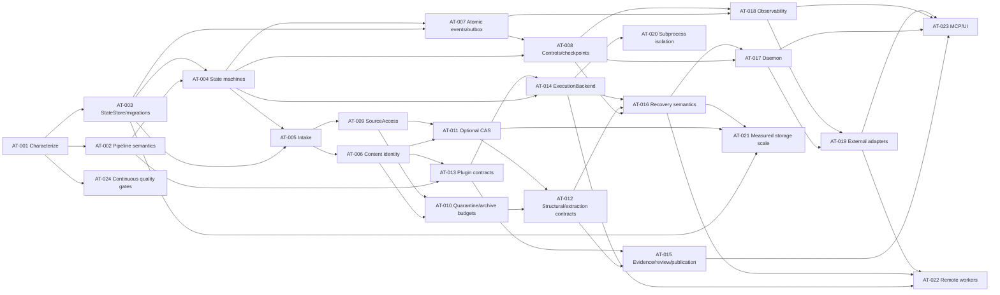

# ATLAS Evidence-Driven Architecture Execution Plan

## Plan Metadata

- **Repository:** `https://github.com/Runndownn/ATLAS`
- **Frozen implementation ref:** `efa547cafc64b58d60d19dcc1e5ba32c6b046bc5`
- **Donor repository:** `https://github.com/Runndownn/Yggdrasil`
- **Frozen donor ref:** `2b0c51b6132c2a16e63fc2e2de2d2b4598b5fe40`
- **Plan version:** 1.0
- **Plan date:** 2026-08-21
- **Status:** Proposed; read-only assessment complete; no implementation authorized
- **Owner:** @unassigned
- **Source assessment:** `ATLAS_Evidence_Driven_Architecture_Blueprint.md`
- **Target toolchain:** Python 3.13 reference runtime; SQLite reference backend; operating-system contract unresolved
- **Evidence limitations:** Current ATLAS HEAD unresolved; Yggdrasil live URL unavailable; original direction PDF not independently accessible; no frozen checkout was executed.

## Objective

Evolve ATLAS from a compact, single-process, sequential artifact-processing kernel into a durable local artifact lifecycle control plane while preserving the ordered six-stage semantic spine and avoiding premature DAG, distributed-worker, or governance-platform complexity.

The plan restores five governing invariants:

1. An accepted intake is an immutable observation manifest.
2. Artifact occurrence and exact byte identity are separate.
3. Authoritative state transitions and durable events commit atomically.
4. Replayable work has explicit idempotency and reconciliation semantics.
5. Plugins, workers, AI, CLIs, APIs, and transports cannot independently mutate lifecycle authority.

## Scope

This plan covers truth reconciliation, pipeline semantics, state machines, migrations, source/intake identity, content identity, durable events, controls/checkpoints, filesystem and archive safety, quarantine, optional CAS, structural/extraction contracts, plugin and execution abstractions, findings/evidence/review/publication, crash recovery, daemon ownership, observability, adapters, isolation, measured scale-out, and release engineering.

## Non-Goals

- No code implementation, repository mutation, branch, commit, or pull request is part of this plan.
- Do not convert ATLAS into a generic DAG scheduler, task queue, agent framework, Airflow-, Temporal-, Celery-, or Kubernetes-like platform.
- Do not add PostgreSQL, object storage, remote workers, MCP, multi-tenant IAM, or operator UI before their evidence gates are met.
- Do not treat README claims, TODO completion markers, diagrams, interfaces, or placeholders as implementation proof.
- Do not copy Yggdrasil code without restored source, dependency/license review, and donor-specific test analysis.

## Authority and Evidence Baseline

Authority order:

1. frozen ATLAS code and tests;
2. ATLAS schemas/configuration/packaging/CI;
3. ATLAS architecture documentation;
4. ATLAS plans/TODOs;
5. product-direction requirements extracted in the frozen assessment;
6. frozen Yggdrasil donor evidence;
7. authoritative external documentation;
8. explicit engineering inference.

The live ATLAS repository page displayed `main`, public visibility, 35 commits, and the expected repository perimeter on 2026-08-21. Its exact current HEAD SHA was not exposed through the available fetch path. The Yggdrasil URL returned 404, and the original direction PDF was not separately accessible. All line-level work is therefore frozen to the SHAs above and must be revalidated before implementation.

## Current-State Architecture Summary

ATLAS is a single-process Python runtime. `AtlasRuntime` composes `PipelineOrchestrator`, `JobStore`, one event bus, phase handlers, filesystem/archive helpers, and an in-memory hash manifest. Jobs run asynchronously, but a job iterates a caller-supplied phase list sequentially. SQLite persists jobs, phases, and selected lifecycle events; phase-detail events and progress are not a complete durable history. Fingerprinting re-discovers the filesystem, extraction writes adjacent to source archives, controls are process-local, and review creates transient candidates rather than durable trust decisions.

## Confirmed Findings

- **GAP-001:** invalid or missing sources can be represented as discovery errors without necessarily failing the job.
- **GAP-002:** phase order is caller-controlled rather than a protected A–F invariant.
- **GAP-003:** CLI and orchestrator error-policy concepts conflict.
- **GAP-004:** downstream rediscovery breaks intake identity and exposes source mutation ambiguity.
- **GAP-005:** content identity and deduplication are process-local.
- **GAP-006:** state mutation and event persistence are not one transaction.
- **GAP-007:** pause/resume/cancel and active-job authority are process-local.
- **GAP-008:** extraction is not confined to a job-owned quarantine.
- **GAP-009:** no attempt/checkpoint/replay model exists.
- **GAP-010:** review/promotion records are not durable authority.
- **GAP-011:** nested-container depth is configured but not recursively enforced.
- **GAP-012:** plugins have weak typed/capability contracts and execute in-process.
- **GAP-013:** schema migration/version ownership is absent.
- **GAP-014:** safety helpers are not one mandatory filesystem access path.
- **GAP-015:** metadata-based result storage can truncate or conflate authoritative records.

## Assumptions and Unresolved Decisions

- Supported operating systems and filesystem semantics are unresolved.
- Default byte-retention/CAS policy is unresolved.
- Source-provider types beyond local directories are unresolved.
- Publication destination and idempotency contracts are unresolved.
- Human review is not proven mandatory for every promotion.
- Retention periods are unresolved.
- Numeric performance SLOs are unresolved.
- Future single-user, multi-user, or multi-tenant deployment scope is unresolved.
- The Yggdrasil donor snapshot and original direction document must be restored and revalidated.

## Workstream and Dependency Map

## Execution Tasks

### [ ] AT-001 — Establish deterministic current-behavior characterization

- **Priority:** P0
- **Owner:** @unassigned
- **Dependencies:** None
- **Status:** Not started
- **Evidence:** GAP-001, GAP-002, GAP-003, GAP-004, GAP-006, GAP-007, GAP-009; [ATLAS-TEST:efa547cafc64b58d60d19dcc1e5ba32c6b046bc5:tests/test_runtime.py:L18-L144]; [ATLAS-TEST:efa547cafc64b58d60d19dcc1e5ba32c6b046bc5:tests/test_orchestrator.py:L103-L111]
- **Purpose:** Pin the observable defects and compatibility surfaces before refactoring so corrections do not erase evidence or silently change unrelated behavior.
- **Affected surfaces:** Existing `tests/`; create `tests/characterization/`, versioned fixtures under `tests/fixtures/v0_1/`; no production-file behavior changes in this task.
- **Constraints:** Preserve the six-stage lifecycle, compatibility obligations, deterministic authority, and this task's stated rollback boundary. Do not add unrelated product scope.

#### Implementation steps

1. Create executable fixtures for missing/non-directory/unreadable sources, invalid phase permutations, contradictory error-policy inputs, a failed phase under non-abort policy, source mutation between A and B, progress visibility, process-local pause/resume/cancel, event-persistence failure, and >50 analyzer findings.
2. Record current results as characterization expectations and tag each known-defect expectation with its GAP ID; do not label known-bad behavior as desired behavior.
3. Capture CLI exit status, persisted rows, job/phase terminal states, emitted events, filesystem side effects, and exceptions as machine-readable evidence.
4. Preserve existing public imports, sample YAML, CLI invocations, and database fixtures for later compatibility testing.

#### Edge and failure cases

- Empty tree; unreadable child; dangling symlink; duplicate phase; missing handler; event-store full/fault; analyzer emits 0, 1, 50, and 51 findings.

Required failure behavior: A test-harness setup failure is distinct from a product failure and must fail the test run with retained diagnostics. Known-defect expectations remain explicitly marked until corrected by a later task.

#### Security, safety, and privacy controls

Use temporary directories, no privileged mounts by default, sanitized fixtures, and explicit cleanup. Platform-specific race tests must skip only with a documented capability reason.

#### Observability and debugging

Archive JUnit/JSON reports, persisted database copies for failing cases, captured event sequences, and filesystem manifests.

#### Tests

Pytest characterization suite; three clean deterministic runs; negative tests for traversal/symlink/archive mutation; subprocess-based CLI checks.

#### Acceptance criteria

- [ ] Each GAP-001 through GAP-015 has at least one executable reproducer or an explicit `INSUFFICIENT EVIDENCE` investigation record.
- [ ] Three clean runs produce byte-identical machine-readable expectation files except normalized timestamps/temporary paths.
- [ ] No production behavior changes are included.
- [ ] CI retains the characterization artifacts on failure.
- [ ] Required tests pass with no unapproved skips.
- [ ] Documentation, compatibility, migration, and rollback obligations are satisfied.

#### Risks and mitigations

- **Risk:** The change may alter a legacy surface, persist partial state, or create a second authority path.
  **Mitigation:** Delete only the new test/fixture files; production data is untouched. Migration contract: None.
- **Completion evidence:** Committed fixture manifest, test report, current-versus-target expectation matrix, and clean-run determinism evidence.

### [ ] AT-002 — Introduce a versioned PipelineDefinition and enforce canonical A–F semantics

- **Priority:** P0
- **Owner:** @unassigned
- **Dependencies:** AT-001
- **Status:** Not started
- **Evidence:** GAP-002, GAP-003, REQ-001, REQ-002, REQ-006, REQ-007; [ATLAS:efa547cafc64b58d60d19dcc1e5ba32c6b046bc5:atlas/core/orchestrator.py:L25-L68,L128-L220]; [ATLAS:efa547cafc64b58d60d19dcc1e5ba32c6b046bc5:atlas/cli.py:L42-L91]
- **Purpose:** The current caller-controlled phase list and overlapping failure flags permit extraction-before-structure and ambiguous terminal truth.
- **Affected surfaces:** Create `atlas/config/models.py`, `atlas/config/loader.py`; refactor `atlas/cli.py`, `atlas/core/orchestrator.py`; update `examples/*.yaml`; compatibility shim for `PipelineConfig`.
- **Constraints:** Preserve the six-stage lifecycle, compatibility obligations, deterministic authority, and this task's stated rollback boundary. Do not add unrelated product scope.

#### Implementation steps

1. Define `PipelineDefinition(schema_version, name, source, failure_policy, phases, metadata)` with six named phase slots in canonical order.
2. Represent disabled work as a validated phase policy that becomes a durable `SKIPPED` state; never by deleting or reordering semantic slots.
3. Replace `continue_on_phase_error` and `abort_on_error` with one `FailurePolicy`; reject contradictory legacy values rather than guessing.
4. Define typed phase-specific configuration and reject unknown required keys, invalid types, unsupported capabilities, and phase settings that have no consumer.
5. Compute and persist a canonical configuration digest after normalization.

#### Edge and failure cases

- Duplicate phase keys; omitted optional phase; unknown schema version; conflicting legacy flags; environment override with wrong type; YAML duplicate keys.

Required failure behavior: Invalid configuration fails before job creation with stable error codes and source locations; no partial job row or workspace is created.

#### Security, safety, and privacy controls

Configuration cannot grant undeclared filesystem/network/process capabilities. YAML parsing uses safe loaders and duplicate-key rejection.

#### Observability and debugging

Emit/configure `pipeline.validated` diagnostics containing schema version, digest, legacy-normalization warnings, and deprecated keys without secrets.

#### Tests

Parser unit/property tests, invalid-permutation tests, duplicate-key tests, all existing example YAML as compatibility fixtures, CLI preflight integration.

#### Acceptance criteria

- [ ] All six phase slots appear in every normalized pipeline in canonical order.
- [ ] Every current example either normalizes successfully with an expected digest or fails with an approved migration message.
- [ ] Contradictory legacy error flags are rejected before job creation.
- [ ] No `phase_config` field remains unconsumed.
- [ ] Required tests pass with no unapproved skips.
- [ ] Documentation, compatibility, migration, and rollback obligations are satisfied.

#### Risks and mitigations

- **Risk:** The change may alter a legacy surface, persist partial state, or create a second authority path.
  **Mitigation:** Keep the legacy loader and `PipelineConfig` facade behind a feature flag for one compatibility window; new stored definitions remain readable. Migration contract: Support unversioned YAML through a documented compatibility window; provide `atlas pipeline migrate` or equivalent dry-run converter before deprecation.
- **Completion evidence:** Versioned JSON/YAML schema, migration examples, compatibility matrix, parser tests, and configuration-digest evidence.

### [ ] AT-003 — Create the StateStore abstraction and versioned SQLite migration system

- **Priority:** P0
- **Owner:** @unassigned
- **Dependencies:** AT-001
- **Status:** Not started
- **Evidence:** GAP-009, REQ-018; [ATLAS:efa547cafc64b58d60d19dcc1e5ba32c6b046bc5:atlas/core/job_store.py:L19-L65,L172-L350]; [ATLAS:efa547cafc64b58d60d19dcc1e5ba32c6b046bc5:atlas/schema/__init__.py:L1-L9]
- **Purpose:** Inline schema creation, independent commits, and absent schema versioning prevent safe evolution of authoritative records.
- **Affected surfaces:** Create `atlas/persistence/base.py`, `atlas/persistence/sqlite.py`, `atlas/persistence/migrations/`; refactor `atlas/core/job_store.py`; replace `atlas/schema/__init__.py` exports.
- **Constraints:** Preserve the six-stage lifecycle, compatibility obligations, deterministic authority, and this task's stated rollback boundary. Do not add unrelated product scope.

#### Implementation steps

1. Define explicit transaction ownership, read/write repository interfaces, connection lifecycle, foreign-key enforcement, busy timeout, WAL policy, and error taxonomy.
2. Add a schema metadata table and immutable numbered migrations with checksums and forward-only application.
3. Before migrating an existing database: integrity check, verified backup, schema fingerprint, migration transaction, row/invariant verification, migration event, retained backup.
4. Provide backup, restore-verification, and orphan/partial-migration diagnostics.
5. Keep SQLite as authoritative local/reference backend; do not introduce PostgreSQL in this task.

#### Edge and failure cases

- Legacy v0.1 DB; empty DB; corrupt DB; full disk; lock contention; process kill during migration; checksum mismatch; newer unsupported schema.

Required failure behavior: Migration failure leaves the original database and verified backup intact; startup fails closed on corruption, unknown newer schema, or checksum drift.

#### Security, safety, and privacy controls

Database/workspace path must be outside untrusted source roots; restrictive file permissions; SQL parameters only; backup path canonicalization.

#### Observability and debugging

Migration start/end/failure events, lock-wait metrics, integrity-check result, schema version, backup hash and location.

#### Tests

Fresh install, every-version upgrade, interrupted migration fault injection, lock contention, FK enforcement, backup/restore, corruption and newer-schema negative tests.

#### Acceptance criteria

- [ ] Fresh and v0.1-upgraded databases have identical schema fingerprints and pass integrity/FK checks.
- [ ] Killing migration at each defined fault point never destroys the pre-migration database.
- [ ] No direct `aiosqlite` write remains outside the persistence package except approved migration bootstrap.
- [ ] Backup and restore verification are documented and automated.
- [ ] Required tests pass with no unapproved skips.
- [ ] Documentation, compatibility, migration, and rollback obligations are satisfied.

#### Risks and mitigations

- **Risk:** The change may alter a legacy surface, persist partial state, or create a second authority path.
  **Mitigation:** Restore the verified pre-migration backup; application refuses to run a binary incompatible with the restored schema. Migration contract: This task is the migration foundation; ship v0.1-to-v1 migration and retain legacy readers until AT-004+ data is available.
- **Completion evidence:** Migration manifest/checksums, fresh/upgrade test artifacts, backup hashes, schema diagram, and operator recovery procedure.

### [ ] AT-004 — Implement explicit Job, Phase, Attempt, and control transition guards

- **Priority:** P0
- **Owner:** @unassigned
- **Dependencies:** AT-002, AT-003
- **Status:** Not started
- **Evidence:** REQ-014–REQ-017; GAP-007, GAP-008; state reconstruction in Sections 3 and 10.
- **Purpose:** Current mutable status fields do not define legal transitions, attempts, fencing, immutable terminal truth, or stale-result behavior.
- **Affected surfaces:** Create `atlas/models/states.py`, `atlas/core/lifecycle.py`; refactor `atlas/core/orchestrator.py`; add migrations/tables for phase runs and attempts.
- **Constraints:** Preserve the six-stage lifecycle, compatibility obligations, deterministic authority, and this task's stated rollback boundary. Do not add unrelated product scope.

#### Implementation steps

1. Define exhaustive legal transition tables and guards for jobs, phase runs, attempts, and control requests.
2. Represent each execution as a new immutable attempt with attempt number, backend identity, lease/fencing token, start/end, outcome, error class, checkpoint reference, and result digest.
3. Make terminal job/phase/attempt states immutable except through explicit reconciliation records.
4. Define failure propagation, skip reasons, suspension, cancellation, retry scheduling, restart, and replay semantics.
5. Reject late results whose fencing token or expected state no longer matches.

#### Edge and failure cases

- Duplicate completion; cancel during retry delay; pause at terminal phase; resume non-suspended job; late worker result; crash after external effect but before result commit.

Required failure behavior: Guard rejection is deterministic and leaves state unchanged; unknown side-effect outcome enters `RECONCILIATION_REQUIRED`, not automatic retry.

#### Security, safety, and privacy controls

Fencing tokens are unguessable or monotonic within authoritative state; control actor/adapter identity is recorded; no API/CLI bypass.

#### Observability and debugging

Transition counters by from/to/result, rejection reason, attempt age, stale-result count, terminal-state audit record.

#### Tests

Exhaustive table/property tests, concurrent transition races, stale fencing, duplicate command idempotency, crash-point integration.

#### Acceptance criteria

- [ ] Every transition documented in Section 10 has a direct positive and negative test.
- [ ] Concurrent incompatible transitions yield one committed winner and deterministic loser errors.
- [ ] Terminal-state immutability and stale-result rejection are proven under concurrency.
- [ ] Legacy status strings project consistently for compatibility readers.
- [ ] Required tests pass with no unapproved skips.
- [ ] Documentation, compatibility, migration, and rollback obligations are satisfied.

#### Risks and mitigations

- **Risk:** The change may alter a legacy surface, persist partial state, or create a second authority path.
  **Mitigation:** Compatibility projection permits old readers; rollback restores pre-migration DB, not ad-hoc state rewrites. Migration contract: Map legacy `completed→SUCCEEDED`, `error→FAILED`; create attempt 1 for active/historical phase rows where provenance is sufficient, otherwise mark `legacy_unattributed`.
- **Completion evidence:** Machine-readable transition table, exhaustive test report, migration mapping, and concurrency/fencing evidence.

### [ ] AT-005 — Introduce SourceRoot and accepted IntakeGeneration records

- **Priority:** P0
- **Owner:** @unassigned
- **Dependencies:** AT-003, AT-004
- **Status:** Not started
- **Evidence:** GAP-001, GAP-004, REQ-003, REQ-014; [ATLAS:efa547cafc64b58d60d19dcc1e5ba32c6b046bc5:atlas/phases/reconnaissance.py:L20-L111]
- **Purpose:** Downstream phases currently rediscover mutable sources, so a job has no immutable occurrence set or completeness decision.
- **Affected surfaces:** Create `atlas/intake/service.py`, `atlas/artifacts/models.py`; refactor `atlas/phases/reconnaissance.py`, `atlas/safety/filesystem_discovery.py`; add persistence migrations.
- **Constraints:** Preserve the six-stage lifecycle, compatibility obligations, deterministic authority, and this task's stated rollback boundary. Do not add unrelated product scope.

#### Implementation steps

1. Register `SourceRoot` with normalized locator, provider type, allowed-root policy, and stable source ID.
2. Build an `IntakeGeneration` in `BUILDING`; persist every observed occurrence candidate and exclusion/error reason.
3. Accept only after traversal completes and completeness/budget/error policy passes; compute deterministic manifest digest; partial traversal is `FAILED` or `BLOCKED`, never valid empty intake.
4. Use deterministic relative-path ordering and bounded traversal; record mount/symlink/special-file policy decisions.
5. Downstream phases receive only `intake_generation_id` and occurrence IDs.

#### Edge and failure cases

- Missing root; permission error mid-tree; disappearing entry; symlink loop; mount boundary; special file; maximum entries/bytes/depth reached; case/Unicode collision.

Required failure behavior: Incomplete generations remain non-accepted with retained diagnostics; no later phase interprets them as success.

#### Security, safety, and privacy controls

Allowed roots, canonical relative paths, no symlink following by default, mount policy, resource budgets, no source writes.

#### Observability and debugging

Entries/bytes/errors/exclusions by reason, traversal duration, manifest digest, budget utilization, source mutation indicators.

#### Tests

Deterministic traversal, missing/unreadable source, symlink/mount/collision fixtures, million-entry synthetic benchmark procedure, crash before/after acceptance.

#### Acceptance criteria

- [ ] Missing or incomplete source cannot produce a completed job.
- [ ] Two unchanged traversals produce the same manifest digest and ordered occurrence set.
- [ ] Fingerprinting no longer invokes filesystem discovery.
- [ ] All accepted-generation rows are immutable through public APIs.
- [ ] Required tests pass with no unapproved skips.
- [ ] Documentation, compatibility, migration, and rollback obligations are satisfied.

#### Risks and mitigations

- **Risk:** The change may alter a legacy surface, persist partial state, or create a second authority path.
  **Mitigation:** New intake tables are additive; legacy Recon path remains read-only behind a compatibility feature flag during one window. Migration contract: Legacy jobs receive `intake_generation_id=NULL` and `provenance_complete=false`; no fabricated occurrences.
- **Completion evidence:** Schema, intake service, deterministic manifest fixtures, mutation tests, and provenance-completeness status surface.

### [ ] AT-006 — Persist occurrence-to-content identity using canonical SHA-256

- **Priority:** P0
- **Owner:** @unassigned
- **Dependencies:** AT-005
- **Status:** Not started
- **Evidence:** GAP-004, GAP-005, REQ-004, REQ-005; [ATLAS:efa547cafc64b58d60d19dcc1e5ba32c6b046bc5:atlas/storage/hash_store.py:L34-L63]; [ATLAS:efa547cafc64b58d60d19dcc1e5ba32c6b046bc5:atlas/phases/fingerprinting.py:L20-L136]
- **Purpose:** Current hashes are process-local and disconnected from accepted occurrences, preventing cross-run deduplication and exact-byte lineage.
- **Affected surfaces:** Create/extend `atlas/artifacts/models.py`, `atlas/artifacts/hasher.py`; refactor `atlas/storage/hash_store.py`, `atlas/phases/fingerprinting.py`; migrations.
- **Constraints:** Preserve the six-stage lifecycle, compatibility obligations, deterministic authority, and this task's stated rollback boundary. Do not add unrelated product scope.

#### Implementation steps

1. Canonical identity is `sha256:<hex>`; optional BLAKE3 is acceleration/integrity metadata, never the sole canonical identity.
2. Fingerprint only accepted regular-file occurrences; open through canonical source access (AT-009 integration point), stream bytes, validate pre/post handle metadata, and persist occurrence↔content relation atomically.
3. Recognize one content identity across many occurrences and runs.
4. Record hash algorithm/version, byte count, read start/end, mutation result, and capture/storage status.
5. Keep hashing separate from blob retention; CAS arrives in AT-011.

#### Edge and failure cases

- File truncates/appends/replaces during read; sparse/large file; duplicate bytes; interrupted hash; unsupported special file; BLAKE3 unavailable.

Required failure behavior: Mutation yields a typed stale-source result and blocks dependent work according policy; interrupted hashes create no content binding.

#### Security, safety, and privacy controls

Race-resistant source opening, bounded read buffers, no active-content execution, digest comparison in constant behavior where applicable.

#### Observability and debugging

Bytes hashed, throughput, duplicate hit/miss, mutation failures, algorithm/version, restart dedup result.

#### Tests

Source swap/truncate/append, duplicate bytes in multiple paths/runs, multi-gigabyte streaming fixture/procedure, restart dedup, algorithm compatibility.

#### Acceptance criteria

- [ ] Cross-process/restart reprocessing recognizes existing SHA-256 identities.
- [ ] Source mutation cannot attach the wrong identity to an occurrence.
- [ ] No phase independently invents content IDs.
- [ ] Legacy `HashStore.has_content()` compatibility behavior is covered.
- [ ] Required tests pass with no unapproved skips.
- [ ] Documentation, compatibility, migration, and rollback obligations are satisfied.

#### Risks and mitigations

- **Risk:** The change may alter a legacy surface, persist partial state, or create a second authority path.
  **Mitigation:** Compatibility facade can read new identities; additive tables permit reverting code after DB backup. Migration contract: Import verified legacy SHA-256 values as orphan `ContentIdentity` rows only; do not fabricate occurrence bindings.
- **Completion evidence:** Identity schema, hash service, restart/mutation test artifacts, duplicate metrics, and migration report.

### [ ] AT-007 — Make state transition, event history, and outbox atomic

- **Priority:** P0
- **Owner:** @unassigned
- **Dependencies:** AT-003, AT-004
- **Status:** Not started
- **Evidence:** GAP-009, GAP-010, REQ-013, REQ-024; [ATLAS:efa547cafc64b58d60d19dcc1e5ba32c6b046bc5:atlas/core/orchestrator.py:L298-L339]; [ATLAS:efa547cafc64b58d60d19dcc1e5ba32c6b046bc5:atlas/core/event_bus.py:L24-L230]
- **Purpose:** Current publish-then-persist behavior can commit authoritative state without durable evidence and treats RabbitMQ as an ambiguous side channel.
- **Affected surfaces:** Create `atlas/events/models.py`, `atlas/events/recorder.py`, `atlas/events/dispatcher.py`; split/refactor `atlas/core/event_bus.py`; migrations.
- **Constraints:** Preserve the six-stage lifecycle, compatibility obligations, deterministic authority, and this task's stated rollback boundary. Do not add unrelated product scope.

#### Implementation steps

1. Persist authoritative state mutation, required durable event, and transport outbox row in one StateStore transaction.
2. Define immutable event IDs, local sequence, schema version, correlation/causation IDs, entity IDs, class, occurred time, and typed payload.
3. Make transports projections only; implement at-least-once outbox dispatch with idempotent delivery keys, backoff, retention, backlog limits, and reconciliation.
4. Coalesce/sample high-volume progress events while keeping current progress authoritative.
5. Preserve legacy routing keys through a versioned adapter.

#### Edge and failure cases

- DB full; transport down; duplicate dispatcher; crash after publish before ack; poison event; consumer failure; backlog overflow.

Required failure behavior: If event/outbox cannot commit, state transition does not commit. Delivery failure remains pending/dead-lettered with evidence; no swallowed persistence exceptions.

#### Security, safety, and privacy controls

Validate event type/schema, prevent payload secrets/path leakage, authenticate deployment transports optionally, reject event injection into authoritative command paths.

#### Observability and debugging

Outbox depth/age, delivery attempts, dead letters, sequence gaps, coalescing counts, transport health.

#### Tests

Transaction fault injection at each write, ordering/replay, duplicate dispatch, broker outage/recovery, backpressure, schema-version compatibility.

#### Acceptance criteria

- [ ] Every required state transition query returns its durable event in the same committed transaction.
- [ ] RabbitMQ can be disabled or unavailable without corrupting state.
- [ ] Crash/redelivery tests produce no duplicate lifecycle effects.
- [ ] Outbox backlog has explicit bounded/degraded behavior.
- [ ] Required tests pass with no unapproved skips.
- [ ] Documentation, compatibility, migration, and rollback obligations are satisfied.

#### Risks and mitigations

- **Risk:** The change may alter a legacy surface, persist partial state, or create a second authority path.
  **Mitigation:** Disable external dispatchers while retaining history/outbox; restore pre-migration DB for schema rollback. Migration contract: Import legacy `atlas_events` as schema v0/legacy class; start new sequence after verified maximum; keep routing adapter.
- **Completion evidence:** Event schema, transaction tests, broker fault report, outbox diagnostics, and transport authority documentation.

### [ ] AT-008 — Persist progress, control requests, safe points, and versioned checkpoints

- **Priority:** P0
- **Owner:** @unassigned
- **Dependencies:** AT-004, AT-007
- **Status:** Not started
- **Evidence:** GAP-006, GAP-007, GAP-008, REQ-008, REQ-015, REQ-016, REQ-017.
- **Purpose:** Current progress and pause/resume/cancel are process-local; restart repeats phases without verified recovery state.
- **Affected surfaces:** Refactor `atlas/phases/base.py`, coordinator and CLI; create checkpoint/control models and persistence tables; add `atlas/core/context.py` if useful.
- **Constraints:** Preserve the six-stage lifecycle, compatibility obligations, deterministic authority, and this task's stated rollback boundary. Do not add unrelated product scope.

#### Implementation steps

1. Expose a typed `PhaseContext` for durable progress, control polling, checkpoint creation, artifact/result writes, and telemetry.
2. Persist idempotent `ControlRequest` records with requested/applied/rejected state and actor/correlation identity.
3. Define safe control points per built-in phase; `PAUSED` means the attempt durably acknowledged a safe checkpoint.
4. Version checkpoints by phase/operation/config/input digests and validate before resume.
5. Separate current progress state from sampled progress history.

#### Edge and failure cases

- Cancel during hashing/extraction/publication; duplicate control; stale checkpoint; resume after plugin upgrade; crash after checkpoint write; long uninterruptible call.

Required failure behavior: Unsafe control remains pending until safe point or timeout; invalid checkpoint is rejected and restart/reconciliation policy is explicit.

#### Security, safety, and privacy controls

Authorize control adapters at deployment boundary; record actor; avoid checkpointing secrets; protect checkpoint integrity with digests.

#### Observability and debugging

Live progress, last checkpoint, pending control age, safe-point latency, resume reason, rejected stale checkpoint count.

#### Tests

Two-process logical integration, crash/restart for each built-in phase, duplicate/stale control, checkpoint mismatch, cancellation cleanup.

#### Acceptance criteria

- [ ] A second process can observe live progress from persistent state.
- [ ] Pause/resume/cancel requests are durably acknowledged or rejected with reasons.
- [ ] Stale or incompatible checkpoints never resume work.
- [ ] Built-in phases document maximum control latency and checkpoint granularity.
- [ ] Required tests pass with no unapproved skips.
- [ ] Documentation, compatibility, migration, and rollback obligations are satisfied.

#### Risks and mitigations

- **Risk:** The change may alter a legacy surface, persist partial state, or create a second authority path.
  **Mitigation:** Disable resume use of new checkpoints while retaining them as diagnostics; controls fall back only for new jobs under explicit compatibility mode. Migration contract: Legacy active jobs cannot be safely resumed unless compatibility evidence exists; mark them `RECOVERY_REQUIRED` or `legacy_nonresumable`.
- **Completion evidence:** Control/checkpoint schemas, phase safe-point contracts, two-process tests, crash/restart report, and status output.

### [ ] AT-009 — Create one canonical race-resistant SourceAccess service

- **Priority:** P0
- **Owner:** @unassigned
- **Dependencies:** AT-005
- **Status:** Not started
- **Evidence:** GAP-004, GAP-012, REQ-011; [ATLAS:efa547cafc64b58d60d19dcc1e5ba32c6b046bc5:atlas/safety/path_safety.py:L26-L146].
- **Purpose:** PathSafetyService is not the authoritative route for all opens, leaving bypasses and source TOCTOU exposure.
- **Affected surfaces:** Create `atlas/safety/source_access.py`; extend `atlas/safety/path_safety.py`; integrate all phases and intake/artifact services.
- **Constraints:** Preserve the six-stage lifecycle, compatibility obligations, deterministic authority, and this task's stated rollback boundary. Do not add unrelated product scope.

#### Implementation steps

1. Resolve all source access from registered root + canonical relative path; prohibit arbitrary post-intake absolute paths.
2. Define symlink policy, mount-boundary policy, special-file policy, case/Unicode normalization policy, and platform capability fallback.
3. Use handle-relative/no-follow operations where supported; validate opened handle metadata against occurrence record.
4. Centralize temporary-file creation and destination path construction separately from source access.
5. Add static/runtime guards against direct phase `open()` bypass.

#### Edge and failure cases

- Symlink swap; parent rename; mount insertion; hard link; Windows reparse point; case-fold collision; Unicode normalization; device/FIFO/socket.

Required failure behavior: Unsafe/stale access returns typed error without following or materializing the target; job/phase policy determines block/fail, never silent skip.

#### Security, safety, and privacy controls

Required core control; allowed roots, no-follow, handle validation, secure temp files, source read-only guarantee.

#### Observability and debugging

Safety decision/reason, platform capability, denied path count, mutation/race detection, reduced-assurance mode.

#### Tests

Adversarial filesystem race fixtures, symlink/mount/reparse tests by OS, static bypass scan, property tests for canonical paths.

#### Acceptance criteria

- [ ] Static analysis finds no unapproved built-in direct source opens.
- [ ] Symlink/mount/case/Unicode fixtures produce documented deterministic outcomes.
- [ ] All phase source reads are attributable to an occurrence ID.
- [ ] Reduced-assurance mode is never the silent default.
- [ ] Required tests pass with no unapproved skips.
- [ ] Documentation, compatibility, migration, and rollback obligations are satisfied.

#### Risks and mitigations

- **Risk:** The change may alter a legacy surface, persist partial state, or create a second authority path.
  **Mitigation:** Compatibility path adapter remains read-only and loudly warns; no weakening of canonical policy for new jobs. Migration contract: Existing absolute paths are normalized to SourceRoot + relative path only when safely provable; otherwise provenance incomplete.
- **Completion evidence:** SourceAccess API, OS capability matrix, adversarial test corpus/results, and bypass inventory at zero or approved exceptions.

### [ ] AT-010 — Introduce quarantine workspaces and recursive cumulative archive budgets

- **Priority:** P0
- **Owner:** @unassigned
- **Dependencies:** AT-006, AT-009
- **Status:** Not started
- **Evidence:** GAP-012, GAP-013, REQ-009, REQ-010, REQ-012; [ATLAS:efa547cafc64b58d60d19dcc1e5ba32c6b046bc5:atlas/phases/extraction.py:L20-L181]; [ATLAS:efa547cafc64b58d60d19dcc1e5ba32c6b046bc5:atlas/safety/archive_safety.py].
- **Purpose:** Current extraction writes beside the source and nested-depth configuration is not recursively enforced.
- **Affected surfaces:** Create `atlas/artifacts/workspace.py`; extend `atlas/safety/archive_safety.py`, `atlas/phases/structural_discovery.py`, `atlas/phases/extraction.py`.
- **Constraints:** Preserve the six-stage lifecycle, compatibility obligations, deterministic authority, and this task's stated rollback boundary. Do not add unrelated product scope.

#### Implementation steps

1. Create unique per-job/phase/attempt quarantine workspaces outside source roots with quotas and restrictive permissions.
2. Inspect nested containers recursively through a bounded work queue before materialization where feasible; enforce cumulative depth, member count, declared/actual expanded bytes, per-file bytes, compression ratio, temp bytes, and wall time.
3. Canonicalize member names and reject absolute, parent traversal, NUL, reserved/device, symlink/hardlink/device entries unless an explicit safe policy exists.
4. Require an accepted StructuralReport for the exact parent ContentIdentity before extraction.
5. Account actual bytes written, hash every materialized output, and persist derivation records; partial extraction remains contained.

#### Edge and failure cases

- Malformed archive; overlapping paths; duplicate/case-colliding members; nested bomb; symlink/hardlink/device; disk exhaustion; encrypted member; partial write; recursive cycle by repeated content.

Required failure behavior: Stop at first required safety/budget violation; mark ExtractionRecord failed/blocked; retain or purge quarantine according policy with evidence; no partial publication.

#### Security, safety, and privacy controls

Required core control; active content is never executed; secure temp/open flags; no source-adjacent writes; total-job budgets.

#### Observability and debugging

Nested depth, member/byte budgets, actual versus declared bytes, quarantine usage, rejection reasons, cleanup status.

#### Tests

Adversarial archive corpus, generated path/member properties, nested bombs, disk-full fault injection, partial extraction cleanup, no-write-under-source assertion.

#### Acceptance criteria

- [ ] All adversarial archives terminate within configured resource bounds.
- [ ] No Phase-D write occurs under source root.
- [ ] Every extracted file has a derivation edge and hash before downstream use.
- [ ] Nested-depth and cumulative-byte limits are enforced recursively, not only counted.
- [ ] Required tests pass with no unapproved skips.
- [ ] Documentation, compatibility, migration, and rollback obligations are satisfied.

#### Risks and mitigations

- **Risk:** The change may alter a legacy surface, persist partial state, or create a second authority path.
  **Mitigation:** Disable new extraction only by blocking jobs; never fall back to source-adjacent legacy extraction for new jobs. Migration contract: Legacy extracted directories are external/unmanaged artifacts and are never retroactively trusted; optional import requires re-intake.
- **Completion evidence:** Workspace/recursive-budget implementation plan, corpus manifest, fault results, cleanup evidence, and lineage samples.

### [ ] AT-011 — Add an optional local immutable content-addressable store

- **Priority:** P1
- **Owner:** @unassigned
- **Dependencies:** AT-006, AT-009
- **Status:** Not started
- **Evidence:** REQ-005, REQ-029; GAP-005; ADR-005.
- **Purpose:** Persistent identities enable safe deduplication, reproducibility, and stable inputs, but a true CAS must not be confused with hashing.
- **Affected surfaces:** Create `atlas/artifacts/store.py`; extend runtime/config/persistence; preserve `HashStore` facade.
- **Constraints:** Preserve the six-stage lifecycle, compatibility obligations, deterministic authority, and this task's stated rollback boundary. Do not add unrelated product scope.

#### Implementation steps

1. Store blobs at digest-derived immutable locations using staged exclusive write, streamed hash verification, fsync of file and directory where supported, and no-replace commit.
2. Verify an existing digest path before reuse; treat mismatch as integrity incident.
3. Record blob status, size, provider, retention class, verification time, and occurrence/capture provenance.
4. Reconcile harmless orphan blobs when filesystem commit succeeds but DB commit fails.
5. Make CAS optional; identity-only operation remains explicit with reduced reproducibility status.

#### Edge and failure cases

- Concurrent identical writers; partial blob; DB failure after finalize; disk quota; bit rot; cross-device rename; unsupported fsync/no-replace.

Required failure behavior: Unknown/mismatched existing blob fails closed; orphan is quarantined/reconciled; quota failure does not corrupt existing blobs.

#### Security, safety, and privacy controls

Store outside source/workspaces, restrictive permissions, no execution, safe filename derivation, integrity verification on configurable schedule.

#### Observability and debugging

Bytes stored/deduplicated, put latency, orphan count, verify failures, quota/retention usage, cache hit/miss.

#### Tests

Concurrent writers, every crash point, duplicate corpus, bit-flip verification, quota full, provider conformance.

#### Acceptance criteria

- [ ] Repeated identical content consumes one blob payload.
- [ ] No concurrent writer overwrites existing content.
- [ ] Crash-point tests leave either a valid committed blob, a detectable orphan, or no blob—never a false identity.
- [ ] Identity-only and captured-byte status is visible in provenance.
- [ ] Required tests pass with no unapproved skips.
- [ ] Documentation, compatibility, migration, and rollback obligations are satisfied.

#### Risks and mitigations

- **Risk:** The change may alter a legacy surface, persist partial state, or create a second authority path.
  **Mitigation:** Disable new puts and keep read/verify access; immutable blobs can be retained or removed only through audited retention tooling. Migration contract: Legacy identities can gain blobs only by re-reading verified occurrences or explicit import; never assume bytes exist.
- **Completion evidence:** Provider contract, local implementation, crash/concurrency report, retention/quota documentation, and dedup benchmark.

### [ ] AT-012 — Persist StructuralReport and ExtractionRecord as exact-byte contracts

- **Priority:** P1
- **Owner:** @unassigned
- **Dependencies:** AT-010, AT-011
- **Status:** Not started
- **Evidence:** REQ-009, REQ-019, REQ-028; GAP-004, GAP-012, GAP-013.
- **Purpose:** Current structural and extraction phases exchange summaries/live paths rather than durable records bound to exact content.
- **Affected surfaces:** Extend `atlas/artifacts/models.py`; refactor `atlas/phases/structural_discovery.py`, `atlas/phases/extraction.py`; migrations.
- **Constraints:** Preserve the six-stage lifecycle, compatibility obligations, deterministic authority, and this task's stated rollback boundary. Do not add unrelated product scope.

#### Implementation steps

1. Persist reports keyed to parent ContentIdentity, inspector/version, policy/config digest, manifest, risk/budget assessment, and acceptance state.
2. Extraction consumes a report ID and verifies exact content/config/policy binding before materialization.
3. Persist one ExtractionRecord per attempt with workspace, plan, actual outputs, derivation edges, budgets, failure/cleanup status.
4. Support deterministic reuse only for declared deterministic inspectors and exact key matches.

#### Edge and failure cases

- Archive changes after report; inspector upgrade; policy change; same content at new path; duplicate members; failed cleanup.

Required failure behavior: Binding mismatch blocks extraction and emits stale-report evidence; partial/unknown extraction requires reconciliation or cleanup.

#### Security, safety, and privacy controls

Report data remains inert; no member materialization during structural inspection; policy digests prevent stale unsafe reuse.

#### Observability and debugging

Report cache hit/miss, stale binding, member/risk counts, extraction output/cleanup status, lineage query latency.

#### Tests

Swap archive after C, policy/config change, repeated identical content, partial write/crash, bidirectional lineage queries.

#### Acceptance criteria

- [ ] Phase D rejects any report/content/config/policy mismatch.
- [ ] Every extracted content identity traces to exact parent/member/report/attempt.
- [ ] Repeated deterministic structure analysis can be reused only under exact key equality.
- [ ] Unknown/partial outcomes are visibly non-success.
- [ ] Required tests pass with no unapproved skips.
- [ ] Documentation, compatibility, migration, and rollback obligations are satisfied.

#### Risks and mitigations

- **Risk:** The change may alter a legacy surface, persist partial state, or create a second authority path.
  **Mitigation:** New records are additive; disable reuse and extraction while retaining reports for diagnostics. Migration contract: Legacy structural/extraction metadata remains a non-authoritative summary with `lineage_complete=false`.
- **Completion evidence:** Schemas, phase contract changes, swap/reuse/crash tests, and sample lineage export.

### [ ] AT-013 — Define versioned typed plugin descriptors and a deterministic registry

- **Priority:** P1
- **Owner:** @unassigned
- **Dependencies:** AT-002, AT-006
- **Status:** Not started
- **Evidence:** GAP-014, GAP-015, REQ-021, REQ-022, REQ-023; [ATLAS:efa547cafc64b58d60d19dcc1e5ba32c6b046bc5:atlas/phases/analysis.py:L18-L134].
- **Purpose:** Arbitrary in-process plugin dictionaries lack schema, version, capability, resource, determinism, and authority boundaries.
- **Affected surfaces:** Create `atlas/plugins/contracts.py`, `atlas/plugins/registry.py`; refactor `atlas/phases/analysis.py`; compatibility adapter for `AnalyzerPlugin`.
- **Constraints:** Preserve the six-stage lifecycle, compatibility obligations, deterministic authority, and this task's stated rollback boundary. Do not add unrelated product scope.

#### Implementation steps

1. Define stable plugin ID/version/API range, supported inputs, output schema, capabilities, filesystem/network/process needs, tools, CPU/memory/temp/time expectations, active-content risk, deterministic/cacheable flags, and provenance.
2. Build deterministic registry discovery with duplicate/conflict rejection and explicit enabled/deployed status.
3. Normalize output into typed AnalysisFinding records; reject arbitrary dictionaries and preserve complete result sets.
4. AI plugins may produce findings/recommendations but cannot mutate lifecycle, provenance, safety, evidence acceptance, or promotion decisions.
5. Version operation/config/policy/input digests for reproducibility and optional memoization.

#### Edge and failure cases

- Duplicate ID; incompatible API version; malformed result; unavailable external tool; nondeterministic plugin marked cacheable; 0/50/51/large findings; plugin crash.

Required failure behavior: Invalid plugin is disabled/rejected before work; optional plugin failure is isolated and recorded; required plugin failure follows pipeline policy.

#### Security, safety, and privacy controls

Capability least privilege; no direct StateStore; no implicit source/network; secret references mediated; output schema and size limits.

#### Observability and debugging

Registry snapshot/digest, plugin load/disable reason, execution/resource metrics, finding counts, cache eligibility/hit/miss.

#### Tests

Registry determinism, version compatibility, duplicate conflict, malformed/oversized results, attribution, losslessness, AI authority negative tests.

#### Acceptance criteria

- [ ] No arbitrary dictionary reaches durable findings.
- [ ] Two clean registry builds produce the same ordered snapshot/digest.
- [ ] More than 50 findings persist losslessly within declared limits.
- [ ] A plugin cannot invoke lifecycle transitions through its context.
- [ ] Required tests pass with no unapproved skips.
- [ ] Documentation, compatibility, migration, and rollback obligations are satisfied.

#### Risks and mitigations

- **Risk:** The change may alter a legacy surface, persist partial state, or create a second authority path.
  **Mitigation:** Disable new plugin discovery and retain adapter for legacy trusted plugins; findings remain readable. Migration contract: Wrap legacy `AnalyzerPlugin` behind an adapter with generated descriptor and deprecation warning; mark provenance as legacy where fields are unknown.
- **Completion evidence:** Plugin API/schema, registry snapshot artifact, compatibility tests, normalized finding fixtures, and security contract.

### [ ] AT-014 — Separate lifecycle semantics from execution location with ExecutionBackend

- **Priority:** P1
- **Owner:** @unassigned
- **Dependencies:** AT-004, AT-013
- **Status:** Not started
- **Evidence:** REQ-022, REQ-025, REQ-030; ADR-008.
- **Purpose:** A stable work/result contract is required before isolation or remote execution; the backend must never own lifecycle state.
- **Affected surfaces:** Create `atlas/execution/base.py`, `atlas/execution/inprocess.py`; integrate coordinator/plugins; later `subprocess.py` in AT-020.
- **Constraints:** Preserve the six-stage lifecycle, compatibility obligations, deterministic authority, and this task's stated rollback boundary. Do not add unrelated product scope.

#### Implementation steps

1. Define `WorkSpec` containing immutable operation, plugin/version, input identity references, config/policy digests, resource limits, deadline, idempotency key, and fencing token.
2. Define `WorkResult` with status, output references/digest, diagnostics, resource usage, and echoed authority fields.
3. Implement trusted in-process backend first and backend conformance suite.
4. Coordinator alone validates result and transitions attempts/phases; backend cannot access StateStore authority.
5. Support cancellation/deadline protocol and stale-result rejection.

#### Edge and failure cases

- Timeout; backend loss; duplicate result; stale fencing; malformed/oversized output; cancellation race; backend shutdown.

Required failure behavior: Unknown result or lost backend leaves attempt timed out/lost/reconciliation-required according operation contract; no blind success.

#### Security, safety, and privacy controls

Minimize backend credentials/context; mediated artifact access; signed/authenticated protocol deferred to remote adapter but fields reserved.

#### Observability and debugging

Queue/run latency, backend health, resource usage, cancellations, stale/malformed results, conformance version.

#### Tests

In-process conformance, identical analyzer through direct/contract path, cancellation/timeout/stale results, serialization compatibility.

#### Acceptance criteria

- [ ] A bundled analyzer produces identical normalized findings through the backend contract.
- [ ] Backend code has no direct lifecycle write capability.
- [ ] Stale/malformed/duplicate results are rejected deterministically.
- [ ] Conformance suite is reusable for AT-020/022.
- [ ] Required tests pass with no unapproved skips.
- [ ] Documentation, compatibility, migration, and rollback obligations are satisfied.

#### Risks and mitigations

- **Risk:** The change may alter a legacy surface, persist partial state, or create a second authority path.
  **Mitigation:** Switch coordinator to compatibility direct executor while retaining WorkSpec/Result records for new jobs only. Migration contract: Route trusted built-ins through in-process backend behind existing APIs; preserve direct plugin adapter during transition.
- **Completion evidence:** Contracts, in-process backend, conformance suite, equivalence evidence, and authority-boundary documentation.

### [ ] AT-015 — Implement first-class findings, evidence, decisions, and publication attempts

- **Priority:** P1
- **Owner:** @unassigned
- **Dependencies:** AT-012, AT-013
- **Status:** Not started
- **Evidence:** GAP-011, GAP-015, REQ-019, REQ-020, REQ-027, REQ-028; [ATLAS:efa547cafc64b58d60d19dcc1e5ba32c6b046bc5:atlas/phases/review.py:L19-L236].
- **Purpose:** Review currently produces transient candidates rather than durable approve/reject/hold decisions and verifiable publications.
- **Affected surfaces:** Create `atlas/review/service.py`, `atlas/review/publication.py`; refactor `atlas/phases/review.py`; extend artifact/finding models and migrations.
- **Constraints:** Preserve the six-stage lifecycle, compatibility obligations, deterministic authority, and this task's stated rollback boundary. Do not add unrelated product scope.

#### Implementation steps

1. Persist normalized findings separately from evidence records, promotion decisions, publication requests/attempts, and destination verification.
2. Define decision states `APPROVE/REJECT/HOLD` with actor/policy identity, exact evidence-set digest, reason, time, and supersession rules.
3. Require an authorized current decision before publication; harmless local jobs may use explicit policy decisions without interactive approval.
4. Use staged destination writes, idempotency keys, verification, no-replace/expected-replace semantics, and unknown-outcome reconciliation.
5. Provide bidirectional lineage from publication to exact source bytes and from source occurrence to all derived publications.

#### Edge and failure cases

- Hold/reject; evidence superseded; destination already exists; partial external write; timeout after destination commit; duplicate request; destination outage.

Required failure behavior: Publication failure/unknown remains a non-success attempt with reconciliation instructions; no promotion record implies destination success.

#### Security, safety, and privacy controls

Destination policy/capability restrictions, optional deployment authorization, secret references, path/command injection prevention, immutable attribution.

#### Observability and debugging

Decision latency/outcomes, stale evidence, publication attempts/reconciliation, destination verification, lineage query diagnostics.

#### Tests

Approve/reject/hold E2E, stale evidence negative, duplicate/partial/unknown publication, unauthorized adapter, bidirectional lineage.

#### Acceptance criteria

- [ ] Every publication traces to exact source and derived content identities, findings, evidence, decision, policy, actor, and attempt.
- [ ] Reject/hold cannot publish.
- [ ] Unknown destination outcome enters reconciliation and does not auto-repeat mutation.
- [ ] AI/plugin-only output cannot create an approved decision.
- [ ] Required tests pass with no unapproved skips.
- [ ] Documentation, compatibility, migration, and rollback obligations are satisfied.

#### Risks and mitigations

- **Risk:** The change may alter a legacy surface, persist partial state, or create a second authority path.
  **Mitigation:** Disable publication adapters; retain decisions/evidence as read-only records; restore DB for schema rollback. Migration contract: Legacy promotion candidates remain historical summaries with `decision_authority=none`; they are never treated as approved publications.
- **Completion evidence:** Review/publication schemas, adapter contract, E2E/fault evidence, lineage export, and operator status.

### [ ] AT-016 — Define retries, timeouts, idempotency, reconciliation, and crash recovery per phase

- **Priority:** P1
- **Owner:** @unassigned
- **Dependencies:** AT-004, AT-008, AT-012, AT-014
- **Status:** Not started
- **Evidence:** GAP-008, REQ-017; Sections 23 and ADR-011.
- **Purpose:** Replay is unsafe unless each operation declares duplicate effects, checkpoints, and unknown-outcome handling.
- **Affected surfaces:** Coordinator/lifecycle, phase contracts, execution backends, review/publication; create error/recovery policy module if needed.
- **Constraints:** Preserve the six-stage lifecycle, compatibility obligations, deterministic authority, and this task's stated rollback boundary. Do not add unrelated product scope.

#### Implementation steps

1. Define typed error taxonomy and per-operation retryability, maximum attempts, backoff/jitter, deadline, idempotency key, checkpoint/restart mode, and reconciliation hook.
2. Classify built-in operations as pure/restartable, checkpoint-resumable, idempotent side effect, or externally reconcilable side effect.
3. On startup, scan nonterminal attempts and deterministically resume, retry, reconcile, block, or fail based on verified state.
4. Never automatically retry an operation with unknown duplicate effects.
5. Retain failed attempt evidence and link successor attempts.

#### Edge and failure cases

- Crash before/after every transaction and external write; timeout while child still runs; stale checkpoint; repeated host restarts; dependency outage; retry storm.

Required failure behavior: Unreconcilable/unsafe state becomes `BLOCKED/RECONCILIATION_REQUIRED` with operator evidence; retry budget exhaustion is terminal under policy.

#### Security, safety, and privacy controls

Bound retries/resources, no secret leakage in errors, external reconciliation uses least privilege and exact idempotency identity.

#### Observability and debugging

Attempt/retry/recovery counters, reason codes, backoff, checkpoint age, unresolved outcomes, restart recovery summary.

#### Tests

Subprocess kill/fault injection at durable points for every built-in phase, repeated restart, retry exhaustion, external unknown outcome, stale checkpoint.

#### Acceptance criteria

- [ ] Every built-in phase has a documented/tested operation-semantics classification.
- [ ] Crash matrix yields one deterministic recovery decision per fault point.
- [ ] No side-effecting unknown outcome is automatically repeated.
- [ ] Recovery diagnostics identify exact attempt/checkpoint/effect boundary.
- [ ] Required tests pass with no unapproved skips.
- [ ] Documentation, compatibility, migration, and rollback obligations are satisfied.

#### Risks and mitigations

- **Risk:** The change may alter a legacy surface, persist partial state, or create a second authority path.
  **Mitigation:** Disable automatic recovery and require manual block/restart for new jobs; never weaken unknown-outcome safeguards. Migration contract: Legacy active jobs are classified conservatively as nonresumable unless exact durable evidence proves safe continuation.
- **Completion evidence:** Recovery matrix implementation, phase semantics registry, crash-test artifacts, and startup recovery report.

### [ ] AT-017 — Add a long-running local daemon as the authoritative active-job owner

- **Priority:** P1
- **Owner:** @unassigned
- **Dependencies:** AT-008, AT-016
- **Status:** Not started
- **Evidence:** GAP-007, REQ-014, REQ-015; README remaining limitation on process-local controls.
- **Purpose:** A CLI process cannot durably own jobs or honor controls from another process; hydrating private `_jobs` is not control.
- **Affected surfaces:** Create `atlas/service/daemon.py`; refactor `atlas/cli.py`, runtime/coordinator; add claim/lease tables as needed.
- **Constraints:** Preserve the six-stage lifecycle, compatibility obligations, deterministic authority, and this task's stated rollback boundary. Do not add unrelated product scope.

#### Implementation steps

1. Run a single local owner/claim loop that discovers runnable jobs, claims with lease/fencing token, executes/recoveries, and renews authority.
2. CLI submits commands and reads status through shared command/state service; it never edits private runtime maps.
3. Support graceful shutdown, abandoned-claim recovery, single-instance lock or multi-owner-safe claims, and health/readiness.
4. Keep same-process library mode for tests/embedded use under explicit ownership contract.
5. Do not add remote/distributed workers.

#### Edge and failure cases

- Two daemons; stale lease; host sleep; daemon kill; CLI during shutdown; database lock; orphan subprocess.

Required failure behavior: Lost lease stops authority; stale owner result rejected; readiness false on unusable store; claims recover after expiry/reconciliation.

#### Security, safety, and privacy controls

Local IPC/database permissions, actor attribution, no unauthenticated network listener by default, least-privileged daemon account.

#### Observability and debugging

Daemon identity/uptime, claim/lease age, runnable queue, recovery actions, health/readiness, shutdown status.

#### Tests

Launch daemon and second CLI process pause/resume/cancel; competing-daemon claim test; kill/restart; stale fencing; embedded equivalence.

#### Acceptance criteria

- [ ] Separate CLI process controls a job executing under daemon ownership.
- [ ] Private `_jobs` hydration/mutation is removed from CLI.
- [ ] Competing daemon cannot double-execute a fenced attempt.
- [ ] Graceful and forced restart produce deterministic recovery.
- [ ] Required tests pass with no unapproved skips.
- [ ] Documentation, compatibility, migration, and rollback obligations are satisfied.

#### Risks and mitigations

- **Risk:** The change may alter a legacy surface, persist partial state, or create a second authority path.
  **Mitigation:** Return to foreground mode for new jobs only; existing daemon-owned nonterminal jobs are blocked/recovered safely, not stolen. Migration contract: CLI defaults may remain foreground for one window; add explicit `atlas daemon`/connection detection and deprecation path.
- **Completion evidence:** Daemon/service code plan, ownership tests, health/status output, operator runbook, and compatibility behavior.

### [ ] AT-018 — Provide canonical status, telemetry, health, and diagnostic bundles

- **Priority:** P1
- **Owner:** @unassigned
- **Dependencies:** AT-007, AT-008
- **Status:** Not started
- **Evidence:** REQ-008, REQ-013, REQ-029; Sections 15 and 23.
- **Purpose:** Operators need authoritative progress, blockers, provenance, and recovery evidence without reading raw SQLite or logs.
- **Affected surfaces:** Create status/telemetry modules; extend CLI, runtime, persistence queries; documentation.
- **Constraints:** Preserve the six-stage lifecycle, compatibility obligations, deterministic authority, and this task's stated rollback boundary. Do not add unrelated product scope.

#### Implementation steps

1. Define structured JSON logs with stable error taxonomy and correlation/job/phase/attempt/work IDs.
2. Expose canonical job status projection: current phase/attempt, progress, pending control, checkpoint, blocker, retry, resource budget, outbox backlog, provenance completeness.
3. Define metrics and optional traces without making them authoritative.
4. Implement liveness/readiness/dependency health semantics and a sanitized diagnostic bundle with schema/config/runtime versions and relevant evidence.
5. Redact secrets and bound payload-derived text/path samples.

#### Edge and failure cases

- Huge job; high-cardinality paths; clock skew; telemetry sink outage; corrupted row; partial diagnostic bundle; secret-like metadata.

Required failure behavior: Telemetry sink failure degrades observability but not lifecycle state; diagnostics report missing components explicitly.

#### Security, safety, and privacy controls

Redaction before logging/export, path minimization, no raw file content by default, access controls optional deployment layer.

#### Observability and debugging

This task defines it: stable logs, metrics, traces, health/readiness, progress, errors, diagnostic bundle integrity.

#### Tests

Golden structured logs/status, redaction, telemetry outage, high-volume cardinality limits, health dependency semantics, diagnostic reproducibility.

#### Acceptance criteria

- [ ] A user can identify exact phase/attempt/checkpoint/blocker/recovery action without raw DB inspection.
- [ ] Telemetry outage cannot change job outcome.
- [ ] Diagnostic bundle contains no fixture secrets/raw payloads and has a manifest hash.
- [ ] Health/readiness semantics are deterministic and tested.
- [ ] Required tests pass with no unapproved skips.
- [ ] Documentation, compatibility, migration, and rollback obligations are satisfied.

#### Risks and mitigations

- **Risk:** The change may alter a legacy surface, persist partial state, or create a second authority path.
  **Mitigation:** Disable optional sinks; keep status service and durable state queries. Migration contract: Legacy jobs show reduced fields with `provenance_complete=false`; CLI output remains backward-readable with additive fields/JSON version.
- **Completion evidence:** Status schema, metric catalog, log/error taxonomy, diagnostic example, redaction and outage test evidence.

### [ ] AT-019 — Implement REST, RabbitMQ, and webhook adapters over the shared command/event contracts

- **Priority:** P2
- **Owner:** @unassigned
- **Dependencies:** AT-017, AT-018
- **Status:** Not started
- **Evidence:** REQ-024, REQ-025, REQ-030; current RabbitMQ publisher-only behavior.
- **Purpose:** External interfaces are useful only after durable semantics exist and must not create alternate lifecycle authority.
- **Affected surfaces:** Create `atlas/api/`; complete event transport/dispatcher; optional webhook adapter; CLI/Python remain canonical clients.
- **Constraints:** Preserve the six-stage lifecycle, compatibility obligations, deterministic authority, and this task's stated rollback boundary. Do not add unrelated product scope.

#### Implementation steps

1. Expose versioned request/response schemas that invoke the same CommandService and StatusService as CLI/Python.
2. Complete RabbitMQ as outbox-backed event transport with publisher confirms, bounded retry/DLQ, schema/version headers, and no consumer-driven state mutation.
3. Webhooks are signed optional notifications with idempotent delivery.
4. Define authentication/authorization as deployment adapters; local single-operator mode need not require network IAM.
5. Generate and verify OpenAPI/contract artifacts.

#### Edge and failure cases

- Duplicate request; stale ETag/version; broker/webhook outage; malformed schema; replayed command; slow consumer; API process restart.

Required failure behavior: Return stable errors without partial state; outbox retains delivery; replayed idempotent command returns prior result.

#### Security, safety, and privacy controls

Optional authn/authz/TLS/rate limits, request size/schema, replay protection, secret handling, event injection separation.

#### Observability and debugging

Request IDs/latency/errors, outbox/delivery metrics, contract version, auth decisions, replay detections.

#### Tests

Contract/OpenAPI validation, lifecycle-bypass negative tests, duplicate/replay, broker outage/redelivery, webhook signature, auth adapter.

#### Acceptance criteria

- [ ] REST and CLI produce identical authoritative state for equivalent commands.
- [ ] RabbitMQ outage does not block committed lifecycle transitions beyond explicit outbox capacity policy.
- [ ] No event payload can mutate state by being replayed as a command.
- [ ] OpenAPI/event schemas are versioned and CI-checked.
- [ ] Required tests pass with no unapproved skips.
- [ ] Documentation, compatibility, migration, and rollback obligations are satisfied.

#### Risks and mitigations

- **Risk:** The change may alter a legacy surface, persist partial state, or create a second authority path.
  **Mitigation:** Remove/disable adapters without changing core state or job executability. Migration contract: Preserve legacy routing keys through v1 adapter; introduce REST additively.
- **Completion evidence:** Versioned contracts, integration/fault reports, OpenAPI artifact, and adapter runbooks.

### [ ] AT-020 — Add subprocess execution with mediated artifacts and enforceable limits

- **Priority:** P2
- **Owner:** @unassigned
- **Dependencies:** AT-014
- **Status:** Not started
- **Evidence:** GAP-014, REQ-022; ADR-010.
- **Purpose:** Third-party analyzers should not share process authority, unrestricted filesystem, or StateStore credentials.
- **Affected surfaces:** Create `atlas/execution/subprocess.py`; extend plugin descriptors/policy and workspace/artifact access.
- **Constraints:** Preserve the six-stage lifecycle, compatibility obligations, deterministic authority, and this task's stated rollback boundary. Do not add unrelated product scope.

#### Implementation steps

1. Launch plugins in a separate process with a minimal JSON/binary contract, dedicated workspace, mediated content handles/copies, and no StateStore credentials.
2. Enforce timeout/termination, output size, temp storage, process count, and platform-available CPU/memory constraints; report unsupported controls.
3. Network and external tool access are denied by default and explicitly declared/policy-granted.
4. Sanitize environment, working directory, inherited descriptors, PATH/tool resolution, and secrets.
5. Treat containers/sandboxes as later backend adapters, not mandatory core.

#### Edge and failure cases

- Fork bomb; stdout flood; child tree; ignored termination; output protocol corruption; temp exhaustion; network attempt; Windows job object/POSIX limits.

Required failure behavior: Kill process tree, mark attempt failed/timed out, retain bounded diagnostics, clean/quarantine workspace; no host-wide retry storm.

#### Security, safety, and privacy controls

Core control for untrusted plugins where technically enforceable; document platform gaps; no secrets unless explicitly referenced.

#### Observability and debugging

CPU/memory/temp/time, denied capability attempts where observable, exit/signal, output truncation, cleanup.

#### Tests

Hostile plugin corpus: file escape, network, process spawn, output flood, timeout, memory/temp exhaustion; backend conformance by OS.

#### Acceptance criteria

- [ ] Test plugin cannot access StateStore credentials or source paths outside mediated input under supported controls.
- [ ] Timeout kills the entire child tree and preserves deterministic evidence.
- [ ] Unsupported resource controls are visible and cannot be claimed as enforced.
- [ ] In-process backend remains limited to explicitly trusted plugins.
- [ ] Required tests pass with no unapproved skips.
- [ ] Documentation, compatibility, migration, and rollback obligations are satisfied.

#### Risks and mitigations

- **Risk:** The change may alter a legacy surface, persist partial state, or create a second authority path.
  **Mitigation:** Disable subprocess backend; untrusted plugins become unavailable rather than silently in-process. Migration contract: Legacy plugins default to trusted in-process compatibility; require descriptor/trust classification before subprocess eligibility.
- **Completion evidence:** Backend, capability policy, hostile-plugin test report, platform enforcement matrix, and cleanup diagnostics.

### [ ] AT-021 — Add PostgreSQL and object-storage adapters only after measured trigger conditions

- **Priority:** P3
- **Owner:** @unassigned
- **Dependencies:** AT-003, AT-011, AT-016, benchmark evidence from AT-024
- **Status:** Not started
- **Evidence:** REQ-026, REQ-030; ADR-003; OQ-007.
- **Purpose:** Additional stores are justified only when SQLite/local CAS fail defined workloads while semantics are already stable.
- **Affected surfaces:** Later `atlas/persistence/postgres.py`, `atlas/artifacts/object_store.py`; migration/conformance tooling.
- **Constraints:** Preserve the six-stage lifecycle, compatibility obligations, deterministic authority, and this task's stated rollback boundary. Do not add unrelated product scope.

#### Implementation steps

1. Define quantitative trigger report from local benchmarks: contention, dataset size, recovery objective, multi-host need, or storage durability gap.
2. Implement adapters behind existing StateStore/ContentStore contracts; do not change lifecycle/data semantics.
3. Provide migration/copy verification, dual-read or maintenance-window strategy, consistency model, backup/restore, and rollback.
4. Keep one authoritative store per deployment; no split-brain dual writers.

#### Edge and failure cases

- Partial copy; network partition; object eventual consistency; credential outage; schema mismatch; rollback after writes.

Required failure behavior: Abort cutover on verification mismatch; retain old authority; reconcile unknown copied objects without promoting them.

#### Security, safety, and privacy controls

TLS/IAM/secrets are deployment controls; least privilege, bucket/database isolation, encryption options, audit.

#### Observability and debugging

Migration progress/checksums, backend latency/contention, object verify failures, cutover authority status.

#### Tests

Backend conformance, migration fault/rollback, partition/outage, large-data benchmarks, restore drill.

#### Acceptance criteria

- [ ] A written benchmark proves the selected adapter solves a measured limitation.
- [ ] All core conformance/recovery tests pass unchanged.
- [ ] Cutover/rollback drill preserves row/blob counts and hashes.
- [ ] No dual-writer authority exists.
- [ ] Required tests pass with no unapproved skips.
- [ ] Documentation, compatibility, migration, and rollback obligations are satisfied.

#### Risks and mitigations

- **Risk:** The change may alter a legacy surface, persist partial state, or create a second authority path.
  **Mitigation:** Stop new writes, restore old authority from verified point, reconcile post-cutover records via manifest. Migration contract: Introduce → shadow copy/verify → cut over authority → observe → deprecate old backend; exact approach based on workload.
- **Completion evidence:** Trigger analysis, adapter conformance report, migration/rollback drill, cost/resource model, and operator guide.

### [ ] AT-022 — Add remote workers with leases, fencing, and the existing WorkSpec contract

- **Priority:** P3
- **Owner:** @unassigned
- **Dependencies:** AT-014, AT-016, AT-019, AT-021 if multi-node store required
- **Status:** Not started
- **Evidence:** REQ-026, REQ-030; Option C deferred; R-11.
- **Purpose:** Remote execution is an infrastructure adapter, not a reason to redefine lifecycle semantics.
- **Affected surfaces:** Later `atlas/execution/remote.py`, worker service/protocol, deployment docs.
- **Constraints:** Preserve the six-stage lifecycle, compatibility obligations, deterministic authority, and this task's stated rollback boundary. Do not add unrelated product scope.

#### Implementation steps

1. Dispatch immutable WorkSpec to authenticated workers; lease/heartbeat/fencing tokens and idempotency keys are authoritative in StateStore.
2. Workers receive scoped artifact access and cannot write lifecycle state.
3. Define result authentication/integrity, stale worker rejection, cancellation, worker drain, retry/reconciliation, and compatibility negotiation.
4. Preserve phase barriers and coordinator ownership.
5. Adopt only after workload/operational need is demonstrated.

#### Edge and failure cases

- Partition; duplicate delivery; stale worker; clock skew; worker upgrade mismatch; lost cancel; artifact transfer interruption; malicious worker.

Required failure behavior: Lease expires; attempt becomes lost/recoverable under operation semantics; stale results rejected; unknown side effect reconciled.

#### Security, safety, and privacy controls

Mutual service identity, scoped single-use access, transport security, no StateStore credentials, tenant isolation only if deployment requires.

#### Observability and debugging

Worker/lease health, queue/run/transfer latency, stale results, retries, capability/version distribution.

#### Tests

Network partition, worker kill, duplicate work, stale result, protocol mismatch, local/remote conformance, load/soak.

#### Acceptance criteria

- [ ] Remote backend passes the same conformance/recovery suite as local backends.
- [ ] Killing/partitioning a worker cannot double-commit a side effect.
- [ ] Stale result fencing is demonstrated.
- [ ] Documented workload evidence justifies deployment complexity.
- [ ] Required tests pass with no unapproved skips.
- [ ] Documentation, compatibility, migration, and rollback obligations are satisfied.

#### Risks and mitigations

- **Risk:** The change may alter a legacy surface, persist partial state, or create a second authority path.
  **Mitigation:** Drain remote dispatch, run new work locally, reconcile in-flight leases/results. Migration contract: Enable per operation/phase with local fallback only where idempotency contract permits; no flag-day move.
- **Completion evidence:** Need justification, protocol spec, security model, fault/soak results, and rollback drill.

### [ ] AT-023 — Expose MCP and operator UI only as bounded clients of canonical services

- **Priority:** P3
- **Owner:** @unassigned
- **Dependencies:** AT-015, AT-017, AT-018, AT-019
- **Status:** Not started
- **Evidence:** REQ-025, REQ-027, REQ-030; R-18.
- **Purpose:** Agent/UI convenience must not become an alternate provenance, policy, or promotion authority.
- **Affected surfaces:** Later `atlas/integrations/mcp.py`, optional UI project/adapter.
- **Constraints:** Preserve the six-stage lifecycle, compatibility obligations, deterministic authority, and this task's stated rollback boundary. Do not add unrelated product scope.

#### Implementation steps

1. Expose read/status/analysis proposal tools first; any consequential command uses CommandService, policy, idempotency, and decision attribution.
2. Treat all model/tool text as untrusted data; prevent prompt/content instructions from becoming lifecycle commands.
3. Require explicit capability declarations and optional deployment authorization for controls/publication.
4. UI renders authoritative status and evidence, clearly distinguishing observed, inferred, proposed, approved, and published.
5. Do not embed model authority in core.

#### Edge and failure cases

- Prompt injection in artifact; tool enumeration; replayed control; stale UI state; XSS in findings; model timeout/hallucination; confused deputy.

Required failure behavior: Unsafe/invalid request rejected; AI failure produces no lifecycle mutation; stale UI command requires version check/idempotency.

#### Security, safety, and privacy controls

Untrusted-content separation, output encoding, CSRF/auth optional deployment, least privilege, no raw secrets/content by default.

#### Observability and debugging

Tool calls, denied actions, proposal/decision separation, model/plugin versions, stale/replay events.

#### Tests

Prompt-injection fixtures, lifecycle-bypass negative tests, XSS/output encoding, stale/replay controls, AI authority assertions.

#### Acceptance criteria

- [ ] No MCP/UI path can bypass CommandService/state guards/review.
- [ ] Artifact text cannot cause an unrequested tool action.
- [ ] UI labels authority categories accurately.
- [ ] Removing the adapters leaves core semantics unchanged.
- [ ] Required tests pass with no unapproved skips.
- [ ] Documentation, compatibility, migration, and rollback obligations are satisfied.

#### Risks and mitigations

- **Risk:** The change may alter a legacy surface, persist partial state, or create a second authority path.
  **Mitigation:** Disable/uninstall adapters; all authoritative records remain accessible through Python/CLI. Migration contract: Additive optional packages; no existing interface replacement.
- **Completion evidence:** Threat model, bounded contract, negative tests, operator UX evidence, and adapter removal test.

### [ ] AT-024 — Establish continuous release-quality gates and benchmark evidence

- **Priority:** P1
- **Owner:** @unassigned
- **Dependencies:** Begins with AT-001 and expands as each task lands
- **Status:** Not started
- **Evidence:** R-16; [ATLAS:efa547cafc64b58d60d19dcc1e5ba32c6b046bc5:.github/workflows/tests.yml:L1-L34]; Sections 21, 24, and 26.
- **Purpose:** Current CI is test-only on Ubuntu/Python 3.13 and does not prove migration, packaging, security, compatibility, recovery, or performance.
- **Affected surfaces:** `.github/workflows/*`, `pyproject.toml`, packaging/release scripts, `SECURITY.md`, `CONTRIBUTING.md`, benchmark and fixture directories.
- **Constraints:** Preserve the six-stage lifecycle, compatibility obligations, deterministic authority, and this task's stated rollback boundary. Do not add unrelated product scope.

#### Implementation steps

1. Build/install wheel from clean environment; pin/lock dependency strategy; generate SBOM and package provenance; publish checksums/signatures as chosen policy.
2. Run formatting/lint, type checking, unit/integration/E2E, state-machine/property, migration, crash/restart, security/adversarial, compatibility, and OS-specific path tests.
3. Define mandatory gates with no unapproved skips; report coverage boundaries rather than calling the system production-ready.
4. Create reproducible benchmark suite for small files, million entries, multi-GB files, archives/nesting, duplicates, concurrent jobs, analyzers, subprocess, and later remote.
5. Retain raw benchmark/test/release evidence and rollback procedure.

#### Edge and failure cases

- Flaky race tests; unavailable OS capability; dependency advisory without fix; reproducibility drift; migration failure; benchmark regression/noisy host.

Required failure behavior: Mandatory gate failure blocks release; approved skip requires owner/reason/expiry; rollback package/database backup remains available.

#### Security, safety, and privacy controls

Dependency/secret scanning, minimal publish credentials, protected release environment, artifact integrity, license inventory.

#### Observability and debugging

CI timing/flakes, test category status, coverage boundaries, benchmark trends/raw data, artifact hashes/SBOM.

#### Tests

This task owns gate execution; include wheel smoke, clean install, migration matrix, adversarial corpus, restore/rollback drill.

#### Acceptance criteria

- [ ] Every release candidate passes all declared mandatory gates with no unapproved skips.
- [ ] Wheel installs and runs smoke/E2E from a clean environment.
- [ ] Release bundle includes SBOM, hashes, test/migration/security reports, benchmark raw data, and rollback instructions.
- [ ] Claims explicitly state untested platforms/workloads and no blanket production-ready language.
- [ ] Required tests pass with no unapproved skips.
- [ ] Documentation, compatibility, migration, and rollback obligations are satisfied.

#### Risks and mitigations

- **Risk:** The change may alter a legacy surface, persist partial state, or create a second authority path.
  **Mitigation:** Retain previous release artifacts/schema backup; documented application/database rollback drill. Migration contract: Introduce gates incrementally; baseline current failures, then make corrected gates mandatory by task dependency.
- **Completion evidence:** Green release evidence bundle, reproducible build comparison, benchmark baseline, security/license reports, and signed-off rollback drill.

## Validation and Release Gates

Mandatory gates accumulate as tasks land:

1. Deterministic characterization and compatibility fixtures.
2. Unit and property tests for configuration and state transitions.
3. Fresh-database and every-supported-upgrade-path migration tests.
4. Transaction-fault injection and crash/restart tests.
5. Source mutation, symlink, mount-boundary, traversal, archive-bomb, and disk-exhaustion tests.
6. Replay/idempotency and unknown-outcome reconciliation tests.
7. Backend conformance tests for every store, transport, and execution adapter.
8. Wheel build/install/smoke tests from a clean environment.
9. Ruff, type checking, dependency scanning, license review, SBOM, and artifact hash verification.
10. Reproducible benchmark runs with raw data, environment metadata, and no unsupported scalability claims.

A capability is not complete because an interface exists. Completion requires implementation plus the task's defined normal, adverse, restart, migration, compatibility, observability, and rollback evidence.

## Rollback and Recovery

- Back up and integrity-check every legacy database before migration.
- Keep compatibility facades and legacy readers during the declared dual-support window.
- Use introduce → dual-support → migrate → verify → deprecate → remove.
- Treat non-backwards-compatible database rollback as restoration of the verified pre-migration backup unless a tested down-migration exists.
- Preserve staged/quarantined side effects until destination reconciliation is conclusive.
- Reject stale worker/plugin results by attempt and fencing token.
- Retain the prior installable package, schema backup, migration report, and rollback runbook for each release candidate.

## Risks and Mitigations

| Risk | Mitigation |
|---|---|
| Characterization tests canonize defects | Mark current and target expectations separately; change expectations only in the correcting task |
| Metadata migration loses data | Dual-write compatibility projection, row-count/digest checks, verified backup |
| Event outbox becomes a second state store | State remains authoritative; outbox is a transport projection only |
| Source manifests are mistaken for snapshots | Name and document observation semantics; verify/capture bytes before downstream use |
| CAS adds storage cost without value | Keep optional; benchmark duplicate-heavy workloads before default enablement |
| Plugin declarations are trusted rather than enforced | Trusted in-process and isolated subprocess tiers; negative capability tests |
| Distribution changes lifecycle meaning | Backend conformance suite and central transition authority |
| Donor code introduces hidden coupling/license risk | Restore exact donor ref, dependency map, provenance record, port tests, prefer reimplementation |
| Numeric targets are invented | Define measurement procedures first; set SLOs only after baseline evidence |
| Future interfaces bypass lifecycle rules | One command service and negative bypass tests |

## Completion Definition

The program is complete only when:

- all implemented capabilities have one authoritative owner and versioned contract;
- the A–F semantic order is enforced and every skip is durable and reasoned;
- source occurrence and byte identity are independently represented;
- every side effect is idempotent or reconcilable after crash/replay;
- state transition and durable event history are atomic;
- controls/checkpoints survive process restart;
- untrusted filesystem/archive/plugin inputs are bounded and fail closed;
- findings, evidence, decisions, and publications retain exact lineage;
- compatibility and migration evidence exists for supported legacy surfaces;
- all mandatory task gates pass with no unapproved skips;
- release artifacts include hashes, SBOM, test/migration/security/benchmark evidence, diagnostics, and a practiced rollback;
- remaining limitations and unsupported workloads are explicitly documented.
